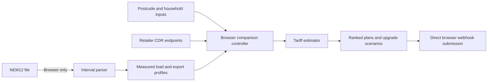
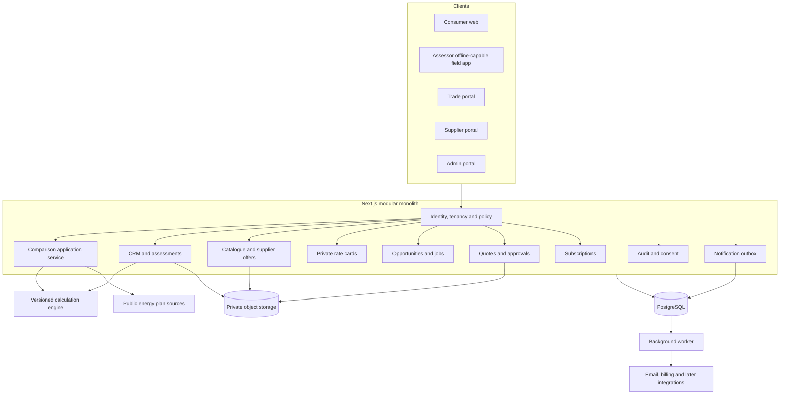
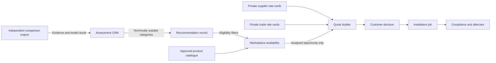

# Historical architecture baseline

Status: retained design history, not current implementation truth
Date: 13 July 2026

This review predates the TLink marketplace, CRM, admin, D1, R2, Sites and field-sync implementation. Use [docs/RELEASE_TRUTH.md](./docs/RELEASE_TRUTH.md) for current architecture and release status and [ROADMAP.md](./ROADMAP.md) for approved follow-on work. The principles below remain useful where they do not conflict with those current documents.

## 1. Executive recommendation

Keep the existing electricity comparator working while extracting its calculation logic into a versioned, tested comparison domain. Build Direct to Trades initially as a modular monolith in the existing Next.js application, backed by PostgreSQL, private object storage, server-side authorisation, an append-only audit trail, and a job queue or transactional outbox.

Do not begin with microservices. The immediate need is strong domain boundaries and access controls, not distributed infrastructure. Each module should own its rules and expose a narrow application-service interface so it can be separated later if scale or compliance requires it.

The smallest useful next milestone is **Comparison Integrity 1.1**:

1. Make NMI-derived annual usage clearly read-only by default, with a deliberate override flow.
2. Put coverage, confidence, measured versus extrapolated status, and unsupported charge warnings on every result.
3. Add scenario tests proving that equal annual consumption with different interval patterns produces different TOU, solar, and battery results.
4. Remove NMI values from emailed URLs.
5. Move lead submission behind a same-origin server route with server-side validation, abuse controls, consent evidence, and a verifiable success response.

This milestone improves credibility and privacy without starting the commercial platform or rewriting the compatibility comparer.

## 2. Current architecture assessment

### What exists

| Area | Current implementation | Assessment |
|---|---|---|
| Web application | Next.js 16 App Router with React 19 | Suitable foundation, but only a small part of the product is native Next.js. |
| Electricity comparison | `public/electricity-comparator.html`, served by `src/app/compare/route.ts` | Mature compatibility implementation. It combines UI, CDR retrieval, tariff interpretation, lead capture, and orchestration in one large browser script. Preserve until parity exists. |
| Interval model | `public/electricity-model.js` | Good first extraction. Pure functions are reusable and testable, but the module is untyped JavaScript and still coupled to a fixed 48-bin half-hour model. |
| NMI files | Parsed locally with `FileReader`; raw file is not uploaded | Strong privacy default. The parsed data remains in browser memory. This claim must be revisited if saved assessments later persist interval data. |
| Electricity plan data | Browser fetches CDR Product Reference Data from each retailer and caches responses in `localStorage` | Functional offline-friendly design, but browser CORS, cache integrity, performance, observability, and abuse controls are weak. The roadmap already calls for a server route. |
| Gas comparison | Native Next page with a server-side `/api/gas-plans` endpoint | Shows the preferred direction, although the endpoint still needs response caching, timeouts, schema validation, observability, and stronger failure reporting. |
| Leads and enquiries | Browser posts directly to a hard-coded Google Apps Script webhook using `no-cors` | Not an adequate long-term customer-data boundary. There is no authenticated server acknowledgement, durable consent record, central rate limit, or application audit event. |
| Persistence | Browser `localStorage` for public tariff caches and browser-side rate counters | No customer, assessment, participant, quote, rate-card, subscription, or audit database exists. |
| Identity and permissions | None | Direct to Trades cannot safely begin until authentication, organisation tenancy, roles, and server-side authorisation are designed. |
| Hosting | Historical target was Netlify; the active target is now Sites with Cloudflare bindings | Treat [docs/RELEASE_TRUTH.md](./docs/RELEASE_TRUTH.md) as authoritative. Australian data location, backup, encryption, logging, and exit requirements still require documented review. |
| Automated verification | Node tests for NEM12 parsing, TOU fractions, solar, battery, and the supplied fixture | Useful baseline. There are no tariff-contract fixtures, end-to-end comparison tests, access-control tests, or security tests yet. |

### Current comparison data flow

The comparison engine now uses measured time patterns for ordinary TOU tariffs, measured seasonal shares when a sufficiently complete year is present, and actual export shape for time-varying feed-in tariffs. Annual kWh is still the scaling quantity. For short files it is extrapolated from observed daily use, so the profile is personal but seasonal confidence remains limited.

## 3. Technical debt and security risks

### Release-critical

| Risk | Evidence and impact | Required treatment |
|---|---|---|
| NMI in URL | `magicLink()` adds the NMI to the query string. URLs can enter browser history, analytics, server logs, referrer data, screenshots, and email systems. | Remove NMI from share and reminder URLs. Use an opaque server-side comparison reference only after consented saved comparisons exist. |
| Direct public webhook | A hard-coded endpoint is visible to every browser. `no-cors` returns an opaque response, so the UI can report success without confirming application processing. | Create a same-origin lead endpoint. Validate server-side, rate-limit centrally, record consent and purpose, verify downstream delivery, and return an explicit status. Store secrets only server-side. |
| Browser-only abuse controls | Comparison and lead limits are stored in `localStorage` and can be cleared or bypassed. | Apply server-side IP and behavioural throttles to server endpoints. Avoid relying on IP alone. Add bot protection appropriate to risk and accessibility. |
| No access-control boundary | There is no identity, organisation tenancy, role model, or object-level authorisation. | Do not implement participant dashboards or private rate cards until server-side tenant isolation and deny-by-default authorisation tests exist. |
| No durable consent or audit record | Lead payloads contain contact and energy details, but consent wording, version, timestamp, actor, disclosure purpose, and recipients are not stored in an application audit trail. | Add structured consent receipts and immutable audit events before CRM or trade sharing. |
| Editable NMI-derived annual total | Uploading a file fills the manual annual field but leaves it editable. Changing it rescales cost while retaining the original measured shape, which can produce an unexplained hybrid result. | Lock derived fields while the meter dataset is active. Allow an explicit adjustment with reason, original value, new value, and visible impact. |

### Important technical debt

| Risk | Impact | Direction |
|---|---|---|
| Large compatibility script | UI, data retrieval, state, pricing, modelling, and lead capture are difficult to review independently. | Extract typed modules incrementally and preserve the compatibility page until interaction parity is demonstrated. |
| Untyped tariff payloads | Retailer CDR payload variation can silently change calculations. | Introduce runtime schemas, typed normalised tariff models, source-version tracking, and rejected-feature reporting. |
| Incomplete tariff coverage | Demand charges, controlled loads, some fees, credits, incentives, and eligibility rules are not fully costed. | Use a feature-support matrix. Exclude a plan from a definitive rank when an uncosted material feature can change the outcome, or label it as incomplete rather than presenting a precise rank. |
| Fixed half-hour profile grid | Five and 15-minute source data is aggregated into 30-minute bins. This is adequate for most TOU windows but insufficient for some demand calculations. | Preserve native interval resolution in the canonical dataset. Derive half-hour profiles only as a view. |
| Short-sample annualisation | A few weeks can be personal but seasonally unrepresentative. | Add coverage thresholds, climate-season warnings, optional bill-total reconciliation, and confidence-aware ranking language. Do not present low-confidence results as exact. |
| Location resolution | Postcode filters offers, while NMI mainly identifies a distributor for display. Postcodes can cross network or tariff boundaries. | Resolve and validate distributor explicitly. Require confirmation where postcode and NMI-derived distributor conflict. Filter by both geography and distributor when reliable data is available. |
| Coarse solar model | State-average yield and a representative generation curve do not model postcode irradiance, roof orientation, tilt, shading, inverter clipping, degradation, weather variability, or export limits. | Add a versioned site-solar model later, with location and roof inputs plus uncertainty ranges. Keep the current model clearly indicative. |
| Client tariff cache | Public plan details in `localStorage` can be stale, manually altered, or inconsistent between browsers. | Fetch, validate, cache, and timestamp tariff data server-side. Include source and calculation versions in results. |
| Limited tests | Model unit tests do not prove whole-plan ranking, seasonal tariff handling, distributor filtering, or tenant isolation. | Add golden tariff fixtures, property-based conservation checks, end-to-end flows, and deny-by-default authorisation tests. |
| No operational telemetry | Retailer failures are mostly swallowed and reported as missing plans. | Add structured logs, correlation IDs, source health metrics, calculation diagnostics, and alerts without logging raw NMI data. |

## 4. Proposed target architecture

### Architecture choice

Use a **modular monolith** first:

- One Next.js application for web UI and server application endpoints.
- A separate internal calculation package with no UI, database, or network dependency.
- PostgreSQL as the system of record.
- Private object storage for documents and optional raw meter files.
- A transactional outbox and background worker for emails, document processing, reminders, and integrations.
- Server-side session handling with multi-factor authentication required for privileged users.
- Organisation-scoped authorisation enforced in application services and reinforced with database row-level controls where supported.
- Append-only audit events for security-sensitive and commercially sensitive activity.

### Domain boundaries

1. **Comparison** owns plan ingestion, tariff normalisation, calculation requests, coverage diagnostics, and result snapshots.
2. **Calculation engine** owns deterministic energy, tariff, solar, battery, and later electrification calculations. Every result records engine version, tariff snapshot, assumptions, unsupported features, and confidence.
3. **CRM and assessments** owns customer, property, consent, appointments, field observations, files, assessment versions, and recommendations.
4. **Identity and access** owns users, organisations, memberships, roles, sessions, MFA, and policy decisions.
5. **Catalogue** owns canonical products, compliance documents, product status, and supplier-specific availability. Supplier pricing does not belong in the public product record.
6. **Rate cards** owns private, effective-dated supplier and trade pricing. Published versions are immutable; changes create new versions.
7. **Jobs** owns opportunities, eligibility matching, invitations, assignments, access grants, status transitions, and revocation.
8. **Quotes** owns quote revisions, line provenance, customer presentation, approvals, and change history. It references immutable rate-card and product snapshots.
9. **Subscriptions** owns configurable plans, enrolments, billing state, and entitlements. Subscription does not change technical recommendation rank.
10. **Audit and consent** receives append-only events from every domain and exposes controlled compliance views.

### Offline assessment design

Offline field capture should be a later milestone, not a reason to make all business data browser-local now. Use a service worker and encrypted local application store for explicitly downloaded assigned records only. Each record needs a server version, device sync state, field-level validation, and conflict policy. Sensitive documents should not be cached by default. Sign-out, reassignment, expiry, or remote revocation should make locally cached records inaccessible at the next possible control point.

## 5. Roles and permissions

Permissions must be evaluated server-side against the user, organisation, object, assignment, purpose, and record state. Hiding a button is not authorisation.

| Role | Core access | Explicit restrictions | Classification |
|---|---|---|---|
| Anonymous consumer | Run an unsaved comparison with local NMI parsing | No CRM, saved records, trade details, or private pricing | Required for initial release |
| Consumer account holder | Own properties, consents, assessments, quotes, decisions, documents, and access history | Own records only; cannot view private supplier or trade rate cards | Important but can follow |
| Assessor | Assigned customers, properties, appointments, assessment forms, and recommendations | No unassigned customers; cannot alter published rate cards or approved quote history | Required for CRM release |
| Assessment supervisor | Team scheduling, quality review, reassignment, and assessment approval | No supplier-wide private pricing unless separately authorised | Important but can follow |
| Trade organisation owner | Own business, memberships, licences, service areas, subscription, opportunities, quotes, and jobs | Never sees competitor rates, jobs, or unassigned customers | Required for trade release |
| Trade estimator | Assigned opportunity details and own quote construction | Cannot manage organisation billing or competitor information | Required for quote release |
| Trade field worker | Assigned job schedule, site details, completion evidence, and compliance uploads | No rate-card administration or unrelated customers | Important but can follow |
| Supplier organisation owner | Own profile, users, subscription, products, documents, regions, and rate cards | Never sees competitor pricing, activity, or customer identity without a justified workflow | Required for supplier release |
| Supplier catalogue manager | Own products, documents, availability, and private price versions | Cannot manage platform approval or other suppliers | Required for catalogue release |
| Platform support | Minimum customer and participant information needed to resolve a logged support case | Private rate cards and sensitive documents masked unless elevated for a recorded reason | Required for platform release |
| Platform compliance reviewer | Verification documents, licences, consent, audit, complaints, and suspensions | Cannot silently change calculations, quotes, or commercial pricing | Required for participant release |
| Platform marketplace administrator | Cross-market catalogue, controlled matching rules, and approved aggregate reporting | Access to private rates requires a separately logged privileged permission | Required for marketplace release |
| Security administrator | Identity, sessions, access policy, incident response, and security logs | No routine access to customer energy or commercial content | Required for platform release |
| Service account | One narrowly defined integration action | No interactive login; short-lived credentials; rotation and audit required | Required when integrations begin |

Avoid a universal daily-use super-admin. Emergency elevation should be time-limited, reason-coded, approved where practical, and audited.

## 6. Proposed database schema

The following is a logical schema. Exact types, indexes, retention, and partitioning should be finalised during implementation design.

### Identity and tenancy

- `users(id, status, email_normalised, phone_normalised, created_at, last_login_at)`
- `organisations(id, organisation_type, legal_name, trading_name, abn, status, created_at)`
- `memberships(id, user_id, organisation_id, status, joined_at)`
- `roles(id, code, scope_type)`
- `membership_roles(membership_id, role_id)`
- `sessions(id, user_id, expires_at, mfa_level, revoked_at)`
- `access_grants(id, subject_id, resource_type, resource_id, purpose, starts_at, expires_at, revoked_at)`

### Verification and subscriptions

- `verification_cases(id, organisation_id, type, status, reviewer_id, decided_at, reason_code)`
- `credentials(id, organisation_id, credential_type, jurisdiction, identifier, expires_at, status)`
- `insurance_policies(id, organisation_id, policy_type, insurer, expires_at, status)`
- `subscription_products(id, participant_type, name, amount_cents, billing_period, version, active)`
- `subscriptions(id, organisation_id, subscription_product_id, status, starts_at, ends_at, external_reference)`
- Verification files belong in private object storage and are referenced through `documents`.

### Consumer, property, consent, and assessment

- `customers(id, owning_organisation_id, user_id_nullable, name, contact_fields_encrypted, status)`
- `properties(id, customer_id, address_fields_encrypted, postcode, state, distributor_id, climate_zone, timezone)`
- `consent_receipts(id, customer_id, property_id_nullable, purpose_code, notice_version, granted_at, expires_at, withdrawn_at, capture_channel, evidence_hash)`
- `appointments(id, property_id, assessor_membership_id, starts_at, status)`
- `assessments(id, property_id, assessor_membership_id, version, status, methodology_version, started_at, completed_at)`
- `assessment_answers(id, assessment_id, field_definition_id, value_json, source, confidence)`
- `recommendations(id, assessment_id, category, suitability_status, rationale, evidence_json, commercial_independence_status)`

### Meter data and calculations

- `meter_datasets(id, property_id, nmi_token, source_type, interval_minutes, start_date, end_date, coverage_ratio, actual_ratio, confidence, raw_document_id_nullable, retention_until)`
- `meter_channels(id, meter_dataset_id, channel_code, direction, unit, register_type, controlled_load_flag)`
- `meter_daily_summaries(id, meter_channel_id, local_date, import_kwh, export_kwh, quality_summary_json)`
- Native intervals should use a partitioned `meter_intervals` table only if server-side persistence is justified. Otherwise store an encrypted object plus derived summaries.
- `tariff_sources(id, retailer, source_uri, source_version, fetched_at, content_hash, status)`
- `normalised_plans(id, external_plan_id, tariff_source_id, effective_from, effective_to, geography_json, contract_json, support_status)`
- `calculation_runs(id, property_id_nullable, assessment_id_nullable, engine_version, tariff_snapshot_at, input_snapshot_json, assumptions_json, unsupported_features_json, confidence, created_at)`
- `calculation_results(id, calculation_run_id, plan_id, annual_cost_cents_nullable, rank_nullable, cost_breakdown_json, result_status)`

Do not use a raw NMI as a broadly searchable identifier. Encrypt it where operationally required, maintain a keyed lookup token separately, mask it in interfaces, and exclude it from URLs and ordinary logs.

### Catalogue and private rate cards

- `products(id, category, manufacturer, model, technical_spec_json, status)`
- `product_documents(id, product_id, document_id, document_type, verification_status)`
- `supplier_products(id, supplier_organisation_id, product_id, supplier_sku, status, availability_status)`
- `service_areas(id, organisation_id, area_type, area_value, starts_at, ends_at)`
- `rate_cards(id, organisation_id, rate_card_type, name, status)`
- `rate_card_versions(id, rate_card_id, version, effective_from, effective_to, published_at, published_by, content_hash)`
- `rate_card_lines(id, rate_card_version_id, line_type, product_id_nullable, region_rule_json, quantity_rule_json, amount_cents, tax_code, conditions_json)`

Published rate-card versions and lines must be immutable. A quote records the exact version and line snapshot used. Application queries must always scope rate-card reads by owning organisation before applying any further filter.

### Opportunities, jobs, and quotes

- `opportunities(id, property_id, assessment_id, category, status, consent_receipt_id, created_at)`
- `opportunity_matches(id, opportunity_id, trade_organisation_id, eligibility_snapshot_json, score_components_json, status)`
- `invitations(id, opportunity_match_id, invited_at, expires_at, response, responded_at)`
- `assignments(id, opportunity_id, trade_organisation_id, assigned_at, revoked_at, access_grant_id)`
- `quotes(id, opportunity_id, trade_organisation_id, status, current_revision_id, valid_until)`
- `quote_revisions(id, quote_id, revision, created_by, created_at, totals_json, assumptions_json, source_snapshot_hash)`
- `quote_lines(id, quote_revision_id, line_type, description, quantity, unit_amount_cents, product_id_nullable, supplier_product_id_nullable, rate_card_version_id_nullable, provenance_json)`
- `jobs(id, accepted_quote_revision_id, status, scheduled_at, completed_at)`
- `job_events(id, job_id, event_type, actor_id, occurred_at, details_json)`
- `completion_records(id, job_id, record_type, document_id, verification_status)`
- `customer_feedback(id, job_id, customer_id, rating, comments, moderation_status)`

### Documents, notifications, and audit

- `documents(id, owner_organisation_id_nullable, customer_id_nullable, storage_key, classification, content_type, size_bytes, content_hash, retention_until, created_by)`
- `document_access_events(id, document_id, actor_id, action, purpose, occurred_at)`
- `notification_outbox(id, event_type, recipient_reference, template_version, payload_json, status, attempts, next_attempt_at)`
- `audit_events(id, occurred_at, actor_type, actor_id, organisation_id, action, resource_type, resource_id, purpose, before_hash, after_hash, correlation_id, ip_risk_metadata)`

Audit records should avoid duplicating sensitive content. Store identifiers, action metadata, and cryptographic hashes where that proves integrity without copying whole documents or rate cards.

## 7. Relationship between core systems

The comparison result is evidence, not a sales instruction. Technical suitability is determined before marketplace availability. Commercial participation can affect whether a suitable option is available and its confirmed price, but it must not silently change the technical recommendation. Quote lines must show their provenance as product, supplier, labour, travel, allowance, tax, rebate, or manual site-specific adjustment.

## 8. Phased backlog, dependencies, and acceptance criteria

### Phase 1: Comparison Integrity 1.1

Classification: **Required for the initial release**

Dependencies: existing comparer and interval model only.

Backlog:

- Lock and relabel NMI-derived annual usage; add an explicit audited-in-session override.
- Display observed days, date range, coverage, actual interval percentage, annualisation status, and confidence on results and plan cards.
- Remove NMI from generated URLs and webhook payload links.
- Add a same-origin server lead endpoint with validation, server throttling, consent fields, and delivery acknowledgement.
- Add equal-annual-use load-shape fixtures and tariff fixtures proving distinct TOU rankings and solar/battery outcomes.
- Add a supported-feature matrix and incomplete-estimate result state.
- Confirm distributor conflicts instead of silently combining postcode and NMI indications.

Acceptance criteria:

- An uploaded dataset cannot be accidentally combined with a manually edited annual total.
- A deliberate override preserves original value, adjusted value, reason, and visible adjusted status for the session.
- Two fixtures with the same annual kWh and different peak timing produce different costs on at least one applicable TOU plan.
- Low-confidence data is visible before the customer follows a retailer link.
- No NMI appears in the address bar, reminder URL, ordinary log payload, or third-party lead request.
- The UI reports a lead as received only after a server-confirmed result.
- Tests, lint, build, desktop flow, and mobile flow pass.

### Phase 2: Comparison service extraction

Classification: **Required for the initial release** for a public production comparison service; **Important but can follow** for continued offline-only testing.

Dependencies: Phase 1.

Backlog:

- Create typed tariff schemas and a normalised plan model.
- Move public retailer retrieval, validation, caching, and health monitoring to server routes.
- Extract calculation engine into a typed package with deterministic fixtures.
- Record source time, source hash, engine version, assumptions, and unsupported features with each result.
- Preserve browser-local NEM12 parsing unless the customer explicitly saves an assessment.

Acceptance criteria:

- Identical versioned inputs produce identical calculation outputs.
- Malformed retailer payloads are rejected with a diagnostic and cannot silently produce a zero charge.
- Source failures and plan exclusions are counted and visible in internal diagnostics.
- The compatibility comparator passes the same interaction audit before any native replacement is made primary.

### Phase 3: Platform security foundation and participant onboarding

Classification: **Required for the initial Direct to Trades release**

Dependencies: reviewed architecture, privacy impact assessment, threat model, provider decisions.

Backlog:

- Authentication, organisation tenancy, MFA for privileged users, server sessions, role policies, and access-grant lifecycle.
- Consumer, trade, supplier, assessor, support, compliance, and administrator onboarding.
- Verification cases, credentials, insurance, approval, suspension, renewal, and configurable subscriptions.
- Append-only audit and consent receipts.

Acceptance criteria:

- Automated tests prove one organisation cannot read, infer, export, or mutate another organisation's records.
- Privileged access is reason-coded and audited.
- Customer data cannot be disclosed to a trade without a current consent receipt and assignment-based access grant.
- Suspension immediately blocks new access and preserves audit evidence.
- Subscription status controls platform entitlements but never recommendation rank.

### Phase 4: Catalogue and private rate cards

Classification: **Required for the initial Direct to Trades release**

Dependencies: Phase 3.

Backlog:

- Canonical products, document verification, supplier products, availability, service areas, and immutable rate-card versions.
- Trade labour, installation, travel, call-out, and site-condition rates.
- Effective dating, scheduled changes, approval workflow, and quote-ready APIs.

Acceptance criteria:

- Cross-tenant rate-card access tests pass at API and database layers.
- Published versions are immutable and every change creates a new version.
- Quotes can reproduce the exact product and rate inputs used at creation time.
- No aggregate endpoint, count, error, or timing response reveals a competitor's confidential price.

### Phase 5: Assessment CRM

Classification: **Required for the initial Direct to Trades release**

Dependencies: Phase 3; catalogue can progress in parallel after the security foundation.

Backlog:

- Customer, property, consent, appointment, assessor assignment, configurable forms, NMI attachment, photos, documents, recommendations, and internal notes.
- Offline capture proof of concept after the online workflow is stable.

Acceptance criteria:

- Every customer-data view and disclosure is attributable to an actor and purpose.
- Assessment versions preserve original observations and later corrections.
- Raw meter files are optional, private, retention-controlled, and never exposed to trades by default.
- Offline records are limited to assigned work and resolve sync conflicts without silently overwriting server changes.

### Phase 6: Job allocation and quotation

Classification: **Required for the initial Direct to Trades transaction release**

Dependencies: Phases 3, 4, and 5.

Backlog:

- Eligibility matching, invitations, assignment, controlled customer disclosure, quote revisions, approvals, rejection, and status workflow.
- Matching considers capability, licence, location, availability, compatibility, workload, customer choice, performance, response time, and fair opportunity.

Acceptance criteria:

- A trade sees customer details only after valid invitation or assignment and consent checks.
- Matching scores have documented components and exclude subscription price as a hidden technical ranking factor.
- Every quote line records source and version; manual adjustments require a reason.
- Customer-facing views disclose marketplace coverage, commercial relationships, assumptions, and whether pricing is indicative or confirmed.

### Phase 7: Installation, compliance, and aftercare

Classification: **Important but can follow** the first controlled quotation pilot, but required before full job lifecycle launch.

Dependencies: Phase 6.

Acceptance criteria:

- Job state transitions are authorised, timestamped, and auditable.
- Required completion and compliance documents are defined by job type and jurisdiction.
- Warranty, complaint, dispute, and correction paths preserve the original record.

### Phase 8: Marketplace analytics

Classification: **Future enhancement** and **Requires professional compliance review**

Dependencies: sufficient real volume, privacy review, competition-law protocol, and aggregation thresholds.

Acceptance criteria:

- No competitor-specific rate, future price intention, customer, or strategy can be inferred.
- Cohorts below an approved minimum size are suppressed.
- Benchmarks are historical, aggregated, anonymised, purpose-limited, and reviewed before release.
- Participants receive general performance context, not instructions to adopt a price.

### Phase 9: Finance integration

Classification: **Future enhancement** and **Requires professional compliance review**

Dependencies: stable earlier workflows, legal model, licensing or authorised-partner decision, consent design, disclosure design, and responsible-lending controls.

Acceptance criteria:

- Energy suitability remains separate from credit eligibility and commercial referral value.
- Estimated repayments cannot be mistaken for approval or personalised credit advice.
- Referral, assistance, commission disclosure, record keeping, and complaint responsibilities are approved before launch.

## 9. Professional review gates

This section identifies review needs and is not legal advice.

| Area | Why review is required | Gate |
|---|---|---|
| Privacy and retention | NMI, address, interval usage, household behaviour, photos, contact details, and assessment records can identify people and reveal occupancy patterns. OAIC guidance emphasises privacy by design, reasonable security, and destruction or de-identification when information is no longer needed. | Complete a privacy threshold assessment and likely a full PIA before CRM persistence or trade disclosure. Approve collection notices, consent purposes, retention schedule, overseas disclosures, access and correction, and breach response. |
| Security | Private rate cards and customer records require layered technical and organisational controls, not only UI separation. | Complete threat modelling, access-control design review, penetration testing, backup and restore test, incident response plan, and supplier security review before participant launch. |
| Comparator and consumer claims | Ranking, "best", "approved", "verified", savings, payback, market coverage, sponsored placement, and reviews can mislead if the basis or commercial relationship is unclear. ACCC comparator guidance should inform presentation. | Legal review of comparison methodology disclosures, substantiation, commercial coverage, endorsements, reviews, and customer terms before public commercial launch. |
| Competition and confidentiality | Cross-market rate-card access and benchmarking can expose competitively sensitive information or influence future pricing. Aggregation alone does not automatically eliminate risk. | Competition-law protocol, access restrictions, minimum cohort rules, historical-only policy, output review, and staff training before benchmarking. |
| Trade licensing and claims | Licence, accreditation, insurance, product approval, rebate, and compliance rules vary by trade, product, scheme, and jurisdiction. | Define what each verification label proves, authoritative sources, renewal frequency, disclaimer language, and suspension process with professional review. |
| Job allocation fairness | Automated matching may create unfair exclusion, conflicts of interest, or unsubstantiated "recommended" status. | Document score factors, conflicts, sponsored treatment, human override, appeal, audit, and customer choice before automated allocation. |
| Subscriptions and billing | Recurring fees, trial terms, cancellation, renewal, and entitlement claims must be clear and configurable. | Review participant contracts, billing disclosures, cancellation flow, tax treatment, and failed-payment handling before charging. |
| Finance | Specific credit referral or assistance can require licensing or authorisation, disclosure, and conduct controls. | Do not implement until the operating model is reviewed by qualified Australian credit counsel and, where appropriate, a licensed partner. |

Relevant official guidance:

- [OAIC guide to privacy impact assessments](https://www.oaic.gov.au/privacy/privacy-guidance-for-organisations-and-government-agencies/privacy-impact-assessments/guide-to-undertaking-privacy-impact-assessments)
- [OAIC APP 11 security guidance](https://www.oaic.gov.au/privacy/australian-privacy-principles/australian-privacy-principles-guidelines/chapter-11-app-11-security-of-personal-information)
- [OAIC notifiable data breach quick reference](https://www.oaic.gov.au/privacy/notifiable-data-breaches/quick-reference-guide-for-responding-to-data-breaches)
- [ACCC guide for comparator website operators and suppliers](https://www.accc.gov.au/about-us/publications/a-guide-to-comparator-websites-for-website-operators-and-suppliers)
- [ACCC guidelines on concerted practices](https://www.accc.gov.au/system/files/Updated%20Guidelines%20on%20Concerted%20Practices.pdf)
- [ASIC credit licensing guidance](https://asic.gov.au/for-finance-professionals/credit-licensees/do-you-need-a-credit-licence/)

## 10. Feature classification summary

### Required for the initial comparison release

- NMI-derived field integrity and explicit override.
- Coverage, confidence, annualisation, and unsupported-feature disclosure.
- Distinct-load-shape and tariff-ranking tests.
- Same-origin lead submission and removal of NMI from URLs.
- Server-side tariff retrieval before relying on the tool as a scaled public service.

### Required for the initial Direct to Trades release

- Identity, organisation tenancy, least-privilege authorisation, MFA for privileged roles, consent, and audit.
- Participant verification and configurable subscriptions.
- Catalogue, private immutable rate cards, assessment CRM, assignment-based disclosure, and quote provenance.
- Privacy impact assessment, threat model, incident response, retention policy, and cross-tenant security testing.

### Important but can follow

- Native electricity UI after verified parity.
- Offline field capture after the online assessment flow is secure.
- Installation scheduling, aftercare, warranty, disputes, and richer operational dashboards.
- More detailed postcode, roof, shading, weather, and export-limit solar modelling.

### Future enhancement

- Aggregated marketplace analytics.
- Advanced fair-allocation optimisation.
- Direct Consumer Data Right integration, if justified and compliant.
- Embedded finance.

### Requires professional compliance review

- Privacy and NDB applicability, customer and participant terms, comparison and advertising claims, commercial disclosures, trade verification labels, competition-sensitive benchmarking, rebate and eligibility claims, subscriptions, and any finance or credit activity.

## 11. Decision log for the next review

Before Phase 3 implementation, the project owner should approve:

1. Whether AEA or a separate entity operates Direct to Trades and holds customer data.
2. Whether raw NMI files are ever stored, and the business purpose and retention period if they are.
3. The exact meaning of approved, verified, recommended, independent, and complete-market claims.
4. Whether customers create accounts before assessment, at quote acceptance, or only optionally.
5. Which participant and staff roles are needed for the first controlled pilot.
6. Which Australian region hosts databases, object storage, backups, logs, email, and identity data.
7. The first pilot categories and jurisdictions, so licence and compliance rules remain bounded.
8. Whether supplier prices are used only to construct quotes or also to inform consumer estimates before assignment.
9. The commercial disclosure shown when a technically suitable option is unavailable from participating suppliers or trades.
10. The professional privacy, security, consumer-law, competition-law, and later credit advisers responsible for review gates.
