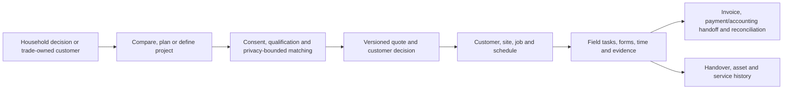

# Executive product summary

Audit date: 21 July 2026 (Australia/Sydney) 
Final repository checkpoint: `ff3c8efe3d5e501286d8e83e28086d6d4590be27` 
Deployed application: Sites version 199 from implementation `4a5cd19dda6f86896cfc751f5a42aa07f9b4eff5`

## One-sentence product description

Australian Energy Assessments and TLink form a connected Australian household-energy, protected trade-marketplace, customer/job operations and field-work platform that takes a household from comparison or project planning through installer matching, quoting, scheduling, evidence, invoicing, payment status, asset handover and service history.

## What problem it solves

Households face fragmented tariffs, technical upgrade choices, assessment pathways, scheme rules and difficulty finding an appropriate trade. Growing trade businesses then repeat the same customer, scope, schedule, evidence and commercial data across spreadsheets, phones, field staff, accounting systems and payment providers. The product attempts to keep that work in one authoritative workflow while delaying disclosure of household identity until an authorised match/handoff.

This is a real multi-domain product, not only a marketing site and not only a CRM. `README.md:3` and `docs/RELEASE_TRUTH.md:9-14` identify four connected surfaces:

- AEA household comparison, planning, scenarios, guides, rebates, assessments and accounts;
- TLink's privacy-protected household-to-installer marketplace;
- TLink's installer/wholesaler operating platform;
- the AEA Field native technician application.

## Industry, geography and customers

The principal market is Australian residential energy/electrification and trade operations. The software includes explicit NSW BASIX content, national NatHERS content, electricity/gas product data and state/territory-dependent electrical work. Likely customers and beneficiaries are households, small-to-growing electrical/energy trade businesses and selected wholesalers. Large-enterprise capabilities remain planned.

The repository cannot establish the legal entity, Privacy Act coverage, accreditation, licences, insurer status, customer contracts or exact jurisdictions actually offered. Those are owner/expert decisions, not facts inferable from code. `02_INDUSTRY_BUSINESS_AND_GLOSSARY.md` therefore treats regulatory topics as applicability questions rather than compliance certifications.

## Important roles

| Role | Principal outcome | Current authority boundary |
| --- | --- | --- |
| Household visitor | Compare energy, model options and start a bounded brief | Public routes; selected NEM12 processing remains browser-local |
| Customer/account holder | Control projects, quotes, appointments, evidence and assets | Firebase identity plus customer/project/object checks |
| Assessor | Collect/model evidence and issue authorised assessment output | Public explanatory flow exists; actual accreditation/authority is `UNKNOWN` |
| Installer owner/office user | Run customers, jobs, quotes, schedule, invoices, providers and aftercare | Owner-scoped TLink records and role checks |
| Technician | Execute assigned field work, forms, time and evidence | Assignment-scoped web/mobile APIs; native distribution remains `BLOCKED` |
| Wholesaler | Maintain selected catalogue/fulfilment records | Supplier boundary; no household-opportunity access by stated policy |
| Administrator/reviewer | Verify participants, triage exceptions and operate governance queues | Admin role on the protected control centre/API |
| Business owner administrator | Control admin access and operations | Highest-value Firebase identity; now has deployed broad Database Console access |
| Regulators/scheme/certifying authorities | Set market, privacy, assessment, safety and scheme rules | External; not controlled by the application |

## Principal end-to-end workflow

The intended commercial advantage is less office re-entry and faster movement from lead to completed, evidenced work. Current product strategy makes core tools free for verified trades and uses marketplace/supply participation to drive value instead of a standard paid-seat gate (`ROADMAP.md:177-195`; `src/app/direct-trade/membership/page.tsx:26-65`). Historical paid subscribers and payment-provider workflows still require explicit commercial treatment.

## Information and records stored

The system models contact and business identity, service/property addresses, customer/project/opportunity/consent records, capability and verification, customers/sites/jobs, appointments/team time, quote versions and acceptance, invoice lines/GST/credits/allocations, payment/provider references and status, messages/delivery events, forms/tasks, photos/PDF evidence, assets/handover/service history, admin audit and operational telemetry. The privacy page describes many of these classes at `src/app/privacy/page.tsx:19-43`.

This includes personal information, operational secrets and financial/accounting records. It is designed not to store raw payment-card data, but current Sites policy separately prohibits a Site from enabling or facilitating financial transactions. The product also contains assessment/electrical/scheme-related evidence whose exact retention and authority depend on the actual service and jurisdiction.

## Major modules and actual status

| Module | Evidence-based current status | What that means |
| --- | --- | --- |
| Public guidance, household plan, scenarios, rebates and assessment education | `IMPLEMENTED, NOT DEPLOYMENT-VERIFIED` by this audit for individual routes | Source/tests exist; current content completeness and every route's live behavior were not exhaustively probed |
| Electricity/gas comparison | `IMPLEMENTED, NOT DEPLOYMENT-VERIFIED` for full current journey | Engines/APIs/tests exist; two real-NEM12 fixture tests skipped and sampled current result reconciliation was not run |
| Protected Direct Trade marketplace | `VERIFIED DEPLOYED` by dated historical release records; current edge cases `PARTIAL` | Matching/contact/quote handoff is substantial; runtime data and participant qualifications were not independently inspected |
| Customer account/projects/quotes/appointments/assets | Mixed `VERIFIED DEPLOYED` release records and `PARTIAL` full-journey proof | Broad customer surfaces exist; recovery, export, deletion and every end-to-end state remain unproven |
| TLink customer/job/schedule/quote/field/invoice platform | Broadly `VERIFIED DEPLOYED`; complete replacement claim `PARTIAL` | Current release lineage is deep; roadmap still identifies incomplete offline/provider/supply/enterprise gates |
| Accounting, calendar, email, SMS and payments | `PARTIAL` | Adapters/readiness states exist; environment revision 18 shows only a subset of configuration keys and account/provider reality remains provider-specific |
| Native technician app | `BLOCKED` for distribution | Source/type tests exist; Apple/Google accounts, signing/mobile Firebase files and physical-device acceptance are not proven |
| Wholesaler purchasing | `PARTIAL`; primary Installer Orders UI `DEAD OR UNREACHABLE` by product decision | Records/APIs remain; primary navigation was deliberately removed pending real-user validation |
| Owner Database Console | `VERIFIED DEPLOYED` in Sites v199; design recommendation is withdrawal | Owner can browse 145 tables; three tables allow generic one-row insert/delete. Broad default-visible PII/schema access and domain-bypass/recovery gaps make this unsuitable admin architecture |
| Embedded AI | `PLANNED ONLY` | Current product has conventional navigation/search/help, not a deployed AI agent |
| Owner-controlled backup/restore/DR | `UNKNOWN` | No complete independent D1/R2 export, backup, PITR or restored application was proven |

The complete feature-by-feature matrix is `03_PRODUCT_FEATURE_AND_WORKFLOW_STATUS.md`; it distinguishes source, test, configuration, release record and runtime proof.

## Backend, data and runtime

The web application is a TypeScript/React/Next-compatible modular monolith packaged through Vinext for a Cloudflare Worker. The audited tree contains 94 API route files representing 197 exported HTTP operations, one Worker entry point and one Sites/Worker cron schedule that dispatches two jobs. Separate source defines two Google Apps Script time-based jobs/triggers (daily lead follow-ups and hourly operational health checks) plus one Expo/OS-managed field-sync background task; their live trigger/device state is `UNKNOWN`. The server uses Drizzle with a SQLite/D1 schema of 145 regular application tables, five FTS virtual tables, 16 triggers and 79 production SQL migrations. It stores binary evidence in R2 and uses Firebase Authentication. The native Expo application keeps an encrypted local SQLite cache and synchronises through server-authoritative APIs.

The database has **no declared foreign keys**; relationships and tenancy are application-enforced. The Drizzle journal contains 68 entries while 79 production SQL migrations exist. A clean local replay of all 79 passed, but upgrade history, deployed migration ledger, restore and referential integrity are separate unknowns.

## Where it is hosted and who controls it

| Component | Current host/control evidence | Owner-control conclusion |
| --- | --- | --- |
| Public web and server APIs | ChatGPT Sites production deployment compiled into a Cloudflare Worker; canonical `compare.ausenergyassessments.com` | Sites/ChatGPT workspace controls deployment; exact owner/billing/transfer continuity is not fully proven |
| Relational data | Sites-managed Cloudflare D1 binding `DB` | Application can access it; independent owner Cloudflare-account query/export/PITR/restore is `UNKNOWN` |
| File/evidence storage | Sites-managed R2 binding `EVIDENCE` | Application can access it; independent inventory/export/restore is `UNKNOWN` |
| Identity | Firebase Authentication | Application verifies tokens; Firebase project ownership/settings/MFA/revocation/billing evidence was inaccessible |
| DNS/TLS/CDN | Canonical domain resolves through Sites/Cloudflare and served HTTPS/security headers on 21 July | Registrant/billing/admin/renewal authority was not fully evidenced in the audit |
| Source | Public GitHub repository `AusEnergyProjects/Webapppro`, final branch/upstream `codex/sites-custom-domain-migration` | Authenticated viewer reported ADMIN; branch protection/CI/release approvals were not proven |
| Email/calendar/accounting/payments | Google/Resend/Twilio/Xero/MYOB/QuickBooks/Microsoft/Stripe/Square adapters and provider records | Readiness differs by provider; missing credentials/accounts are `UNKNOWN` or explicitly absent, never inferred from code |
| Monitoring | Worker logs/route samples plus documented Apps Script/Google Workspace monitoring | Current external monitor operation, retention and two-person operational ownership are `UNKNOWN` |

Official Sites documentation says management is through ChatGPT web/desktop; it does not establish a standalone management CLI/IDE surface, independent bound-resource ownership/export or workspace-outage continuity. The application Database Console is inside the same dependency boundary and cannot substitute for provider-level control.

## What the product properly is

It is a **combination** of:

- consumer energy-comparison and planning application;
- assessment education/intake surface;
- privacy-protected lead/marketplace system;
- multi-role CRM and trade workflow/field-service platform;
- customer portal;
- quoting, scheduling, invoice/payment-status and asset/service system.

Calling it only a CRM understates the workflow and industry scope. Calling it a complete trade-management replacement overstates verified provider, mobile, recovery, supply and operational readiness.

## Technical and operational maturity

Implementation maturity is unusually broad for the repository age: strong typed server boundaries, owner/role scoping, immutable commercial concepts, integer-cent money, 100 executable test modules plus the `test/package.json` support manifest, and a fast green suite. This audit recorded three full test runs across the coordinating and specialist streams at the application snapshot: each found 699 tests, 697 pass, zero fail and two fixture-dependent skips. ESLint, root/mobile TypeScript, 11 focused console tests and replay of all 79 migrations also passed.

Operational maturity is lower. There is no tracked enforced CI workflow, proven staging/promotion chain, complete browser E2E/assistive-technology suite, durable owner-accessible telemetry history, SLO, capacity proof, complete provider acceptance, independent backup/restore or DR exercise. Current `/api/health` is liveness, not dependency readiness. Rapid concurrent commits/releases during this audit also demonstrated that narrative status and audited state can drift within minutes.

## Ten highest risks

1. **Sites financial-transaction prohibition:** deployed code can create Stripe/Square checkouts; enabling it on Sites is blocked pending written provider/legal confirmation or migration (AUD-PLAT-001).
2. **No independent recovery proof:** D1/R2 export, owner-held backup, PITR and full restore are unknown despite use as operational system of record (AUD-DATA-002).
3. **No Sites residency:** official help says code, D1/R2, artifacts and logs have no data/inference residency at launch (AUD-DATA-001).
4. **Workspace/vendor continuity:** transfer, account-loss behavior, non-AI management and second-administrator recovery are unproven (AUD-OPS-001).
5. **Deployed generic Database Console:** one owner can enumerate/browse 145 tables across tenants and mutate three tables outside domain services; withdraw it (AUD-SEC-001).
6. **Privacy/retention/breach governance:** controller/entity coverage, countries, retention/deletion/subject requests and NDB response are incomplete (AUD-PRIV-001).
7. **Data integrity:** no foreign keys, 11 migrations absent from Drizzle journal, and no proven D1/R2 referential restore (AUD-DATA-003/AUD-DATA-005).
8. **High-privilege identity/security gaps:** Firebase revocation/MFA/session controls are unproven, no CSP is deployed, exhaustive route/object auth testing is incomplete, and an unguarded synthetic CLI defaults to the application Firebase project (AUD-SEC-002/003/004, AUD-OPS-003).
9. **Regulated/industry authority:** live accreditation, licensing, consent, certificate/scheme evidence and claim substantiation are unknown or partial (AUD-COMP-001/AUD-COMM-001).
10. **Operations/provider proof:** integrations, CI, staging, load, alert retention, restore and full critical journeys are materially less proven than source/test breadth (AUD-INT-001/AUD-OPS-002/AUD-QA-001).

## Shortest credible path to owner-controlled production

1. Block payment initiation on Sites and withdraw the generic Database Console while preserving release/audit evidence.
2. Name the legal/billing/data/security owners and two human administrators; obtain written Sites/D1/R2 ownership/export/transfer answers.
3. Prove complete D1/R2 export, encrypted owner-held backup and isolated restore with counts, hashes and business invariants.
4. Resolve privacy/residency, regulated-service/qualification and claims boundaries; disable unsupported services/jurisdictions.
5. Select an owner-controlled managed target from requirements, not preference: retain the modular monolith, use managed PostgreSQL, versioned object storage, owner-controlled identity/secrets, durable jobs/queues, observable CI/CD and Australian-region controls where required.
6. Reconcile migration metadata and relationships, build repeatable full/delta import, and prove selected provider journeys in sandbox/staging.
7. Pass tenant/security, accessibility, load, observability, backup/restore and rollback gates; run shadow parity; cut traffic only after signed reconciliation.
8. Keep Sites as a bounded read-only fallback only for an approved window, then archive evidence and decommission through a separately authorised process.

`19_FORMAL_ROADMAP.md` defines measurable gates, staffing scenarios and stop conditions without assigning unevidenced dates.

## Plain-English verdict

The software is a capable and rapidly developed trade/energy platform, but the **present combined hosting arrangement is not suitable for a business-critical production CRM**. The blocker is not simply D1 performance: it is the combination of Sites transaction policy, unavailable residency, unproven owner control/export/restore/transfer, beta/workspace dependency and incomplete operational assurance. The audit verdict is therefore **`MIGRATE THE COMPLETE PRODUCTION APPLICATION`**, preserving the current modular-monolith design and avoiding unnecessary microservices or Kubernetes.
