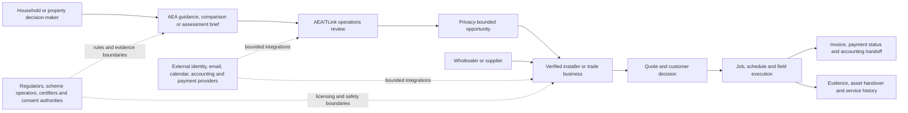

# Industry, business and glossary audit

Audit date: 21 July 2026 (Australia/Sydney) 
Jurisdictional scope: Australia, with explicit NSW-specific BASIX content and state/territory-dependent electrical work 
Legal status: technical compliance-gap analysis, not legal, tax, planning, accreditation or electrical-safety advice

## Plain-language industry primer

This repository spans three adjacent markets rather than one regulated service:

1. **Household energy decisions.** A consumer can compare electricity or gas offers, interpret interval-meter data, model electrification, solar and battery scenarios, and read guidance. Plan comparison uses public product-reference data and estimates; it is not retail energy supply or personal financial advice (`README.md:23-61`).
2. **Residential energy assessment and project preparation.** Public pages explain NatHERS pathways and NSW BASIX and can start a privacy-bounded brief. The site does not presently accept assessment documents through that public page and explicitly labels secure online document review as future work (`src/app/assessments/page.tsx:42-54`). Accreditation, certificate authority and the development-approval pathway remain outside the software unless separately evidenced.
3. **Trade marketplace and operations.** TLink takes a household brief through controlled matching and contact release, then provides trades with customer, job, schedule, quote, field-evidence, invoice, payment-status, asset and service records. It also exposes wholesaler catalogue and fulfilment concepts. `README.md:3` and `docs/RELEASE_TRUTH.md:9-14` explicitly describe four connected product surfaces: AEA household planning, TLink protected marketplace, TLink trade operations and the AEA Field native app.

The business model recorded in the repository is not a normal subscription CRM. Verified trades receive core operating tools for A$0; value is intended to come from a useful trade workflow and marketplace/supply participation rather than gating core tools behind paid membership (`ROADMAP.md:177-195`; `src/app/direct-trade/membership/page.tsx:26-65`). Historical subscribers and provider transaction flows remain material commercial and policy boundaries.

## Value chain and actor map

| Actor | What they need | Authority and boundary evidenced in the product | Material unknown |
| --- | --- | --- | --- |
| Household visitor | Understand costs and options without surrendering unnecessary data | Public comparison, plan, guide, rebate and assessment routes; the NEM12 flow is intended to parse locally (`README.md:23-61`) | Whether every current tariff, rebate and claim is complete for the visitor's location and circumstances |
| Customer/account holder | Keep projects, quotes, appointments, files and assets; decide who receives contact details | Firebase-authenticated customer routes and explicit protected-contact handoff (`src/app/privacy/page.tsx:19-27`) | Current production identity recovery, retention and complete export behavior |
| Property owner, renter or authorised representative | State authority to request work and consent to disclosure | Direct Trade flow records property authority before allocation (`README.md:74`) | Legal sufficiency for each property/tenure and project type |
| Assessor | Collect evidence, model a dwelling and issue only evidence they are authorised to issue | Public content distinguishes design, existing-home and BASIX pathways (`src/app/assessments/page.tsx:11-37`) | Identity, accreditation, software certificate and quality-assurance evidence for the actual service provider |
| Installer/trade owner | Acquire suitable work and run customers, jobs, quotes, schedules, invoices and aftercare | Owner-scoped TLink web workflows and provider-neutral records | Exact licences, insurance, geographic coverage and provider accounts for each participating business |
| Office worker/dispatcher | Schedule, communicate, reconcile and handle exceptions | Role-gated installer workspaces and central notifications | Formal permission catalogue, training and operational coverage outside business hours |
| Technician | Complete assigned work and evidence in the field | Native/mobile sync contract and assignment boundary | Store distribution, physical-device acceptance and offline recovery remain externally blocked |
| Wholesaler/supplier | Publish approved catalogue data and fulfil selected items without receiving household leads | Privacy page says wholesalers do not receive household opportunity details (`src/app/privacy/page.tsx:26-27`) | Live supplier participation, stock authority and reconciliation coverage |
| Administrator/reviewer | Verify parties, triage exceptions and maintain platform governance | Protected operations control centre and admin APIs | Named operational owner, separation of duties and emergency access procedure |
| Business owner administrator | Control admin access and inspect bounded records | Owner-only database console exists at audited HEAD; its production state changed during the audit | Independent database/storage control, export, restore and platform transfer rights |
| Regulators/scheme operators/consent authorities | Define market, privacy, safety, assessment and scheme rules | External primary sources below | Applicability depends on entity, activity, location, contract and facts not present in the repository |

## Business workflow catalogue

| Workflow | Inputs and decisions | Handoffs | Records and outputs | Failure states and controls | Product traceability |
| --- | --- | --- | --- | --- | --- |
| Electricity comparison | Postcode/NMI, customer type, usage or local NEM12, tariff assumptions and eligibility | Browser model -> product-reference API -> ranking -> optional email/lead | Derived usage profile, plan results, assumptions and optional lead | Bad/incomplete interval data, stale retailer data, unsupported tariff, estimation error; disclose assumptions and preserve reproducibility | `/compare`, `/compare/electricity-next`, `/api/electricity-plans`; detailed in `03_PRODUCT_FEATURE_AND_WORKFLOW_STATUS.md` |
| Gas comparison | Postcode/distributor, annual MJ/profile and discount choice | Browser -> gas plan endpoint -> estimate | Ranked annual estimates and optional enquiry | Distributor/calendar mismatch, conditional discount, stale plan data | `/gas-compare`, `/api/gas-plans` |
| Upgrade scenario | Existing load, equipment, solar/battery sizes, costs and location assumptions | Model -> consumer review -> quote/brief | First-year bill-saving scenario and bounded handoff | Not a lifetime return; roof, finance, warranty, degradation, export and compatibility omitted unless separately entered (`README.md:47-53`) | Household plan and scenario components |
| Assessment enquiry | Building stage, location, pathway, plans/specifications or site evidence | Customer -> assessor -> certifier/council/consent authority where applicable | Rating, certificate, commitments or advice according to pathway | Wrong pathway, incomplete plans, uncontrolled design changes, unaccredited work; public upload is deliberately unavailable (`src/app/assessments/page.tsx:46-54`) | `/assessments`, `/direct-trade` brief |
| Protected marketplace | Scope, postcode, authority, capability, consent and customer choice | AEA operations -> bounded installer shortlist -> quote -> contact release | Opportunity, match, disclosure, quote, decision and audit records | Over-disclosure, unsuitable installer, no response, stale opportunity; capped matching and explicit release are documented (`README.md:74`) | Direct Trade/customer/installer/admin routes |
| Direct trade job | Customer/site, scope, team, schedule and evidence request | Office -> technician -> customer -> office | Customer, job, appointment, tasks, forms, evidence and status history | Duplicate customer, schedule conflict, offline conflict, incomplete evidence, unauthorised record | Trade CRM, schedule and field APIs |
| Quote and acceptance | Versioned scope, prices, GST, terms and recipient consent | Trade -> customer -> accepted commercial snapshot | Quote versions, questions, consent and acceptance | Stale version, wrong customer, delivery failure, ambiguous acceptance | Quote APIs and customer/token review surfaces |
| Invoice/payment/accounting handoff | Accepted scope or quick-invoice lines, integer-cent totals, GST, provider selection | TLink -> customer/provider -> verified callback -> reconciliation | Invoice, revisions, credits, allocations, payment attempt/status and provider references | Duplicate request, callback spoof/replay, partial sequence, provider mismatch; TLink remains source of truth | Quick-invoice, payment-link, accounting and webhook routes |
| Field evidence/handover | Assigned work, forms, photos/files, approvals, sign-off and asset details | Technician -> office review -> customer | Append-only evidence, decisions, handover, asset/service history | Unsafe file, loss of assignment, offline queue conflict, orphan object, incomplete retention | Mobile sync, evidence and asset routes; R2 binding |
| Service/aftercare | Asset, due date, consent, channel and owner | TLink -> customer -> provider callback/office exception | Reminder preparation/delivery, service event and audit history | Unapproved SMS sender, delivery failure, stale contact/consent | Follow-up and delivery APIs/runbooks |
| Supplier fulfilment | Approved supplier, products, price/stock, selected quantities | Wholesaler -> installer -> purchase/receipt/warranty | Catalogue, selection, enquiry, PO/fulfilment and warranty records | Stale catalogue, no live stock authority, household-data leakage, unreconciled cost | Marketplace/purchasing routes; primary Orders UI is deliberately withdrawn |

## Product-to-business traceability

| Business outcome | Authoritative product records | External authority/source | Current evidence status |
| --- | --- | --- | --- |
| Household receives a reproducible energy estimate | Input assumptions, derived interval profile, plan product/version and ranked result | AER product-reference data; retailer source payloads | `PARTIAL`: calculation code/tests exist; current completeness and production result accuracy require sampled reconciliation |
| Household reaches an appropriate, qualified trade | Authority/consent, limited opportunity, capability/coverage, quote and contact release | State/territory licensing registers; trade insurance/accreditation records | `PARTIAL`: controlled workflow exists; live qualification currency is not independently proven here |
| Assessment output is valid for its use | Client consent, assessor identity/accreditation, input evidence, software/version, certificate and changes | NatHERS administrator, NSW Planning Portal, certifier/consent authority | `UNKNOWN`: educational pages exist, but operational assessment evidence was inaccessible |
| Trade can run work without duplicate entry | Customer/site/job, schedule, quote, field, invoice, asset and provider-reference ledgers | Connected calendar/accounting/payment systems | `PARTIAL`: broad implementation; several provider credentials and end-to-end sandbox proofs are absent or mixed |
| Financial status remains auditable | Integer-cent TLink commercial records, immutable references, signed callbacks, reconciliation | Accounting/payment provider statements and tax records | `PARTIAL`: code and tests exist; Sites policy compatibility and live provider reconciliation need confirmation |
| Customer evidence remains recoverable and private | D1 metadata, R2 object keys, access/audit/retention/deletion records | Privacy notices/consents; independent backups | `UNKNOWN`: binding access is not proof of owner export, backup, restore or residency |

## Current primary-source applicability register

Sources were checked on 21 July 2026. “Repository evidence” shows why a topic may apply; it does not establish legal applicability. “Expert required” identifies the smallest external determination still needed.

| Requirement/topic | Meaning, jurisdiction and affected workflow | Primary source, section/version | Repository evidence and product impact | Audit status / confidence | Expert confirmation required |
| --- | --- | --- | --- | --- | --- |
| Privacy Act and APP coverage | A covered entity must handle personal information under the Australian Privacy Principles. Coverage depends on entity/turnover and statutory exceptions; some small businesses are covered. Commonwealth; all account, lead, customer, job, evidence, staff and provider workflows | [Privacy Act 1988, latest compilation](https://www.legislation.gov.au/C2004A03712/latest); [OAIC small-business guidance](https://www.oaic.gov.au/privacy/privacy-guidance-for-organisations-and-government-agencies/organisations/small-business), checked 21 July 2026 | The application says it holds contact, address, job, quote, invoice, payment-status, audit and file data (`src/app/privacy/page.tsx:19-23`) | `UNKNOWN`, high confidence that data is personal; low confidence on entity coverage | Privacy lawyer/owner: legal entities, related bodies, turnover, services and exception analysis |
| APP transparency, access/correction and security | If covered, APPs address open and transparent management, notice, use/disclosure, access/correction and security. Commonwealth; all personal-data workflows | [OAIC APP guidelines, updated 13 May 2026](https://www.oaic.gov.au/privacy/australian-privacy-principles/australian-privacy-principles-guidelines); [Australian Privacy Principles](https://www.oaic.gov.au/privacy/australian-privacy-principles/read-the-australian-privacy-principles) | A privacy page exists and offers access/correction contact (`src/app/privacy/page.tsx:43,95-100`), but controller identity, detailed retention, countries and complaint process are not fully evidenced | `PARTIAL`, high | Privacy counsel and accountable privacy officer to approve notice/data map/retention schedule |
| Cross-border disclosure | APP 8 can make an APP entity accountable for overseas recipients, subject to exceptions. Commonwealth; Firebase, Sites, email, calendar, accounting/payment and support flows | [OAIC APP 8 guideline](https://www.oaic.gov.au/privacy/australian-privacy-principles/australian-privacy-principles-guidelines/chapter-8-app-8-cross-border-disclosure-of-personal-information) | Official Sites evidence records no data/inference residency at launch for Site code, D1/R2, artifacts and logs (`06_HOSTING_OWNERSHIP_AND_CRM_SUITABILITY.md:103-116`; official-source index `20_EVIDENCE_INDEX_AND_COMMAND_LOG.md:178-182`); `.openai/hosting.json:1-5` proves only logical managed bindings, not location or owner export | `NOT EVIDENCED`, high for missing residency; applicability follows Privacy Act determination | Privacy counsel plus provider contract/data-location review |
| Notifiable Data Breaches | Covered entities must assess and notify eligible data breaches under the NDB scheme. Commonwealth; identity, CRM, evidence, integration and admin incidents | [OAIC Data breach preparation and response, Part 4](https://www.oaic.gov.au/privacy/notifiable-data-breaches/preventing-preparing-for-and-responding-to-data-breaches/data-breach-preparation-and-response/part-4-notifiable-data-breach-ndb-scheme) | Sensitive operational records and files exist; `OPERATIONS_RUNBOOK.md:87-121` covers monitor/delivery incident repair, while a tracked-filename search for `incident`, `breach`, `security` or `cyber` Markdown runbooks returned zero dedicated breach/NDB files | `NOT EVIDENCED`, medium | Privacy/security counsel after coverage determination; designate incident decision-maker |
| Spam consent and unsubscribe | Commercial electronic messages generally require consent, sender identification and functional unsubscribe. Commonwealth; lead, quote, service, reminder and marketing emails/SMS | [ACMA: Avoid sending spam](https://www.acma.gov.au/avoid-sending-spam) | Structured consent receipts (`db/schema.ts:2419-2430`), notice-version receipt creation (`src/app/api/customer-account/route.ts:91-114`), delivery/provider-event ledgers (`db/schema.ts:867-932`) and current consent/opt-out checks (`src/lib/appointment-notification-server.ts:36-104,112-157,180-200`) exist; every message classification and live provider path was not reconciled | `PARTIAL`, medium-high | Marketing/compliance owner to classify transactional vs commercial templates and retention evidence |
| Do Not Call rules | Telemarketing calls/faxes to registered numbers are restricted unless an exception applies; calling standards may apply. Commonwealth; sales/contact-attempt workflows | [ACMA: Do Not Call Register](https://www.acma.gov.au/do-not-call-register) | Marketplace permits bounded installer contact attempts after controlled handoff (`README.md:74`) | `UNKNOWN`, medium | Counsel/operations owner to classify calls, consent and calling process |
| Misleading or deceptive conduct | Businesses must not make false or misleading claims; overall impression and substantiation matter. Australia; comparisons, savings, price, rebate, accreditation and environmental claims | [Competition and Consumer Act 2010, Schedule 2 Australian Consumer Law, s 18](https://www.legislation.gov.au/C2004A00109/latest); [ACCC false or misleading claims guidance](https://www.accc.gov.au/consumers/advertising-and-promotions/false-or-misleading-claims) | Comparison ranks and scenario outputs can influence expenditure; README labels scenario costs as placeholders (`README.md:47-53`) | `PARTIAL`, high | Consumer-law review of current pages, assumptions, ranking, testimonials and commercial influence |
| Environmental/sustainability claims | Environmental benefit claims should be accurate, specific, substantiated and not omit important qualifications. Australia; electrification, emissions, solar/battery and assessment content | [ACCC environmental and sustainability claims guidance](https://www.accc.gov.au/consumers/advertising-and-promotions/environmental-and-sustainability-claims) | Guides and scenario outputs concern energy/emissions; exact tracked-content and filename searches for an environmental/marketing claim inventory or substantiation register both returned zero matches across `src`, `db`, `test` and `README.md` (commands recorded in report 20). This does not assert that no individual claim is substantiated | `NOT EVIDENCED`, medium-high | Consumer-law/content specialist to approve a claim-and-source register |
| Retail energy product-reference data | AER exposes Energy Made Easy product data without requiring accreditation, with request/version/record limits; Victoria uses separate source arrangements. National Energy Retail Law jurisdictions plus Victoria-specific data; electricity/gas comparison | [AER Energy Product Reference Data](https://www.aer.gov.au/energy-product-reference-data), API list v1/detail v3 at check date | `/api/electricity-plans` and `/api/gas-plans` retrieve plan data; coverage and version currency require operational reconciliation | `PARTIAL`, high | Energy-market specialist to validate jurisdiction, offer eligibility and ranking completeness; legal review if representing a comparison service |
| NatHERS existing-home assessor policy and client consent | Existing-home assessments use the scheme's accredited pathway; from 1 July 2026 updated policies/forms require client consent, separate consent for other services, conflict disclosure and seven-year record retention. Australia; existing-home assessments | [NatHERS updates to Existing Home Assessor policies and consent forms, effective 1 July 2026](https://www.homeenergyrating.gov.au/news/updates-existing-home-assessor-policies-and-consent-forms) | Existing-home rating is marketed (`src/app/assessments/page.tsx:19-26`); no operational accreditation/consent/retention records were accessible | `NOT EVIDENCED`, high | NatHERS administrator/accredited-assessor and counsel confirmation before delivery |
| NatHERS new-home certificate | A NatHERS certificate documents modelled performance through an accredited tool/pathway; it is one input to the relevant approval process. Australia; design assessment | [NatHERS: Understanding your new home's certificate](https://www.homeenergyrating.gov.au/households/new-homes/understanding-your-new-homes-certificate) | Page describes certificate and keeps the approval authority separate (`src/app/assessments/page.tsx:11-16,50-52`) | `EVIDENCED` for explanatory boundary, `UNKNOWN` for operational delivery; medium-high | Accredited assessor/certifier to verify workflow, software and accepted certificate |
| BASIX | NSW BASIX applies through the planning pathway to specified residential development and records commitments/certificate. NSW; new dwellings and qualifying alterations/additions/pools | [NSW Planning Portal: Starting a BASIX application](https://www.planningportal.nsw.gov.au/basix/about-basix/starting-basix-application); [alterations and additions](https://www.planningportal.nsw.gov.au/basix/dwelling-types/alterations-and-additions) | Page makes NSW limitation and thresholds explicit (`src/app/assessments/page.tsx:31-37`) | `PARTIAL`, high for content boundary, unknown for actual project eligibility | NSW planner/certifier/assessor for each development/application |
| Electrical work licensing | Electrical contracting and electrical work require the relevant state/territory licence; classes and certificate duties differ. Each state/territory; installation and service work | Official licensing sources: [NSW](https://www.fairtrading.nsw.gov.au/trades-and-businesses/construction-and-trade-essentials/electricians), [Queensland](https://www.worksafe.qld.gov.au/licensing-and-registrations/electrical-licences/classes-of-licences), [South Australia](https://www.sa.gov.au/topics/business-and-trade/licensing/building-and-trades/licensing), [Victoria](https://www.energysafe.vic.gov.au/licensing/electrical-licences/licence-types/registered-electrical-contractors-rec), [Tasmania](https://www.service.tas.gov.au/services/working-in-tasmania/occupational-licences-and-certificates/apply-for-an-electrical-practitioner-licence/), [ACT](https://www.planning.act.gov.au/professionals/regulation-and-responsibilities/construction-licences), [Western Australia](https://www.wa.gov.au/organisation/service-delivery/electrical-licensing), [Northern Territory](https://worksafe.nt.gov.au/licensing-and-registration/electrical-licensing/electrical-contractor-licence) | Generic verification category/expiry/status exists (`db/schema.ts:153-167`; `src/app/api/trade-verification/documents/route.ts:8-13,128-180`) and allocation gates approved capability (`src/app/api/admin/opportunities/matches/route.ts:61-120`); exact schema/source searches found no structured licence number/class/jurisdiction rules | `PARTIAL`, high that licensing matters; low on each participant | State/territory electrical regulator or licensing counsel; operations owner for register checks and expiry response |
| Electrical certificates/compliance records | Jurisdictions can require prescribed electrical safety/compliance certificates and record/customer delivery. State/territory; job completion and handover | Example primary source: [South Australia certificates of compliance](https://www.sa.gov.au/topics/energy-and-environment/safe-energy-use/certificates-of-compliance); use the applicable regulator for each job | Handover compliance/document records use generic template/category fields (`db/schema.ts:677-709`); exact schema/API/library/test searches found no jurisdiction-specific certificate number/type, enforcement or retention fields | `UNKNOWN`, medium | Licensed contractor and local regulator for each job location/type |
| Small-scale renewable energy scheme and installer eligibility | STCs and eligible solar/battery installations depend on scheme rules, approved components, accredited persons and evidence. Commonwealth; solar/battery quotes and installations | [CER installer and designer requirements](https://cer.gov.au/schemes/renewable-energy-target/renewable-energy-target-participants-and-industry/solar-battery-installers-and-designers); [CER solar batteries](https://cer.gov.au/schemes/renewable-energy-target/small-scale-renewable-energy-scheme/small-scale-renewable-energy-systems/solar-batteries); [STC entitlement calculation](https://cer.gov.au/schemes/renewable-energy-target/small-scale-renewable-energy-scheme/small-scale-technology-certificates/calculate-small-scale-technology-certificate-entitlements) | README models an indicative federal battery discount and warns it is not eligibility or a quote (`README.md:49-53`) | `PARTIAL`, high | CER-accredited practitioner/scheme specialist and legal review of each public claim |
| Cheaper Home Batteries Program | Federal battery support is subject to current program eligibility and implementation rules. Australia; battery scenarios/quotes | [DCCEEW Cheaper Home Batteries Program](https://www.dcceew.gov.au/energy/programs/cheaper-home-batteries); [Renewable Energy (Electricity) Regulations 2001](https://www.legislation.gov.au/F2001B00053/latest) | Scenario uses dated factors and editable inputs (`README.md:49-53`) | `PARTIAL`, medium-high | Scheme specialist to verify date/location/system eligibility and calculation at quote time |
| GST and business records | GST/tax records ordinarily require evidence and retention; the specific obligation depends on entity/transaction. Australia; quotes, invoices, credits, payments and provider sync | [ATO GST records](https://www.ato.gov.au/api/public/content/0-9354073c-055a-4d41-bd51-b7d9e6b4e834), checked 21 July 2026 (generally five years) | TLink stores quotes, invoices, GST, credits and allocations (`src/app/privacy/page.tsx:19-23`) but owner export/retention/restore are unproven | `NOT EVIDENCED` for complete retention, high | Registered tax agent/accountant and owner to define authoritative ledger/export/retention |
| Accessibility | The Disability Discrimination Act can apply to access to goods/services; WCAG 2.2 AA is current standards guidance, not itself proof of statutory compliance. Australia; all public/customer/staff interfaces | [Disability Discrimination Act 1992](https://www.legislation.gov.au/C2004A04426/latest); [Australian Human Rights Commission web accessibility guidance](https://humanrights.gov.au/?a=68429); [W3C WCAG 2.2](https://www.w3.org/TR/WCAG22/) | Static focus-visible/forced-colour (`test/site-navigation.test.mjs:98-107,123-130`), keyboard/date (`test/date-picker.test.mjs:24-39`), dialog/focus-return (`test/native-electricity-route.test.js:35-40`) and scheduling semantics (`test/trade-team-scheduling.test.mjs:172-180`) tests exist; exact `axe|pa11y|lighthouse|screen.?reader|assistive.?technology|wcag` search across package/test/CI returned zero acceptance harnesses | `PARTIAL`, high | Accessibility specialist and users of assistive technology before broad release |
| Electronic acceptance/signatures | Electronic communications and signatures can be recognised subject to consent, reliability and transaction-specific exclusions; state/territory laws may also apply. Commonwealth and relevant jurisdiction; quote acceptance, consents, sign-off | [Electronic Transactions Act 1999](https://www.legislation.gov.au/C2004A00553/latest) | Capability-link quote access hash/expiry/revocation/version checks exist (`src/app/api/quote-review/[token]/route.ts:21-41`); acceptance requires signer/confirmation, stores exact statement/totals, invalidates the secret and writes an event (`src/app/api/quote-review/[token]/route.ts:95-116`; `db/schema.ts:1528-1558`; `test/trade-crm-quotes.test.mjs:73-87,103-119`). Transaction/use-specific legal sufficiency was not reviewed | `UNKNOWN`, medium | Commercial lawyer for exact documents, consent and evidence standard |

### Per-topic actor and source-version disposition

This companion register supplies the actor and source-section/version fields for every row above. `UNKNOWN` means the linked primary page or the evidence captured by this audit did not expose a reliable version/effective date; it is not silently treated as current law or guidance.

| Requirement/topic | Affected actor(s) | Source section | Version/effective-date disposition |
| --- | --- | --- | --- |
| Privacy Act and APP coverage | Business/controller legal entity; household, customer, trade, staff and partner data subjects | Privacy Act s 6D and Schedule 1; OAIC small-business coverage guidance | Linked latest compilation and guidance checked 21 July 2026; exact compilation/guidance effective date `UNKNOWN` in captured evidence |
| APP transparency, access/correction and security | Controller/privacy officer; every data subject; service/provider operators | APP 1, 5, 6, 11, 12 and 13; corresponding OAIC guideline chapters | OAIC guideline collection updated 13 May 2026; statute compilation date `UNKNOWN` in captured evidence |
| Cross-border disclosure | Controller/privacy officer; overseas recipient/provider; affected customer, trade and staff data subjects | APP 8; OAIC APP Guidelines Chapter 8 | OAIC guideline collection updated 13 May 2026; transaction-specific destination/contract version `UNKNOWN` |
| Notifiable Data Breaches | Covered entity, incident decision-maker, OAIC and affected individuals | Privacy Act Part IIIC; OAIC Data breach preparation and response Part 4 | Primary guidance checked 21 July 2026; page version/effective date `UNKNOWN` |
| Spam consent and unsubscribe | Message sender, marketing/operations owner and email/SMS recipient | ACMA “Avoid sending spam” consent, identification and unsubscribe guidance | Primary guidance checked 21 July 2026; page version/effective date `UNKNOWN` |
| Do Not Call rules | Calling business/trade, operations staff and called household/customer | ACMA Do Not Call Register rules and industry calling standards landing guidance | Primary guidance checked 21 July 2026; exact applicable exception/standard version `UNKNOWN` |
| Misleading or deceptive conduct | Business/content owner, comparison user, household and trade customer | Australian Consumer Law s 18; ACCC false-or-misleading-claims guidance | Linked latest statutory compilation and guidance checked 21 July 2026; exact guidance version `UNKNOWN` |
| Environmental/sustainability claims | Business/content owner, household/customer and reviewing regulator | ACCC environmental and sustainability claims guidance; ACL substantiation context | Primary guidance checked 21 July 2026; page version/effective date `UNKNOWN` |
| Retail energy product-reference data | Comparator operator/engineer, retailer/data provider, household and small-business user | AER Energy Product Reference Data API list v1 and detail v3 | API versions v1/v3 recorded at the 21 July 2026 check; endpoint-specific current revision after that date `UNKNOWN` |
| NatHERS existing-home assessor policy and client consent | Accredited assessor, client/property authority, scheme administrator and operations owner | NatHERS existing-home assessor policy/consent update | Effective 1 July 2026, as stated by the primary source |
| NatHERS new-home certificate | Accredited assessor, designer/builder, client and certifier/approval authority | NatHERS “Understanding your new home's certificate” guidance | Primary page checked 21 July 2026; page/version effective date `UNKNOWN` |
| BASIX | NSW applicant/owner, assessor/designer, builder and consent/certification authority | NSW Planning Portal starting-an-application and alteration/addition eligibility guidance | Primary pages checked 21 July 2026; threshold/page version effective date `UNKNOWN` |
| Electrical work licensing | Installer/electrician, contracting business, customer, marketplace reviewer and state/territory regulator | Each linked jurisdiction's licence-class/contractor-registration guidance | Eight jurisdiction sources checked 21 July 2026; each licence instrument/class effective date must be confirmed and is `UNKNOWN` here |
| Electrical certificates/compliance records | Licensed worker/contractor, customer, job administrator and local regulator | South Australia certificate-of-compliance guidance as an example; job jurisdiction's actual instrument controls | Example page checked 21 July 2026; each job's governing certificate/version/retention rule `UNKNOWN` |
| Small-scale renewable energy scheme and installer eligibility | Household/system owner, installer/designer, retailer/agent and Clean Energy Regulator | CER installer/designer requirements, solar-battery eligibility and STC calculation guidance | Primary scheme pages checked 21 July 2026; installation-date/component-specific rule version `UNKNOWN` until quote/job review |
| Cheaper Home Batteries Program | Household, installer/retailer, scenario/content owner and scheme administrator | DCCEEW program guidance and Renewable Energy (Electricity) Regulations 2001 | Linked current sources checked 21 July 2026; applicable installation-date factor/version `UNKNOWN` until quote-time confirmation |
| GST and business records | Business/legal entity, finance staff, customer, accountant/tax agent and ATO | ATO GST records guidance, including the generally five-year retention statement | Guidance checked 21 July 2026; entity/record-specific provision and version `UNKNOWN` pending tax advice |
| Accessibility | Disabled and other users, product owner, designer/developer, tester and service provider | Disability Discrimination Act 1992; AHRC web guidance; WCAG 2.2 | WCAG 2.2 W3C Recommendation dated 5 October 2023; statutory/guidance compilation date `UNKNOWN` in captured evidence |
| Electronic acceptance/signatures | Signer/customer, trade/business counterparty, system operator and legal record owner | Electronic Transactions Act 1999 s 10 and transaction-specific exclusions/consent rules | Linked latest compilation checked 21 July 2026; exact compilation and state/transaction-specific effective date `UNKNOWN` |

## Assumptions embedded in the product

These are implementation/business assumptions to validate, not facts established by this audit.

| Assumption | Evidence | Risk if wrong | Required disposition |
| --- | --- | --- | --- |
| A postcode/distributor and product data are enough to find all relevant plans | `README.md:55-61`; plan API routes | Ineligible or missing offer appears preferable | Sample against authoritative retailer/AER records by jurisdiction and customer type |
| A local NEM12 parse plus the selected model faithfully represents billed usage | Comparator code/tests and `README.md:39-45` | Material cost/ranking error | Fixture provenance, billing reconciliation and explicit unsupported-case behavior |
| State-level solar yield and editable installed costs are useful first-pass defaults | `README.md:47-53` | Consumer treats a scenario as a quote/ROI guarantee | Preserve dated source/version, conspicuous omissions and require written site quote |
| A household attestation establishes adequate property authority | `README.md:74` | Unauthorised property/contact/work request | Define evidence by tenancy/project type and escalation path |
| Capability, coverage and administrator verification remain current | Marketplace and admin workflow | Unlicensed/unsuitable trade receives work | Expiry/reverification policy and regulator checks by job jurisdiction |
| Capped matching and later contact release are sufficient privacy controls | `README.md:74`; `src/app/privacy/page.tsx:26-27` | Identity/address leakage or unclear consent | Data-flow/consent test and immutable disclosure ledger review |
| An accepted scope can drive jobs, invoices and provider handoff without re-entry | Trade CRM/invoice release records | Totals/scope diverge across systems | Exact source-to-provider reconciliation and recovery proof |
| Provider callback state is reliable after verification | Payment/accounting/calendar adapters | False paid/sent/synchronised state | Signature/replay/idempotency tests plus sandbox reconciliation |
| D1 and R2 are durable enough because the app has bindings | `.openai/hosting.json` | Irrecoverable business records or vendor lock-in | Prove owner-controlled complete export, independent backup and restore; binding alone is insufficient |
| A business owner can safely use a bounded database console | Database-console code at `4a5cd19` | Accidental integrity/privacy loss or bypass of domain rules | Withdraw the current generic browsing/mutation path. Only if separately justified, replace it with explicit default-deny projected read-only diagnostics and named domain repair commands, with dual control for risky actions and recovery proof. |
| Generic forms/evidence can satisfy every trade and assessment jurisdiction | Form/evidence/workflow modules | Missing mandatory certificate or retention | Jurisdiction/job-type rule catalogue owned by qualified specialists |
| Existing privacy wording covers all entities/providers/countries | `src/app/privacy/page.tsx` | Invalid/incomplete notice or consent | Controller/entity/provider/region/retention/complaint legal review |

## Glossary

| Term | Plain-English meaning in this audit |
| --- | --- |
| AEA | Australian Energy Assessments, the household-facing identity used by the repository. |
| TLink | The protected marketplace and trade operating-platform identity. |
| AEA Field | The native/mobile technician client paired with TLink's server-authoritative sync APIs. |
| CRM | Customer relationship management: customer/contact history and business follow-up. This product is also a workflow, field-service, quoting/invoicing and marketplace system. |
| NMI | National Metering Identifier: identifier for an electricity connection point; personal/context-sensitive when linked to a household. |
| NEM12 | Australian interval-meter data file format used for consumption intervals. It is input evidence, not a retailer bill. |
| NEM | National Electricity Market. |
| CDR | Consumer Data Right. In this repository, references often concern public energy product-reference APIs; that is distinct from consumer-authorised banking/energy data sharing. |
| AER | Australian Energy Regulator, operator of Energy Made Easy product-reference data for relevant jurisdictions. |
| NatHERS | Nationwide House Energy Rating Scheme. It governs accredited tools/pathways for dwelling energy ratings; a certificate does not replace planning/building approval. |
| BASIX | Building Sustainability Index, a NSW planning requirement and certificate/commitment process for specified residential development. |
| STC | Small-scale technology certificate under the federal Renewable Energy Target. Entitlement is rule- and evidence-dependent. |
| SRES | Small-scale Renewable Energy Scheme. |
| CER | Clean Energy Regulator, the Commonwealth scheme operator for the Renewable Energy Target and STCs. |
| PV | Photovoltaic solar generation. |
| VPP | Virtual power plant: coordinated control of distributed batteries/energy resources; it can affect tariffs, dispatch and consumer outcomes. |
| TOU | Time-of-use tariff: energy rates vary by time band. |
| Controlled load | Separately metered/controlled consumption, commonly hot water, billed on a distinct tariff. |
| Demand tariff | Charge based partly on peak demand, not only total energy. |
| GST | Goods and Services Tax. TLink models monetary values in integer cents and records tax treatment; tax correctness still requires accounting authority. |
| Opportunity | A privacy-limited marketplace summary made available to suitable installers before customer contact release. |
| Contact release | Audited transition that reveals customer contact/address to an authorised trade under the product workflow. |
| Capability link | Expiring/revocable link permitting a bounded customer action without general account access. |
| Immutable snapshot | Versioned commercial or execution record retained so later edits do not silently change what was accepted. |
| Source of truth | The system whose record is authoritative when two providers disagree. TLink is designed to remain authoritative for jobs/commercial state. |
| D1 | Cloudflare's SQLite-based serverless database product, exposed here through a Sites-managed binding; the binding does not prove owner Cloudflare-account control. |
| R2 | Cloudflare object storage, exposed here for files/evidence through a Sites-managed binding; independent owner export/restore was not proven. |
| Worker | Cloudflare Worker-compatible server runtime compiled and deployed by Sites for this application. |
| Sites | ChatGPT Sites managed source-build-deployment-hosting surface. Official material describes the product as beta and does not establish independent owner control of bound D1/R2. |
| Firebase Authentication | External identity provider used for customer, trade and admin identities; application routes still must enforce authorization server-side. |
| RBAC | Role-based access control. Role checks are necessary but do not replace tenant/object ownership checks. |
| PII/personal information | Information about an identified or reasonably identifiable individual; exact legal definitions/applicability require jurisdictional analysis. |
| PHI | Protected health information under the Sites terms' stated restriction; no finding here says the product intentionally processes it. |
| PCI DSS | Payment Card Industry Data Security Standard. The application should not receive/store raw payment-card data; hosted-provider handoff does not resolve Sites' broader transaction-policy wording. |
| APP | Australian Privacy Principle. |
| NDB | Notifiable Data Breaches scheme under the Privacy Act. |
| RPO | Recovery point objective: maximum acceptable data loss measured in time. No approved value or proof exists here. |
| RTO | Recovery time objective: maximum acceptable service restoration time. No approved value or proof exists here. |
| PITR | Point-in-time recovery to a prior database state. Independent Sites D1 PITR access was not evidenced. |
| SLI/SLO | Measured service indicator and its target. Code-level telemetry is not the same as an owner-approved operational SLO. |

## What I need to learn next

1. Read `01_EXECUTIVE_PRODUCT_SUMMARY.md` for the product and current verdict.
2. Read `03_PRODUCT_FEATURE_AND_WORKFLOW_STATUS.md` and follow one household journey and one direct trade job end to end.
3. Learn the difference among comparison, NatHERS assessment, BASIX, electrical installation and certificate/scheme claims; none authorises the others.
4. Read `09_DATA_DATABASE_STORAGE_AND_MIGRATIONS.md` before assuming that an on-screen record is independently backed up or portable.
5. Read `10_AUTH_SECURITY_PRIVACY_AND_COMPLIANCE.md` for identity, tenant and disclosure boundaries.
6. Read `11_EXTERNAL_INTEGRATIONS.md` to distinguish an adapter from a configured and reconciled provider connection.
7. Read the linked regulator/scheme sources for the exact job jurisdiction; obtain qualified advice before presenting an obligation as settled.
8. Read `17_MOVE_OFF_SITES_DECISION_AND_PLAN.md`, then resolve the owner decisions in `18_FINDINGS_RISKS_ASSUMPTIONS_AND_DECISIONS.md` before selecting a target provider.

## Audit conclusion

The product's commercial opportunity is coherent: reduce household decision friction and trade office work while retaining one authoritative job/commercial record. Its industry boundary is not simple. It touches consumer comparisons, assessment representations, licensed electrical work, personal information, marketing communications, tax records and provider-mediated transactions. Current code demonstrates many careful workflow boundaries, but the legal entity, accreditation, licence, retention, hosting-control and provider-contract facts needed to certify applicability were not available. Those gaps are `UNKNOWN` or `NOT EVIDENCED`; they are not a finding that the business is exempt, compliant or non-compliant.
