# 05 — Current architecture and technology

Audit date: 2026-07-21 (Australia/Sydney) 
Repository: `C:\Webproject\aea-energy-domain-migration` 
Audit repository snapshot: branch `codex/sites-custom-domain-migration`, commit `ff3c8efe3d5e501286d8e83e28086d6d4590be27` 
Application/production snapshot: OpenAI Sites version 199, source commit `4a5cd19dda6f86896cfc751f5a42aa07f9b4eff5`

## Executive finding

The product is a single Cloudflare Worker-hosted Vinext application with one Sites-managed D1 database and one Sites-managed R2 bucket, plus a separate Expo mobile client and a Google Apps Script lead relay. The implementation is broad enough to act as a CRM, field-service, quote, invoice, evidence and integration platform. It is not yet an independently operable business-critical CRM: infrastructure ownership, production database access, restore, export, retention, provider credentials, alerting and recovery are not demonstrated.

The checkout and deployment changed during the audit. Snapshot A began at `543cc189f990708e8204d3a2fdf44713322a53fb` with the database-console work uncommitted. Snapshot B was the clean, pushed `4a5cd19` application source while production still served version 198 from `f05995b`. Snapshot C, verified read-only at 2026-07-21 13:53 UTC, is Sites version 199 from the same `4a5cd19` source, deployment `appgdep_6a5f…a8f3`, environment revision 18. Snapshot D moved repository HEAD to documentation-only child `ff3c8ef`; application source and production remain `4a5cd19`/v199. `/api/admin/database` and its UI are therefore **deployment-verified in source provenance** at Snapshot C/D. Signed-in row browsing/redaction/responsive QA is recorded in `docs/RELEASE_TRUTH.md:124`; this architecture audit independently verified the version/deployment identity but did not repeat the signed-in data access.

## Status vocabulary

| Status | Meaning in this report |
|---|---|
| `VERIFIED DEPLOYED` | Exact production version/provenance plus bounded dated runtime evidence. |
| `IMPLEMENTED, NOT DEPLOYMENT-VERIFIED` | Present in tracked source and supported by repository checks, without sufficient live proof. |
| `PARTIAL` | Some required behavior/evidence exists, but the full boundary is not proven. |
| `PLANNED ONLY` | Proposed in current planning without active implementation evidence. |
| `BLOCKED` | A named access, account, policy, credential or safety gate prevents validation/use. |
| `BROKEN` | Executable or observable evidence contradicts required behavior. |
| `STALE` | Once-relevant evidence is no longer current. |
| `CONTRADICTED` | Current evidence sources disagree and the conflict is retained. |
| `DEPRECATED` | Intentionally superseded but still present. |
| `DEAD OR UNREACHABLE` | Present but no longer reachable through the approved product path. |
| `UNKNOWN` | The audit could not establish the fact without provider/account/runtime evidence. |
| `NOT APPLICABLE` | The requirement does not apply to the identified component/use. |

## Runtime topology

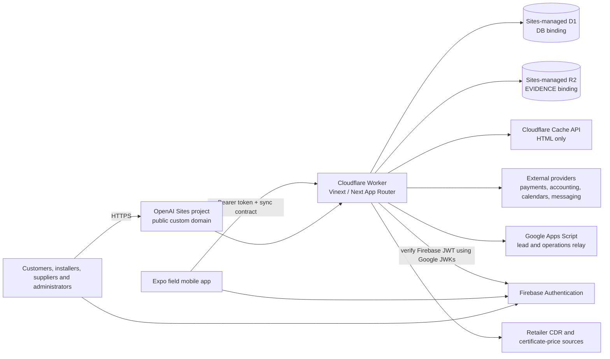

Evidence: `.openai/hosting.json:1-5` declares the Sites project and logical `DB`/`EVIDENCE` bindings; `vite.config.ts:14-27` selects Vinext, the Sites plugin, the Cloudflare Worker entry and the single cron; `worker/index.ts:52-86` implements fetch and scheduled handlers; `db/index.ts:1-9` obtains `env.DB`.

## Application and trust-boundary architecture

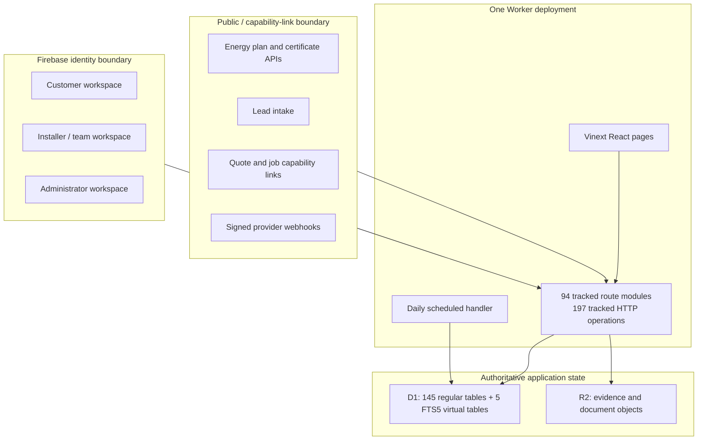

The API count is static source evidence at `4a5cd19`: 94 `src/app/api/**/route.*` modules and 197 exported HTTP handlers. Snapshot C production is the same exact source, so all 94 modules and 197 operations are packaged in version 199. Runtime reachability was sampled only for `/`, `/api/health`, the legacy-host redirect, and the separate signed-in database-console QA recorded in release evidence; source presence does not prove that every route, provider or workflow succeeds in production.

## Architecture truth layers

These five views are intentionally independent. No statement in one layer is promoted into another layer without its own evidence.

### Intended architecture

The tracked product documents intend one combined AEA/TLink product: public energy planning/comparison and assessment education feed a protected marketplace; accepted work becomes an owner-scoped trade CRM, field, quote/invoice, provider-handoff and asset/service record. TLink remains authoritative while calendars/accounting/payments are downstream mirrors. Evidence: `README.md:3-112`, `ROADMAP.md:1-123` and `docs/RELEASE_TRUTH.md:1-126`. Status: `PARTIAL`, because canonical documents still contain contradictions detailed in report 04 and do not prove runtime operation.

### Repository architecture

At final repository `ff3c8ef`, whose application tree is identical to parent `4a5cd19`, the implementation is a Vinext App Router modular monolith with 41 page modules, 94 API route modules/197 operations, one Worker entry point, two daily scheduled functions, 145 D1 tables, R2-backed object workflows, Firebase identity, provider adapters and a separate Expo field client. Evidence: `vite.config.ts:8-27`, `worker/index.ts:52-82`, `.openai/hosting.json:1-5`, `db/schema.ts`, `mobile/package.json:1-62`. Status: `IMPLEMENTED, NOT DEPLOYMENT-VERIFIED` for repository-only surfaces; the exact packaged web source is addressed separately below.

### Configured architecture

Tracked configuration binds the web build to the Sites project, logical D1 `DB`, R2 `EVIDENCE`, canonical host and daily cron. Read-only Sites environment revision 18 showed key-name entries for Firebase-facing runtime configuration, Google Calendar, Square, Resend, Twilio, lead relay, Stripe membership/referral/webhook and integration encryption; Xero, MYOB, QuickBooks, Microsoft Calendar, Stripe Connect and address-autocomplete entries were absent. Values, validity, external accounts and billing ownership were not inspected. Evidence: `.openai/hosting.json:1-5`, `vite.config.ts:8-27`, `worker/index.ts:28-82`, report 11. Status: `PARTIAL`.

### Deployed architecture

Sites v199 is a production deployment of exact application commit `4a5cd19` (161 packaged files, 13,066,240 bytes) behind the public custom domain. The Sites deployment reported succeeded with environment revision 18; canonical root and `/api/health` returned 200 and the legacy host redirected 308. The D1/R2 logical bindings and console read path are deployment-evidenced, but complete route reachability, current scheduled execution, provider health, data contents, ownership and recovery are not. Final repository `ff3c8ef` is only the release-document child, not the deployed application source. Status: `VERIFIED DEPLOYED` for the bounded facts; remaining runtime claims are `UNKNOWN`.

### Recommended architecture

The recommended state is an owner-controlled managed modular monolith: the same bounded web/API modules on owner-managed compute, managed PostgreSQL for relational/audit data, versioned object storage, owner-controlled identity/secrets/queues/observability/CI/IaC, and an Australian-region boundary where approved requirements demand it. Reports 16 and 17 compare alternatives and specify the reversible migration. This is `PLANNED ONLY`; no target was provisioned, migrated or deployed by this audit.

## Required separate architecture views

The diagrams below deliberately separate business, code, deployment, data, identity and failure concerns. They describe the final repository/deployed application checkpoint; recommended future architecture is separate in reports 16 and 17.

### Business workflow

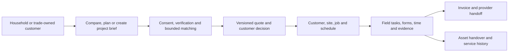

Evidence: product/workflow implementation and release records are mapped in `03_PRODUCT_FEATURE_AND_WORKFLOW_STATUS.md`; authoritative entities are declared in `db/schema.ts`.

### System context

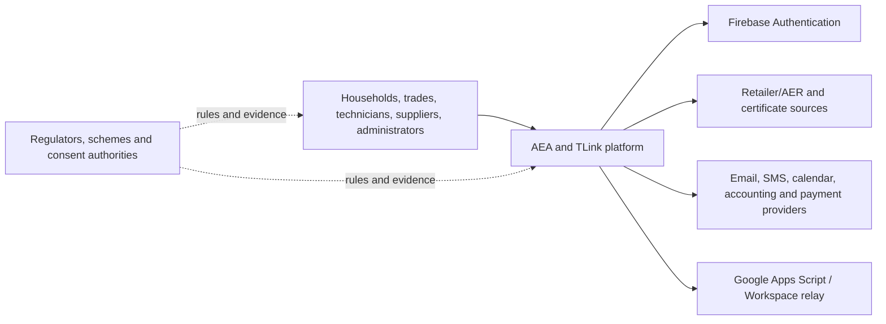

Evidence: `README.md:3-112`, provider catalogue in `11_EXTERNAL_INTEGRATIONS.md`, industry map in `02_INDUSTRY_BUSINESS_AND_GLOSSARY.md`.

### Applications and services

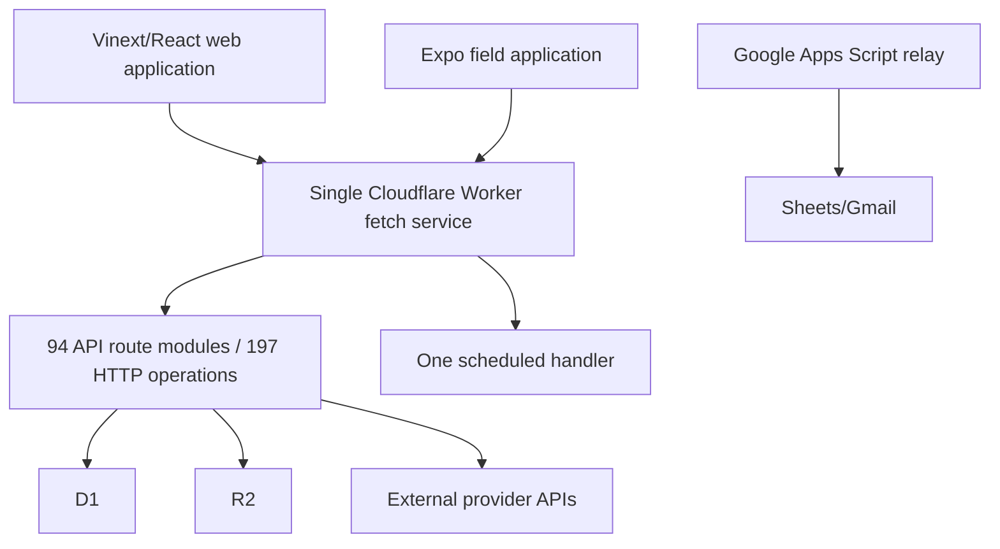

Evidence: `vite.config.ts:14-27`, `worker/index.ts:52-86`, complete route catalogue in report 08 and Apps Script source at `integrations/google-apps-script/lead-email-relay.gs`.

### Packages and dependency direction

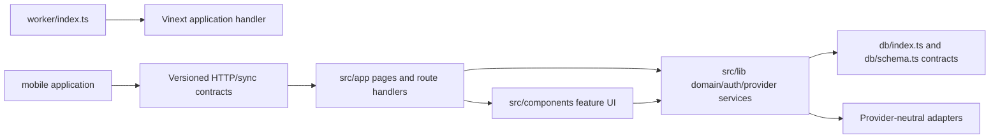

This is the observed dependency direction, not a claim that every import is acyclic. No separate shared-package workspace exists; server, UI and domain code share one root package, while mobile has its own manifest/lockfile.

### Deployment topology

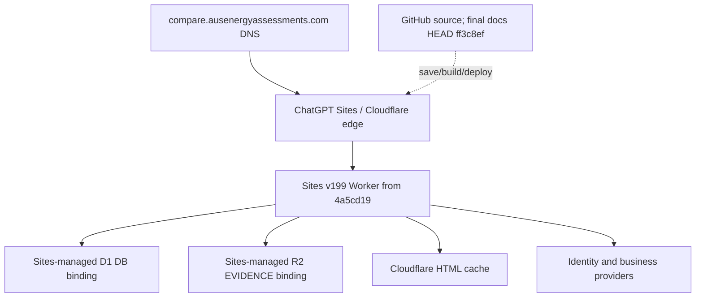

The GitHub-to-Sites edge is a provenance flow, not an observed enforced CI pipeline. `.openai/hosting.json:1-5` proves logical bindings but not independent Cloudflare account ownership.

### Primary data flows

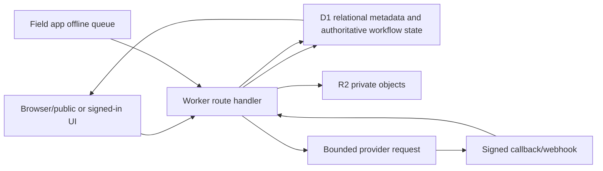

D1 and R2 cannot share one atomic transaction. Upload/delete compensations reduce but do not eliminate orphan/missing-object risk; report 09 maps these paths.

### Authentication

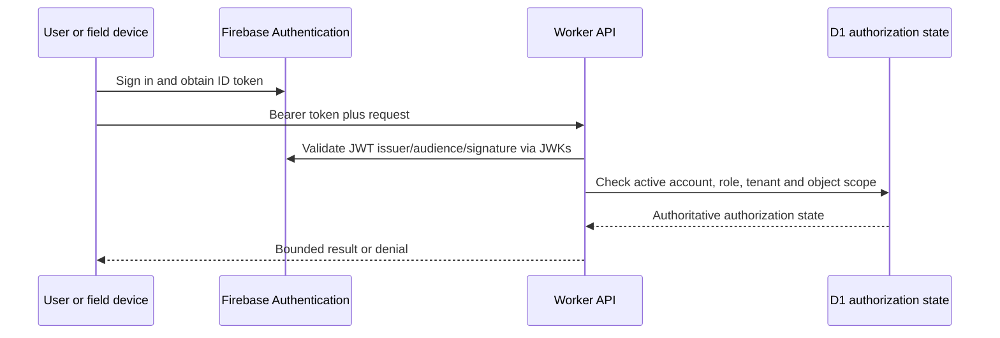

Immediate Firebase revoked-token checking and web session/MFA administration were not proven; report 10 keeps them `PARTIAL`/`UNKNOWN`.

### Trust boundaries

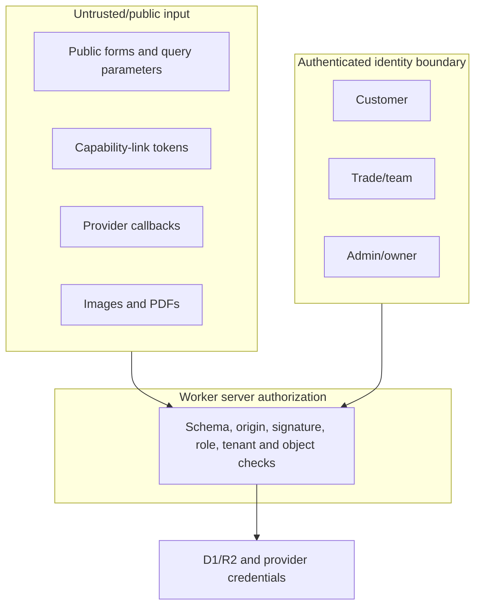

The deployed Database Console expands the owner boundary to default-visible browsing across 145 tables; report 13 recommends withdrawal.

### External integrations

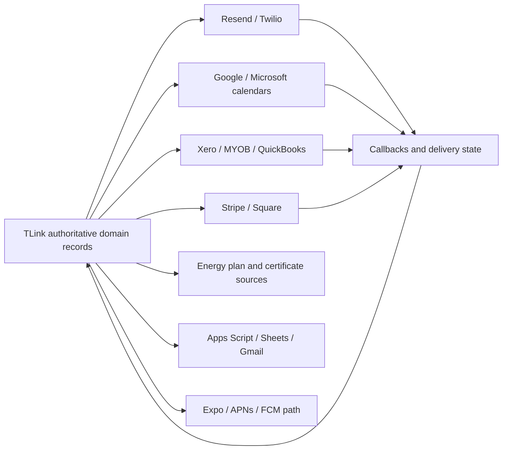

Adapter presence is not operational readiness. Report 11 records environment-key presence/absence and leaves account validity, scopes and health separate.

### Scheduled and asynchronous processing

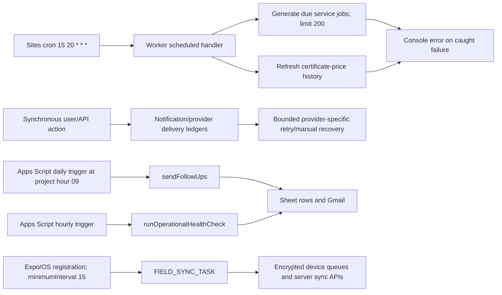

The Sites/Worker deployment has one cron schedule; it is not the only scheduler in the repository. Separate source defines daily and hourly Apps Script triggers (`integrations/google-apps-script/lead-email-relay.gs:37-53,419-446`) and an Expo/OS-managed background-sync task (`mobile/src/lib/background.ts:7-25`). Their deployed trigger, signed-app and execution state is `UNKNOWN`. There is no deployed server queue binding or common durable cross-scheduler run state. Both Worker-scheduled promises catch errors, so the top-level event can resolve despite job failure (`worker/index.ts:73-82`).

### Failure and recovery paths

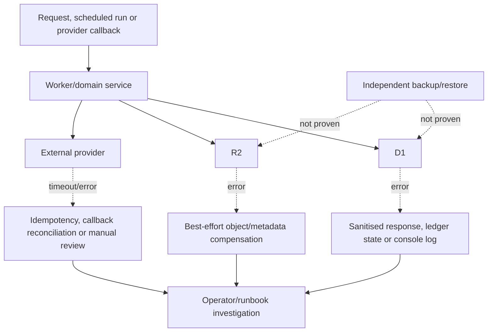

Current failure handling is feature-specific. No owner-controlled full export, restored environment, failover or proved RPO/RTO exists; report 12 classifies recovery/DR as `UNKNOWN`.

### Architecture risk, ownership and coupling disposition

This table makes the mandatory risk dimensions explicit. A successful build or the absence of a search hit is not converted into proof of architectural absence.

| Required dimension | Observed evidence | Status and consequence | Required gate |
|---|---|---|---|
| Component ownership | Feature modules and system boundaries are identifiable, but no tracked `CODEOWNERS`, service catalogue, on-call rota or named business/data/security owner was found; report 04 inventories the documentation-governance gap | `UNKNOWN`; implementation location is known, accountable human ownership is not | Assign product, data, security, runtime, provider and recovery owners with review/escalation paths |
| Fallback and shadow systems | The legacy comparator remains an intentional compatibility route (`src/app/compare/electricity-legacy/route.ts:1-13`); manual finance tracking is a recorded fallback (`docs/RELEASE_TRUTH.md:103`); the Apps Script/Sheets/Gmail relay is a separate operational surface (`integrations/google-apps-script/lead-email-relay.gs`) | `PARTIAL`; explicit fallbacks exist, but no complete shadow-data reconciliation or retirement register proves that parallel stores cannot diverge | Catalogue authority, sync direction, reconciliation, retention and retirement for every fallback/external store |
| Hidden coupling | One root package shares UI, routes and domain libraries; 51 modules execute 63 direct D1 batch operations and configuration is read through process/environment bindings (report 08; `.openai/hosting.json:1-5`) | `PARTIAL`; major boundaries are mapped, but an import/config/data-coupling graph was not run | Add bounded dependency rules and map every binding, direct database access and provider side effect before extraction |
| Circular dependencies | Type checking and production build pass, but neither is a cycle audit; no cycle detector or enforced package-boundary rule is configured | `UNKNOWN`; no circular dependency is claimed present or absent | Run and retain an import-cycle analysis, triage dynamic imports, and enforce agreed package directions |
| Global mutable state | The lead route creates one module-scoped limiter instance (`src/app/api/leads/route.js:11`), whose production path persists enforcement in D1 while its development path keeps an in-memory map (`src/lib/lead-rate-limit.mjs:33-65`); the Worker uses provider cache storage (`worker/index.ts:61`) | `PARTIAL`; no other authoritative module-global mutable store was found by the bounded scan, but isolate lifetime and all dynamic state were not proved | Keep authoritative state in durable owner-scoped stores; document and test any per-isolate cache or limiter semantics |
| Unsafe generic command surfaces | Sites v199 exposes generic bounded reads across 145 ordinary tables and default-deny insert/delete for three allowlisted tables; raw SQL, update, DDL and bulk mutation are absent (report 13; `src/lib/admin-database-console.ts`) | `VERIFIED DEPLOYED` risk surface; broad generic reads remain unsuitable as ordinary operations even with owner authorization | Withdraw generic navigation/route; replace only justified needs with projected read-only diagnostics and named, audited domain repair commands |
| Single points of failure | One Worker deployment, one Sites project/workspace control plane, one D1 binding, one R2 binding and Firebase identity serve the current product; no tested failover or restored standby is evidenced | `PARTIAL`: topology is verified, resilience is `UNKNOWN` | Set RTO/RPO, export independently, restore into an owner-controlled environment, test provider/identity failure and rehearse cutover |
| Ownerless or ownership-unproved systems | Sites project/workspace, managed D1/R2, Firebase project, Apps Script deployment and every external provider account lack complete owner/billing/two-admin/recovery proof (reports 06 and 11) | `UNKNOWN`; this is not a claim that they are ownerless, only that owner control was not evidenced | Obtain account, contract, billing, IAM, recovery and export evidence for every production dependency |

## Technology inventory

| Layer | Technology and pinned/declared version | Current role | Evidence | Status |
|---|---|---|---|---|
| Web application | Vinext `0.0.50`; Next `16.2.10`; React/React DOM `19.2.6` | Server-rendered App Router UI and route handlers | `package.json:21-29`; `vite.config.ts:15-21` | `VERIFIED DEPLOYED`; individual features vary |
| Runtime/build | Vite `8.1.4`; Cloudflare Vite plugin `1.37.1`; TypeScript `^5`; Wrangler `4.92.0` | Builds the Worker and local Cloudflare emulation | `package.json:31-47` | `IMPLEMENTED, NOT DEPLOYMENT-VERIFIED` as a toolchain; resulting v199 artifact is deployed |
| Edge host | OpenAI Sites project backed by a Cloudflare Worker | Public production hosting and bindings | `.openai/hosting.json:1-5`; read-only Sites project/version inspection | `VERIFIED DEPLOYED` |
| Database | Cloudflare D1 / SQLite; Drizzle ORM `^0.45.2`; Drizzle Kit `0.31.10` | CRM and operational source of truth | `db/index.ts:1-9`; `drizzle.config.ts:1-7`; `db/schema.ts` | `PARTIAL`: binding/live rows evidenced; data inventory, backup and ownership not inspected |
| Object storage | Cloudflare R2 binding `EVIDENCE` | Evidence, photos and documents | `.openai/hosting.json:4`; upload/download route implementations | `PARTIAL`: binding/routes exist; production contents/policy/export unknown |
| Authentication | Firebase Web SDK `^12.16.0`; JOSE `^6.2.3` | Client sign-in and server JWT verification | `package.json:22-25`; `src/lib/firebase-server.ts:1-43` | `PARTIAL`: runtime identity works; project IAM/MFA/revocation/ownership unknown |
| Web compression | `fflate` `0.7.4` | NEM12/archive handling | `package.json:24`; import sites | `IMPLEMENTED, NOT DEPLOYMENT-VERIFIED` for every archive path |
| Mobile | Expo `~57.0.6`, React Native `0.86.0`, React `19.2.3`, Firebase `^12.16.0` | Offline-capable field app | `mobile/package.json:1-62` | `BLOCKED` for store release; source/type checks pass |
| Mobile local data | Expo SQLite, Secure Store, File System and Crypto | Encrypted local cache, action/upload queues | `mobile/package.json:18-35`; `mobile/src/lib/database.ts` | `IMPLEMENTED, NOT DEPLOYMENT-VERIFIED`; physical-device recovery unverified |
| Lead relay | Google Apps Script with Google Sheets/Gmail | Lead forwarding and privacy-safe operational notifications | `integrations/google-apps-script/lead-email-relay.gs`; `src/app/api/leads/route.js` | `PARTIAL`: source/runbook exist; deployed script/version/owner unknown |
| Styling | Tailwind CSS `^4` plus application CSS | Web UI | `package.json:34,44`; `src/app/globals.css` | `VERIFIED DEPLOYED` |

`npm ls --depth=0` exited 1 because five WASM support packages were reported as extraneous (`@emnapi/core`, `@emnapi/runtime`, `@emnapi/wasi-threads`, `@napi-rs/wasm-runtime`, `@tybys/wasm-util`). This is dependency hygiene debt, not evidence of a production failure.

### Complete application/service toolchain disposition

| Language/format | Current use | Tool/runtime and exact-version disposition | Evidence | Status |
|---|---|---|---|---|
| TypeScript/TSX | Web pages/components/routes/helpers, Worker, schema/tooling and mobile client | Web lock resolves TypeScript 5.9.3; mobile lock resolves 6.0.3; production JavaScript runtime version `UNKNOWN` | `tsconfig.json`; `mobile/tsconfig.json`; direct lock ledger below | `VERIFIED DEPLOYED` for compiled web artifact; mobile `PARTIAL` |
| JavaScript/ES modules | Lead route, Node tests/scripts, public comparator model and Apps Script-compatible source | Local Node v22.14.0 observed; repository does not pin Node; browser/Worker/Apps Script engine versions `UNKNOWN` | `package.json:5-19`; `src/app/api/leads/route.js`; `integrations/google-apps-script/lead-email-relay.gs` | `PARTIAL` |
| SQL (SQLite/D1/FTS5) | 79 production migrations plus five opt-in synthetic fixtures | Wrangler 4.92.0/Drizzle Kit 0.31.10 locally declared/resolved; production D1 engine/applied ledger `UNKNOWN` | `drizzle.config.ts:1-7`; report 09 | `PARTIAL` |
| CSS/PostCSS | Global application and component-module styling; Tailwind/PostCSS build support | Tailwind/PostCSS lock resolves 4.3.2; browser support matrix not declared | `postcss.config.mjs`; `src/app/globals.css`; root lock ledger below | `VERIFIED DEPLOYED` artifact; compatibility `UNKNOWN` |
| HTML | Tracked legacy electricity comparator document | Browser-native HTML; no separate build step or declared browser support baseline | `public/electricity-comparator.html`; compatibility route implementation | `DEPRECATED` compatibility surface, still reachable by design |
| JSON/JSONC | npm manifests/locks, TypeScript/Expo/EAS/Sites configuration and Drizzle metadata | npm lockfile v3; parsers/tools inherit unpinned Node/CLI versions; generated snapshots are excluded evidence payload | `package.json`; `mobile/package.json`; `.openai/hosting.json:1-5`; `mobile/app.json`; `mobile/eas.json` | `PARTIAL` reproducibility |
| Deployment packaging command | No tracked POSIX shell, archive command or repository-owned Sites packaging script exists | The Vinext production build is defined by npm; the separate saved-version/deploy operation was performed through Sites tooling whose exact invocation is not retained in the repository | `package.json:5-19`; tracked `scripts/` inventory and empty Git history for the previously assumed `scripts/package-site.sh` path | `BLOCKED` for repository-reproducible packaging/promotion despite v199 provenance |
| Google Apps Script `.gs` | Lead relay and operational monitor | Provider V8 runtime/deployment version and tracked manifest `UNKNOWN` | `integrations/google-apps-script/lead-email-relay.gs` | `IMPLEMENTED, NOT DEPLOYMENT-VERIFIED` by this audit |

| Application/service | Languages/framework/runtime | Package manager, manifest and lock | Build/test commands | Protocol, driver and provider SDK | Exact-version/EOL/reproducibility disposition |
|---|---|---|---|---|---|
| Web UI and API | TypeScript/JavaScript, React 19.2.6, Next 16.2.10 through Vinext 0.0.50, Vite 8.1.4, Cloudflare Worker runtime; runtime version itself is provider-managed | npm; root `package.json`; lockfile v3 `package-lock.json` with 784 package entries | Exact root scripts: `dev`, `build`, `start`, `lint`, `typecheck`, `test`, `test:coverage`, `test:integration`, `audit:links`, `benchmark:scale`, `db:check`, `synthetic:validate`, `validate`, `db:generate` (`package.json:5-19`) | Same-origin HTTP/JSON REST-like handlers; multipart and binary responses; OAuth 2.0/provider webhooks; `fetch`; Firebase SDK plus JOSE JWT verification; Drizzle D1 driver; R2 binding | Direct resolved versions are below. No Node/npm/runtime version pin, container or SBOM; Vinext is pre-1.0 and Sites is beta. Support/EOL and vulnerability status are `UNKNOWN`; reproducibility is `PARTIAL` despite the lockfile. |
| Expo field client | TypeScript, Expo 57.0.6, React Native 0.86.0, React/DOM 19.2.3; iOS/Android and optional web | npm; `mobile/package.json`; lockfile v3 `mobile/package-lock.json` with 698 package entries; `mobile/app.json` and `mobile/eas.json` | Exact mobile scripts: `start`, `android`, `ios`, `web`, `lint`, `typecheck`, `doctor`, `export:verify` (`mobile/package.json:51-60`) | HTTPS/JSON to the same API; Firebase SDK; Expo SQLite/Secure Store/File System/Crypto/Notifications/Task APIs; APNs/FCM through Expo when configured | Direct resolved versions are below. Platform SDK/build images, Node/npm, Xcode/Android tooling and credentials are not pinned/proven; `doctor` uses unpinned `@latest`. Store/device compatibility, EOL and vulnerability state are `UNKNOWN`; release is `BLOCKED`. |
| Google Apps Script relay/monitor | JavaScript for Apps Script V8; Google Sheets, Gmail and UrlFetch services | No npm manifest, lockfile or tracked `appsscript.json`; source file only | No repository-owned build/deploy/test command; manual Apps Script operations are described in the runbook | Signed HTTPS webhook/probe, Sheets and Gmail platform APIs | Deployed script/runtime version, scopes, owner and reproducible deployment are `UNKNOWN`; this is a high reproducibility risk. |
| D1 schema/migration layer | SQL/SQLite/FTS5, TypeScript Drizzle ORM 0.45.2, Drizzle Kit 0.31.10, Wrangler 4.92.0 | Root npm tree plus `drizzle.config.ts`, `db/schema.ts`, 79 production SQL files and Drizzle journal/snapshots | `npm.cmd run db:check`; `npm.cmd run db:generate`; clean replay is part of `validate` | Cloudflare D1 Worker binding and Drizzle D1 database interface; prepared SQL | Local zero-to-current replay passed; 11 SQL files are absent from the Drizzle journal. Production engine version, applied ledger and upgrade path are `UNKNOWN`; reproducibility is `PARTIAL`. |
| Sites packaging/deployment | Vinext production build plus Sites saved-version/deployment service | Root npm manifest/lock covers the application build; no tracked archive/package/save/deploy command or client version exists; exact Git SHA and saved-version/deployment metadata provide bounded provenance | `npm.cmd run build`; the external release record identifies saved version and v199, but its exact management-tool invocation is not repository-owned | Sites management API/tooling; produced Worker artifact | v199 is provenance-verified at `4a5cd19`, but packaging/promotion cannot be reproduced from tracked commands alone. Reproducibility is `PARTIAL`; the missing repository operation is `BLOCKED`. |

### Command-class coverage and reproducibility

| Command class | Repository-owned entry point | Disposition |
|---|---|---|
| Web development and local start | `npm.cmd run dev`; `npm.cmd run start` | `IMPLEMENTED, NOT DEPLOYMENT-VERIFIED`; exact Node/npm versions are not repository-pinned |
| Web production build and package | `npm.cmd run build`; no tracked post-build package/archive command | Build is `IMPLEMENTED, NOT DEPLOYMENT-VERIFIED` as a local command; repository-owned packaging is `BLOCKED` because the previously assumed `scripts/package-site.sh` path does not exist |
| Format | No root or mobile `format` script, no direct Prettier/Biome dependency and no formatter configuration was found in tracked manifests/config | `BLOCKED`; there is no repository formatting gate to execute, and ESLint is not silently treated as a formatter |
| Static analysis, tests and migration replay | Root `typecheck`, `lint`, `test`, `test:coverage`, `test:integration`, `db:check`, `synthetic:validate`, `validate`; mobile `lint`, `typecheck`, `doctor`, `export:verify` | `IMPLEMENTED, NOT DEPLOYMENT-VERIFIED`; current executions and limits are in report 12 |
| Mobile native development | `npm.cmd run android`; `npm.cmd run ios`; Expo start/web scripts | `IMPLEMENTED, NOT DEPLOYMENT-VERIFIED`; these are local development commands, not signed-store release proof |
| Mobile native package/release | `mobile/eas.json` defines development, preview, production and submit profiles, but no repository script invokes EAS and only a broad CLI floor `>= 16.0.0` is declared | `BLOCKED`; exact EAS version, native toolchains, credentials, signed builds, submission and rollback are unproved |
| Sites saved-version and production deployment | No tracked package/save/deploy command, client package or pinned management-tool version performs save-version or deploy-saved-version | `BLOCKED` for repository-only reproduction and workspace-dependent; official management flow and observed v199 provenance exist, but reproducible repository-owned release control does not |
| Apps Script build/test/deploy | No repository-owned command or tracked `appsscript.json` | `BLOCKED`; reproducible deployment cannot be run from the repository, while deployed version/scopes/owner remain `UNKNOWN` |

The final read-only tool check observed local Node `v22.14.0`, npm `10.9.2` and Git `2.53.0.windows.2`. These are audit-host facts, not repository pins or production Worker versions. No `engines`, `.nvmrc`, `.node-version`, Volta/asdf declaration or container image pins Node/npm, so a clean build on another host remains `PARTIAL` until the toolchain is declared and reproduced.

### Direct dependency lock ledger

Every direct manifest dependency is listed here as `declared -> lockfile-resolved`. Transitive packages remain enumerated in the two lockfiles but were not individually licence- or vulnerability-audited.

| Tree/class | Complete direct dependency list |
|---|---|
| Web runtime | `drizzle-orm ^0.45.2 -> 0.45.2`; `firebase ^12.16.0 -> 12.16.0`; `fflate 0.7.4 -> 0.7.4`; `jose ^6.2.3 -> 6.2.3`; `next 16.2.10 -> 16.2.10`; `react 19.2.6 -> 19.2.6`; `react-dom 19.2.6 -> 19.2.6`; `vinext 0.0.50 -> 0.0.50` |
| Web development | `@cloudflare/vite-plugin 1.37.1 -> 1.37.1`; `@cloudflare/workers-types ^4.20260702.1 -> 4.20260702.1`; `@tailwindcss/postcss ^4 -> 4.3.2`; `@types/node ^20 -> 20.19.43`; `@types/react ^19 -> 19.2.17`; `@types/react-dom ^19 -> 19.2.3`; `@vitejs/plugin-react 6.0.2 -> 6.0.2`; `@vitejs/plugin-rsc 0.5.26 -> 0.5.26`; `drizzle-kit 0.31.10 -> 0.31.10`; `eslint ^9 -> 9.39.5`; `eslint-config-next 16.2.10 -> 16.2.10`; `react-server-dom-webpack 19.2.6 -> 19.2.6`; `tailwindcss ^4 -> 4.3.2`; `typescript ^5 -> 5.9.3`; `vite 8.1.4 -> 8.1.4`; `wrangler 4.92.0 -> 4.92.0` |
| Mobile runtime | `@expo/ui ~57.0.6 -> 57.0.6`; `@expo/vector-icons ^15.0.2 -> 15.1.1`; `@react-native-async-storage/async-storage 2.2.0 -> 2.2.0`; `@react-native-community/netinfo ^12.0.1 -> 12.0.1`; `expo ~57.0.6 -> 57.0.6`; `expo-application ~57.0.1 -> 57.0.1`; `expo-auth-session ~57.0.3 -> 57.0.3`; `expo-background-task ~57.0.4 -> 57.0.4`; `expo-constants ~57.0.5 -> 57.0.5`; `expo-crypto ~57.0.1 -> 57.0.1`; `expo-dev-client ~57.0.6 -> 57.0.6`; `expo-device ~57.0.1 -> 57.0.1`; `expo-document-picker ~57.0.1 -> 57.0.1`; `expo-file-system ~57.0.1 -> 57.0.1`; `expo-font ~57.0.1 -> 57.0.1`; `expo-glass-effect ~57.0.1 -> 57.0.1`; `expo-image ~57.0.1 -> 57.0.1`; `expo-image-picker ~57.0.4 -> 57.0.4`; `expo-linking ~57.0.3 -> 57.0.3`; `expo-network ~57.0.1 -> 57.0.1`; `expo-notifications ~57.0.5 -> 57.0.5`; `expo-router ~57.0.6 -> 57.0.6`; `expo-secure-store ~57.0.1 -> 57.0.1`; `expo-splash-screen ~57.0.4 -> 57.0.4`; `expo-sqlite ~57.0.1 -> 57.0.1`; `expo-status-bar ~57.0.1 -> 57.0.1`; `expo-symbols ~57.0.1 -> 57.0.1`; `expo-system-ui ~57.0.1 -> 57.0.1`; `expo-task-manager ~57.0.4 -> 57.0.4`; `expo-web-browser ~57.0.1 -> 57.0.1`; `firebase ^12.16.0 -> 12.16.0`; `react 19.2.3 -> 19.2.3`; `react-dom 19.2.3 -> 19.2.3`; `react-native 0.86.0 -> 0.86.0`; `react-native-gesture-handler ~2.32.0 -> 2.32.0`; `react-native-reanimated 4.5.0 -> 4.5.0`; `react-native-safe-area-context ~5.7.0 -> 5.7.0`; `react-native-screens 4.25.2 -> 4.25.2`; `react-native-web ~0.21.0 -> 0.21.2`; `react-native-worklets 0.10.0 -> 0.10.0` |
| Mobile development | `@types/react ~19.2.2 -> 19.2.17`; `typescript ~6.0.3 -> 6.0.3` |

### Compatibility, licensing, vulnerability and duplication disposition

- Installed direct-package metadata reports Apache-2.0 for `drizzle-orm`, `firebase` and TypeScript; dual MIT/Apache-2.0 for Cloudflare Workers types and Wrangler; and MIT for the other direct packages. This is metadata inventory, not legal licence compatibility review. Transitive licence obligations and generated SBOM are `UNKNOWN`/`BLOCKED` because no approved licence/SBOM scanner was run.
- Dependency vulnerability state is `UNKNOWN`/`BLOCKED`: the audit did not run an approved `npm audit` or supply-chain scanner and does not convert an unrun scan into “zero vulnerabilities.”
- The isolated web and mobile lock trees intentionally duplicate Firebase 12.16.0 and React-related packages. They diverge at React/DOM 19.2.6 web versus 19.2.3 mobile, TypeScript 5.9.3 web versus 6.0.3 mobile, and several type/tool packages. No runtime bundle is shown to mix those trees, so this is a maintenance/reproducibility risk, not a proven defect.
- Expo/React Native and its device, notification, SQLite, file, secure-store and native-animation packages are platform-specific. Cloudflare Worker types/plugin/Wrangler and D1/R2 bindings are host-specific. Apps Script uses platform-global services. Each increases exit work and must stay behind the interfaces mapped in reports 11, 16 and 17.
- The only direct external-service SDK is Firebase 12.16.0; JOSE 6.2.3 performs server token verification. Stripe, Square, accounting, calendar, Resend, Twilio and retailer integrations use HTTP/OAuth/webhook adapters rather than dedicated direct SDK packages. The test framework is Node's built-in `node:test` under the observed Node 22.14.0; no browser E2E or native-device test framework is installed.
- Lockfiles make npm resolution repeatable at the package level, but exact Node/npm/OS/native toolchains, Sites/Worker runtime, Apps Script deployment, provider API versions and build images are unpinned or inaccessible. Overall build reproducibility is `PARTIAL`, not complete.

## Request lifecycle and caching

1. The Worker redirects the legacy `*.chatgpt.site` host to the custom domain with HTTP 308 (`worker/index.ts:28-35`).
2. API and non-HTML requests are passed directly to Vinext and receive security headers (`worker/index.ts:12-25,37-59`).
3. Successful HTML GET responses use the Cloudflare default cache with `s-maxage=120` and `stale-while-revalidate=600`; `/api/*` is explicitly excluded (`worker/index.ts:37-49,61-71`).
4. Route handlers authenticate, validate and call D1/R2/provider helpers. There is no separate application server, service mesh, queue consumer, Durable Object or GraphQL/RPC layer.

The observed production root and `/api/health` returned HTTP 200 at 2026-07-21 13:48 AEST. The legacy host returned 308 to `https://compare.ausenergyassessments.com`. HSTS, frame, content-type, referrer and permissions headers were observed. This is a point-in-time availability sample, not an SLA or full functional test.

## Identity and authorization

- Clients obtain Firebase ID tokens. Server validation uses Google’s remote JWK set and checks issuer/audience, subject and email (`src/lib/firebase-server.ts:1-43`).
- Administrative routes call `requireAdminIdentity`; installer/team routes use installer entitlement and team/member guards; customer routes scope records to the Firebase UID. Capability-link routes use high-entropy database tokens, and external webhooks use provider signatures.
- Same-origin checks protect most browser mutations. Their deliberate absence allowance for a missing `Origin` supports non-browser clients; authorization must therefore remain the decisive control.
- The custom JOSE validator does **not** check Firebase token revocation. Firebase’s official session-management guidance requires an explicit revoked-token check when immediate revocation matters: <https://firebase.google.com/docs/auth/admin/manage-sessions>. This is a material gap for removed administrators or team members until token expiry or application-level status checks intervene.
- Public Firebase client configuration is expected for a Firebase web client, but the Firebase project’s owner, IAM, billing and incident-access arrangements are unknown. No secret values are reproduced in this audit.

## State ownership and consistency

D1 is the intended authoritative store for TLink accounts, CRM, jobs, quotes, invoices, payment/accounting ledgers, team state, customer records and evidence metadata. External calendar, accounting and payment systems are mirrors or downstream providers rather than the TLink source of truth. R2 holds binary objects while D1 holds their authorization and metadata. The mobile database is a temporary offline cache; the server is authoritative. The Google Sheet used by Apps Script is a separate lead-delivery/operational record, not the CRM database.

There are no SQL foreign-key declarations in the 79 migration files or Drizzle schema. Relationships are text identifiers enforced by route/application code. D1/R2 writes cannot form one atomic transaction: upload paths generally put the object and then insert metadata, deleting the object on a caught database failure; a Worker termination between operations can still leave orphaned objects or metadata. These design facts materially raise restore, reconciliation and deletion risk.

## Background processing

One cron expression, `15 20 * * *`, calls two jobs concurrently: due-service-job generation (bounded to 200) and certificate-price refresh (`vite.config.ts:20-25`; `worker/index.ts:73-82`). Each error is caught and logged, which means the scheduled event’s top-level promise resolves even when a job fails. No queue binding, retry/backoff policy, circuit breaker, durable cron-run ledger for both jobs, or production alert was found. Certificate sync has its own run table; recurring-service generation has domain idempotency tables, but neither replaces an operational run/alert contract.

## Repository and delivery architecture

- Root scripts provide development, type checking, linting, Node tests, a focused integration suite, migration replay, build and aggregate validation (`package.json:5-19`).
- No `.github/workflows` directory or other CI pipeline was present. Release correctness therefore depends on the manual/agent-run validation and Sites version workflow.
- `PLATFORM_ARCHITECTURE.md` describes a historical baseline and must not be treated as current runtime proof. `docs/RELEASE_TRUTH.md` is useful release history but is also not provider-state evidence.
- `.openai/hosting.json` contains only logical binding names and the Sites project identifier. The local D1 UUID in `vite.config.ts:24` is intentionally a dummy UUID, not the production database identity.
- The tracked mobile constant `SYNC_CONTRACT_VERSION = 2` in `mobile/src/lib/config.ts:4` is unused; the active mobile/server sync implementation uses version 3 (`src/lib/trade-mobile-server.ts:5`). It is stale code, not evidence that live clients negotiate v2.

## Architecture suitability by component

| Component | Suitability | Reason and condition |
|---|---|---|
| One Worker/Vinext application | **Suitable with conditions** | Simple deployment and shared contracts; needs provider timeouts, stronger background-job observability, independent release automation and tested capacity. |
| Cloudflare D1 technology | **Suitable with conditions** | A credible early-stage relational store, but one database is single-threaded per Cloudflare’s limits and this schema lacks foreign keys. Capacity, tenancy, export and restore must be proven. <https://developers.cloudflare.com/d1/platform/limits/> |
| Current Sites-managed D1 instance | **Insufficient evidence** | Owner/provider access, export, Time Travel, recovery and transfer are not demonstrated. |
| R2 technology | **Suitable with conditions** | Appropriate for binary evidence if lifecycle, retention, bucket locks, access, export and reconciliation are established. |
| Current Sites-managed R2 bucket | **Insufficient evidence** | Owner access and policy were not visible; contents and recovery were not inspected. |
| Firebase Authentication | **Suitable with conditions** | Standard identity provider, but ownership/IAM and immediate token revocation need evidence and implementation. |
| Expo mobile architecture | **Suitable with conditions** | Offline queues and local protection are present; physical-device, release, revocation, data-removal and conflict tests remain unverified. |
| Combined current production platform as a business-critical CRM | **Not suitable today** | Hosting-policy conflict with financial transactions, public-beta constraints, provider-managed data with unproven independent recovery, no demonstrated CI/DR/alerting and unresolved account ownership. |

## Evidence and limitations

- Source counts and architecture were inspected at `4a5cd19`. Snapshot B production source was compared to `f05995b`; Snapshot C Sites version/deployment inspection proved production now uses the exact `4a5cd19` source.
- `npm.cmd run db:check` passed at `4a5cd19`: all 79 migrations applied to a fresh local Wrangler D1 database.
- Runtime checks covered only root, health and legacy redirect. No production records, provider connections, R2 objects or secrets were read or changed.
- Sites project/version/binding state was inspected read-only. Cloudflare and Firebase owner dashboards were not available.
- Official platform constraints used in this report: OpenAI Sites <https://learn.chatgpt.com/docs/sites.md>, Cloudflare D1 limits <https://developers.cloudflare.com/d1/platform/limits/>, D1 Time Travel <https://developers.cloudflare.com/d1/reference/time-travel/>, and Firebase session management <https://firebase.google.com/docs/auth/admin/manage-sessions>.
