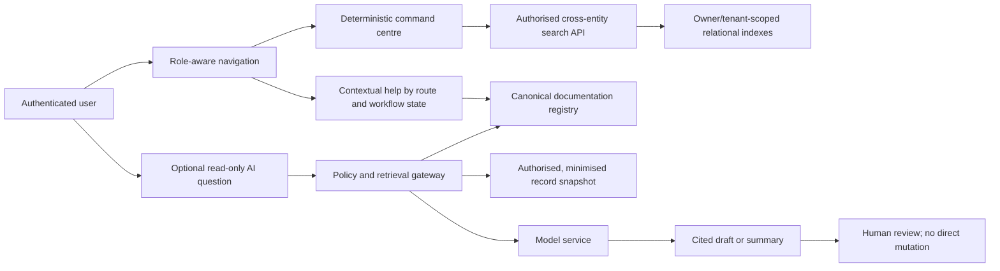

# AI, navigation and platform-intelligence audit

Final repository snapshot: `ff3c8efe3d5e501286d8e83e28086d6d4590be27` on 21 July 2026 (Australia/Sydney). Deployed application source: `4a5cd19dda6f86896cfc751f5a42aa07f9b4eff5`, Sites version 199.

## Decision

The product already has a useful, role-scoped command centre and entity-specific search. Preserve that deterministic navigation layer. Do **not** add a general production agent or allow a model to mutate customer, job, evidence, quote, invoice, payment, access or database records. The first justified AI capability is a read-only assistant over curated product/industry documentation with source citations, freshness labels and strict retrieval authorization. Record summarisation and document extraction should follow only after the data platform, retention policy, owner-controlled hosting and evaluation evidence exist.

Current AI status is `PLANNED ONLY`. No model SDK, model endpoint, prompt registry, embedding store, vector index, AI audit ledger or evaluation dataset appears in `package.json`, the 94 tracked API route files, or the current schema. `docs/AI_DELIVERY_GUARDRAILS.md` governs AI-assisted development, not a customer-facing runtime model (`docs/RELEASE_TRUTH.md:7`).

## What exists now

| Capability | Evidence layer | Status | Assessment |
|---|---|---|---|
| Role-aware TLink command centre | `src/components/TLinkCommandCentre.tsx:48-128,168-245`; server route `src/app/api/tlink-search/route.ts:31-147` | `VERIFIED DEPLOYED` | Component and route commits are ancestors of deployed Sites version 199. It searches jobs, customers, products, orders and team members according to partner type and entitlements. |
| Keyboard navigation and quick actions | `src/components/TLinkCommandCentre.tsx:60-74,149-165,209-243` | `VERIFIED DEPLOYED` | Ctrl/Cmd-K and `/`, arrow keys, Enter and Escape are implemented. New job/customer and direct workspace actions use deterministic navigation. |
| Server authorization and query bounding | `src/app/api/tlink-search/route.ts:8-10,31-50,53-143`; `test/tlink-command-centre.test.mjs:16-34` | `VERIFIED DEPLOYED` | Firebase identity, same-origin checking, active account, entitlements, per-kind limit 8 and total limit 32 are present. The test is structural and does not prove live tenant isolation by itself. |
| Protected-household exclusion | `src/components/TLinkCommandCentre.tsx:221`; query projections in `src/app/api/tlink-search/route.ts:53-140` | `IMPLEMENTED, NOT DEPLOYMENT-VERIFIED` | The route searches owner-scoped direct CRM records and does not query protected AEA opportunity identity. A live adversarial authorization test was not run in this audit. |
| Entity list filters and FTS | `docs/RELEASE_TRUTH.md:32`; `drizzle/0044_flimsy_omega_flight.sql:18-123`; route catalogue in `08_BACKEND_API_WORKERS_AND_JOBS.md` | `VERIFIED DEPLOYED` | FTS5/search is deterministic. It is not semantic or model-based search. |
| Contextual help | Guidance and boundary copy is embedded across forms and workflows; no unified help service or help taxonomy was found | `PARTIAL` | Useful local copy exists, but it is not centrally owned, versioned or searchable. |
| AI summaries, extraction, classification, support or operations assistant | No runtime model dependency, endpoint, schema or evaluation evidence found | `PLANNED ONLY` | Must remain unavailable until the prerequisites below are met. |

### Complete current navigation, workflow, support and search disposition

| Current category | Available path | Search/guidance status | Disposition |
|---|---|---|---|
| Jobs | TLink command centre plus Jobs index/detail | Global owner-scoped command search exists (`src/app/api/tlink-search/route.ts:12-143`) | `VERIFIED DEPLOYED` by v199 ancestry/release record |
| Direct CRM customers | TLink command centre plus Customers index/detail | Global owner-scoped command search exists; detailed list filtering also exists (`src/components/InstallerCrmWorkspace.tsx:182-192,315-354,769-833`) | `VERIFIED DEPLOYED` |
| Products | Command centre, marketplace and supplier catalogue | Role/entitlement-scoped global product search exists | `VERIFIED DEPLOYED` |
| Orders/purchasing | Command centre result kind and retained purchasing workspace/API | Search exists, but installer Orders primary navigation is intentionally removed pending validation | `PARTIAL` |
| Team members | Command centre and People/Team workspaces | Owner-scoped global team search exists | `VERIFIED DEPLOYED` |
| Assessments | Public assessment hub and explanatory pages | No global/entity assessment record search; current surface is guidance, not an assessment-record index | `IMPLEMENTED, NOT DEPLOYMENT-VERIFIED` pages; search `NOT APPLICABLE` to current stored-record model |
| Properties/service sites | Customer/job detail and guided new-job matching | No command-centre/global search kind; sites are nested inside selected customer/job workspaces (`src/components/InstallerCrmWorkspace.tsx:944-945`) | `PARTIAL`; workspace-local access only |
| Documents/evidence | Project/job/photo/handover/verification workspaces with protected download | No document-body/global evidence search; this is an intentional privacy boundary | `PARTIAL`; metadata retrieval is context-bound and body search is `NOT APPLICABLE` by current decision |
| Quotes | Customer/job quote workspaces and capability link | No global quote search kind | `PARTIAL`; workflow-local only |
| Invoices | Dedicated Invoices navigation and job Money workspace | Local invoice search/filter exists (`src/components/TradeInvoiceWorkspace.tsx:29-55,68-69`); no global command-centre invoice kind | `VERIFIED DEPLOYED` workspace by release record; global search unavailable |
| Installed assets/service records | Customer Assets and trade lifecycle/handover workspaces | No global asset search kind | `PARTIAL`; workflow-local only |
| Forms/templates | Job/forms and admin template workspaces | No global form/template search kind | `IMPLEMENTED, NOT DEPLOYMENT-VERIFIED`; workflow-local only |
| Installer/supplier accounts | Partner/profile/verification and admin account directories | No ordinary trade command-centre installer-account search; administrator directory/filter exists separately (`src/components/AdminAccountWorkspace.tsx:52-90,186-198`) | `PARTIAL`; role-separated by design |
| Household workflow-first guidance | Home planner, comparators, guides, rebates and assessment hub route users toward bounded next steps | Deterministic forms/content; no AI | `IMPLEMENTED, NOT DEPLOYMENT-VERIFIED` as complete live journeys |
| Trade workflow-first navigation | TLink role-aware rail, command centre, dashboard shortcuts, Jobs/Customers/Schedule/Invoices and focused job tabs | Deterministic deep links and progressive disclosure | `VERIFIED DEPLOYED` for dated slices; complete keyboard/task acceptance remains partial |
| Customer support | Inline hints/errors, privacy/contact pages, phone/email and token/customer workflows | No support case/ticket taxonomy, searchable help registry, response SLA or AI support | `PARTIAL`; human destination/ownership is not formalised |
| Administrative workflows | Operations control centre, notification inbox, review queues, directories and owner-only Database workspace | Separate admin navigation; no global admin entity/action search | `PARTIAL`; role matrix is in report 10 and generic Database surface should be withdrawn |

## Navigation gaps

1. The global command centre covers only five TLink record kinds. Assessments, properties/service sites, documents/evidence, quotes, invoices, installed assets, forms and administrator work are reached through separate workspaces rather than one cross-entity index.
2. The search route uses substring `LIKE` queries for several operational records (`src/app/api/tlink-search/route.ts:53-143`) even though dedicated FTS indexes exist elsewhere. Relevance, typo tolerance and result explanations are not measured.
3. Search results expose some contact metadata. The owner/tenant checks are server-side, but there is no adversarial live test evidence for cross-tenant, removed-staff, token-revocation and protected-lead cases.
4. There is no canonical help registry connecting an error or workflow step to current documentation, a responsible owner and a last-verified date.
5. There is no search-quality telemetry that can prove unsuccessful queries, time-to-record or task completion without recording sensitive query text.

## Recommended navigation design

Near-term navigation should extend the deterministic system before using AI:

- Give every supported entity a stable type, opaque identifier, display label, authorization resolver and deep link.
- Add properties/service sites, quotes, invoices, assets and evidence metadata only after their result projections are privacy-reviewed; never index document bodies, capability tokens, NMIs, private notes or raw addresses globally.
- Return why a result matched and which workspace will open.
- Keep quick actions deterministic and permission checked at the destination API.
- Add route/workflow help IDs that resolve to current documentation with owner and freshness metadata.
- Measure privacy-safe counters: search category, result count bucket, latency, zero-result rate and selected result rank. Do not log raw queries or record payloads.

## Proposed AI capability register

| ID | Capability | User and value | Source data | Authorization boundary | Main failure modes | Human review and evidence | Privacy | Cost/latency | Model/service requirements | Evaluation | Release |
|---|---|---|---|---|---|---|---|---|---|---|---|
| AI-01 | Cited documentation assistant | Staff and engineers find current product, runbook and industry guidance quickly | Approved documentation registry only | Document ACL before retrieval; no production records | Stale or conflicting guidance; invented status | Every answer cites exact document/version and labels contradictions; answer is advisory | Keep restricted runbooks and secrets outside shared index | Low/interactive; cache only non-sensitive retrieval | Retrieval-grounded text model, deterministic ACL-filtered index, structured citations and abstention; provider/model remains `UNKNOWN` until residency, retention and contract review | 100+ curated questions, citation precision/recall, abstention and stale-source tests | First production AI capability, after documentation recovery |
| AI-02 | Contextual form help | Customer/trade user understands a field or next step | Approved help snippets, route ID and non-sensitive workflow state | Role, route and state checked server-side | Advice exceeds product/legal scope; wrong jurisdiction | Show source and checked date; no form changes | Send only route/help ID and coarse state | Low | Low-latency text model with schema-bounded, cited output; no write tools; deterministic non-AI help fallback; provider/model `UNKNOWN` pending review | Scenario correctness by role/state/jurisdiction; harmful-advice red team | Later first release if AI-01 passes |
| AI-03 | Draft job/activity summary | Office user reviews a long job faster | Authorised event ledger and selected record fields | Exact job membership and field-level policy; no protected fields by default | Missing events, wrong chronology, disclosure to wrong staff | Draft label, source links to every event, user accepts/corrects | High; minimize fields and do not retain prompts independently | Medium | Grounded summarisation model with sufficient bounded context or deterministic batching, JSON output and citation IDs; no action tools; service region/retention `UNKNOWN` | Factual consistency, event coverage, authorization, PII leakage | Later discovery |
| AI-04 | Document classification/extraction | Office user reduces re-entry from approved invoices/certificates | Malware-scanned, authorised file plus declared document type | Object ACL and exact job; isolated processor | Prompt injection in documents; wrong amounts/identifiers; OCR errors | Extract to a review form; never post automatically; cite page/region | Very high; retention, provider terms and residency required | Medium/high asynchronous | Isolated OCR/layout extraction plus schema-constrained model, page-region citations, malware gate and asynchronous job controls; Australian-region/retention capability must be proven | Golden documents, field accuracy, confidence calibration, adversarial document set | Later discovery after storage migration |
| AI-05 | Customer-message draft | Staff creates clearer responses | Authorised conversation, approved templates and job status | Exact conversation/job role | Hallucinated promises, unsafe technical advice, privacy leakage | Staff edits and explicitly sends; source facts shown | High | Medium | Text drafting model with policy template grounding and structured draft only; no provider-send tool; provider/model and retention `UNKNOWN` | Policy compliance, factuality, tone, no-send guarantee | Later discovery |
| AI-06 | Operations triage summary | Owner groups alerts and sees likely common cause | Privacy-safe operational events and runbooks | Owner/admin only; read-only | Suppresses unique incident; false causal claim | Present evidence links and uncertainty; no remediation action | Low if event schema remains redacted | Medium | Read-only cited summarisation over redacted structured events, rare-event-preserving retrieval and abstention; no remediation tools; model/provider `UNKNOWN` | Incident replay, rare-event preservation, abstention | Later discovery |
| AI-07 | Energy-assessment evidence assistant | Accredited assessor reviews evidence checklist | Approved scheme rules, consented assessment documents | Assessor assignment and jurisdiction; separate from public comparison | Regulatory hallucination, outdated scheme data, model treated as assessor | Accredited human is decision maker; source/effective date required | Very high | High | Version-pinned retrieval-grounded model with document/page citations, jurisdiction filter, effective-date gate and approved data region; provider/model `UNKNOWN` pending accredited expert and privacy review | Expert-labelled cases and current-source freshness gate | Not first release |
| AI-08 | Autonomous production agent | None justified | Broad platform data/actions | Would require excessive authority | Data loss, unauthorized disclosure, payments/access mutation | Insufficient safeguard | Unacceptable | Unbounded | No model or service is acceptable under the current evidence and authority boundary | No adequate acceptance evidence | `NOT APPLICABLE`; do not build |

## Mandatory AI control plane

No runtime AI feature should pass its release gate until all of these controls exist and are tested:

1. **Use-case registry:** stable ID, owner, permitted actors, inputs, outputs, model, prompt version, data classification, retention, maximum latency/cost and rollback switch.
2. **Retrieval authorization:** authorize each candidate document and record before it enters a prompt; never filter only after retrieval.
3. **Data minimization:** field allowlists per use case; token, secret, NMI, raw interval data, payment data and unrelated contacts excluded by default.
4. **Prompt-injection boundary:** uploaded content and retrieved text are untrusted data, never instructions; isolate tools from model content.
5. **Read-only default:** the model returns a draft. A deterministic server endpoint performs any separately confirmed action and rechecks authorization, version and idempotency.
6. **Citations and freshness:** source URI, version/effective date and retrieved-at time are visible. Conflicting sources force abstention or a contradiction response.
7. **Complete audit:** actor, use-case ID, model/prompt/retrieval versions, redacted input hash, citations, output hash, decision and subsequent human action; do not store sensitive prompt bodies in ordinary logs.
8. **Model and prompt change control:** pinned model class where supported, prompt review, offline regression, canary, rollback and documented provider deprecation handling.
9. **Cost/latency budgets:** per-use-case token and request caps, tenant/user quotas, timeouts and a deterministic non-AI fallback.
10. **Incident controls:** immediate feature-level disable, provider outage fallback, deletion/retention handling, breach-response integration and owner escalation.

### Explicit interaction, escalation, confidence and monitoring decisions

| Required decision | Recommended design | Prohibited behavior | Acceptance evidence |
|---|---|---|---|
| AI-assisted form completion | AI-02 may explain a field without changing it. For later approved extraction, populate a separate review draft with per-field source/page and validation state; the user deliberately accepts each material value and the server revalidates the complete normal schema | No automatic submit, consent/signature selection, payment/access change, hidden field overwrite, invented required value or model bypass of deterministic validation | Golden form/document cases; field accuracy/calibration; unchanged-form and no-submit tests; rejected/ambiguous data remains blank with reason |
| Human escalation triggers | Escalate whenever sources conflict/are stale, authorization or data classification is unclear, confidence/support is below the approved gate, the user alleges safety/privacy/security/financial/legal harm, an assessment/licence decision is requested, or the model/provider fails repeatedly | No model resolution of legal applicability, safety approval, payment dispute, access grant, incident closure or accredited-assessor decision | Trigger-recall tests, false-negative review and sampled audit showing the model stopped and routed correctly |
| Human escalation destination and proposed SLA | Security/privacy/breach -> named security/privacy incident owner immediately; payment/account/access -> named operations owner within four business hours; regulated assessment/licensing/claims -> qualified product/compliance reviewer before any answer is relied on; ordinary unsupported help -> product/support owner by next business day | No generic dead-end “contact support,” unowned mailbox or silent queue. These are proposed maximum triage targets, not current commitments; accountable people/coverage must be approved before release | Owned rota/destination, acknowledgement timestamp, overdue alert, backup owner and tabletop against each trigger class |
| User-facing confidence indicators | Show `Supported`, `Partially supported` or `Cannot verify` based on source coverage, not a model probability. Display citations, source/effective date and missing/conflicting evidence; extracted fields may show calibrated field confidence plus page/region | No decorative universal confidence percentage, green “safe” badge, or confidence that hides authorization/freshness gaps | Calibration/usability test proves users notice uncertainty and do not over-trust unsupported output; 100% abstention on designated unknowns |
| AI usage monitoring | Record privacy-safe use-case/tenant buckets, actor role, model/prompt/retrieval version, outcome, abstention/escalation, citation coverage, user correction, latency, token/cost and policy-denial counters. Alert on denial/PII leakage, citation regression, cost/latency budget and correction-rate drift | No ordinary logging of raw prompts, retrieved record payloads, secrets, NMI/interval data or document bodies; no cross-tenant dashboard grain | Retention/redaction review, metric definitions, owner/SLO, quota enforcement, alert exercise and periodic offline/live drift report |

## Evaluation and release gates

An AI feature is not `VERIFIED DEPLOYED` because a demonstration looked plausible. The minimum evidence set is:

- a versioned evaluation dataset representing each role, jurisdiction, protected-data boundary, empty state and known contradiction;
- factuality, citation precision, citation completeness, abstention, authorization-denial and PII-leakage thresholds defined before testing;
- prompt-injection, indirect-injection and malicious-file cases;
- deterministic replay metadata and separate evaluation for every material model or prompt change;
- human review measuring correction rate and task time, not only thumbs-up feedback;
- cost and p50/p95 latency at the expected workload;
- provider outage, timeout and rate-limit behavior;
- signed release evidence proving the deployed prompt/model/configuration corresponds to the evaluated version.

Recommended initial gates for AI-01 are 100% authorization-denial success, zero secret/PII disclosure in the adversarial set, at least 95% supported-claim citation precision, at least 95% answerable-question citation recall, 100% abstention on deliberately unsupported deployment/owner questions and a deterministic ordinary-navigation fallback. These are product acceptance recommendations, not claims that the present repository meets them.

## Sequencing

1. Finish the documentation registry and authoritative-source separation described in `15_RECOMMENDED_DOCUMENTATION_ARCHITECTURE.md`.
2. Prove owner-controlled storage, export, backup, deletion and data-region decisions before any record-grounded model use.
3. Extend and adversarially test deterministic cross-entity navigation.
4. Pilot AI-01 on non-sensitive current documentation only.
5. Add AI-02 only if AI-01 meets the release gates.
6. Treat record summaries, document extraction and customer drafting as separate, security-reviewed product decisions.
