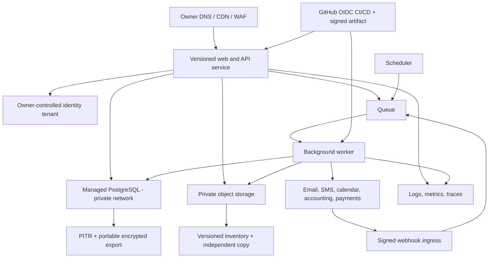

# Production platform options

Sources and service availability were checked 21 July 2026. This is an architecture recommendation, not a purchase order or a claim that any target account exists.

## Recommendation

Choose the **balanced managed production architecture**: retain the modular TypeScript/React application and provider-neutral domain adapters, move the complete production application into an owner-controlled cloud account, run it as one modular web/API service plus separately triggered workers, replace the primary D1 data store with managed PostgreSQL, and place evidence in owner-controlled object storage with versioning, retention and an independently tested export/restore path.

Do not introduce Kubernetes or split the 94 route files into microservices. The verified workload is broad but not proven to require that operational burden. Use queues only for delivery, sync, file processing and other retryable asynchronous work. Keep TLink authoritative for jobs, schedules, quotes, invoices and reconciliation; external providers remain adapters.

The audit does not have owner requirements for cloud preference, contract, budget, staff skills, required Australian residency or support tier. Therefore AWS, Azure and Google Cloud remain a decision gate. AWS Sydney is the reference implementation below because its documented regional service set, RDS recovery and S3 retention controls cover the verified needs, not because vendor selection is already approved.

## Workload requirements derived from the repository

| Requirement | Evidence | Architectural consequence |
|---|---|---|
| Public household tools plus authenticated customer, installer, supplier, field and admin surfaces | `README.md:3`; `docs/RELEASE_TRUTH.md:9-14` | Public edge/cache and private application sessions must coexist. |
| 94 API route files and 197 exported HTTP operations | `08_BACKEND_API_WORKERS_AND_JOBS.md` | Preserve a modular monolith initially; publish a machine contract and rate/authorization policy. |
| 145 relational tables and 79 production migrations | `09_DATA_DATABASE_STORAGE_AND_MIGRATIONS.md` | Managed relational database, transaction semantics, migration rehearsal, reporting replicas/exports and schema ownership are required. |
| Customer/trade PII, property/job records, evidence, quotes, invoices and payment reconciliation | `db/schema.ts`; `src/app/privacy/page.tsx:12-44`; `docs/RELEASE_TRUTH.md:59-63` | Owner-controlled data account, encryption, lifecycle, audit, export, restore and cross-border decision. |
| Private job evidence and customer uploads | `docs/RELEASE_TRUTH.md:49,52-55` | Private object ACLs, malware/file validation, object/database consistency, versioning and retention. |
| Scheduled materialisation and certificate-price sync | `vite.config.ts:23`; `worker/index.ts:73-84` | Durable scheduler with run ledger, alerting, retries and manual replay. |
| Resend/Twilio, Google/Microsoft calendar, Stripe/Square and Xero/MYOB/QuickBooks adapters | `11_EXTERNAL_INTEGRATIONS.md` | Queue/idempotency/webhook ingress, provider secrets, reconciliation and degraded-mode runbooks. |
| Native field client with offline sync | `docs/MOBILE_FIELD_SYNC.md`; field-sync routes in `08_BACKEND_API_WORKERS_AND_JOBS.md` | Stable API versions, device/session revocation, conflict handling and object upload path. |
| Small current live data but expected CRM growth | Sites QA counts in `docs/RELEASE_TRUTH.md:123`; synthetic scale tests in `docs/PLATFORM_SCALE_HARDENING_AUDIT.md` | Start modestly but remove hard ownership/recovery ceilings; scale on observed demand. |

## Three target architecture classes

| Class | Shape | Problems solved | Problems retained | Relative effort / burden | Suitability |
|---|---|---|---|---|---|
| 1. Minimal disruption | Owner-controlled Cloudflare account; Worker/Vinext; owner D1 and R2; separate monitoring/backups | Direct dashboard/API/CLI control, documented D1 export/Time Travel, independent R2 access, lower code change | D1 remains SQLite-oriented; D1/R2 Oceania hints are not Australian guarantees; current 145-table workload/reporting and restore exercise still need proof; Sites auth/management must be removed | Low-to-medium migration; low operations | `SUITABLE WITH CONDITIONS` for restricted/early workload; not preferred where Australian residency or mature relational operations are required |
| 2. Balanced managed | Owner-controlled managed container/serverless web/API, PostgreSQL, object store, queue/scheduler, central logs, IaC and CI/CD | Ownership, strong relational/reporting model, Australian-region choices, independent backups/export, observable jobs and reversible deployment | Requires schema/data migration, target operations capability and provider contract | Medium migration; low-to-medium operations | **Recommended** |
| 3. Enterprise scale | Balanced class plus multi-zone HA, cross-region DR, separate worker pools, read replica/reporting, SIEM, private networking, dedicated security/compliance and support | Higher availability, isolation, formal DR/support and larger scale | Higher fixed cost, complexity, on-call and governance; not justified by current volume evidence | High migration and ongoing burden | `SUITABLE WITH CONDITIONS`; adopt components only when SLO/scale/regulatory evidence demands them |

## Provider evidence

- ChatGPT Sites is public beta, lacks data/inference residency, and its terms restrict transaction-enabling Sites. It cannot be the production target for the verified complete workflow: [ChatGPT Sites Terms, updated 9 July 2026](https://openai.com/policies/chatgpt-sites-terms/) and [Sites management help](https://help.openai.com/en/articles/20001339-creating-and-managing-chatgpt-sites).
- Owner-controlled Cloudflare D1 can export schema/data and has Time Travel, but restore is in-place and Oceania is only a location hint; D1 guaranteed jurisdictions listed in current docs are EU and FedRAMP, not Australia: [D1 import/export](https://developers.cloudflare.com/d1/best-practices/import-export-data/), [D1 Time Travel](https://developers.cloudflare.com/d1/reference/time-travel/), [D1 location](https://developers.cloudflare.com/d1/configuration/data-location/), [R2 location](https://developers.cloudflare.com/r2/reference/data-location/).
- AWS documents `ap-southeast-2` as Sydney with three availability zones. RDS can restore to a new instance at a specified point; S3 Object Lock requires versioning and can protect object versions: [AWS regions](https://docs.aws.amazon.com/global-infrastructure/latest/regions/aws-regions.html), [RDS point-in-time restore](https://docs.aws.amazon.com/AmazonRDS/latest/UserGuide/USER_PIT.html), [S3 Object Lock](https://docs.aws.amazon.com/AmazonS3/latest/userguide/object-lock.html).
- Azure lists Australia East/Southeast and documents zone-redundant HA and geo-redundant backup availability for PostgreSQL Flexible Server in Australia East. Its native PITR backups retain 7–35 days and are not directly exportable, so portable `pg_dump`/restore copies are still necessary: [Azure regions](https://azure.microsoft.com/en-us/explore/global-infrastructure/geographies/), [PostgreSQL service regions](https://learn.microsoft.com/azure/postgresql/flexible-server/service-overview), [backup and restore](https://learn.microsoft.com/azure/postgresql/backup-restore/concepts-backup-restore).
- Google Cloud SQL supports PostgreSQL in `australia-southeast1` (Sydney), HA and point-in-time recovery to a new instance: [Cloud SQL region availability](https://cloud.google.com/sql/docs/postgres/region-availability-overview), [HA](https://cloud.google.com/sql/docs/postgres/high-availability), [restore](https://cloud.google.com/sql/docs/postgres/backup-recovery/restore).
- Firebase has no single project-wide data-location switch and some products do not permit location selection. Firebase Authentication ownership, tenant configuration, processing location and recovery must be verified separately: [Firebase locations](https://firebase.google.com/docs/projects/locations).

## Platform decision matrix

Ratings are relative to this product and assume resources are created in an owner-controlled organization/account with least privilege, billing alerts and contracted support where needed.

| Criterion | Cloudflare Worker + D1/R2 | AWS Sydney | Azure Australia East | Google Cloud Sydney | Evidence/uncertainty |
|---|---|---|---|---|---|
| Code-change effort | Best | Medium | Medium | Medium | Vinext/Worker is current; containerizing Next/Vinext or adapting route runtime needs a spike. |
| Owner dashboard/CLI/API | Strong when in owner account | Strong | Strong | Strong | Current Sites bindings do **not** establish owner account control. |
| Relational fit | Moderate; D1/SQLite | Strong; RDS PostgreSQL | Strong; Flexible PostgreSQL | Strong; Cloud SQL PostgreSQL | 145-table model/reporting favors PostgreSQL; migration complexity unmeasured. |
| Transaction/concurrency headroom | Conditional; workload test required | Strong managed options | Strong managed options | Strong managed options | No production load profile or SLO exists; no vendor guarantees inferred. |
| Australian residency | Not guaranteed by Oceania hint; no AU jurisdiction in cited docs | Region selectable in Sydney/Melbourne; service-by-service contract check | Australia geographies; service-by-service check | Sydney/Melbourne regions; service-by-service check | Identity, support, telemetry and third-party processors require separate review on every provider. |
| PITR | D1 Time Travel 7/30 days by plan; in-place | RDS PITR to new instance | PITR to new server, 7–35 days | PITR to new instance | All require an exercised, application-consistent restore and independent portable export. |
| Object retention | R2 lifecycle/version/lock capabilities require exact plan/config review | S3 versioning/Object Lock documented | Blob versioning/immutability available; exact target config required | GCS versioning/retention available; exact target config required | None is proven until IaC and restore tests exist. |
| Observability | Worker logs/analytics; owner export design needed | CloudWatch/X-Ray/OpenTelemetry choices | Azure Monitor/Application Insights | Cloud Logging/Trace/Monitoring | Define redaction and retention; avoid request bodies/PII. |
| Operational burden | Lowest | Moderate | Moderate | Moderate | Staff skills unknown. |
| Portability | Worker APIs and D1 bind; export available | Container + PostgreSQL/S3 interfaces portable with adaptation | Same | Same | Use standard PostgreSQL, S3-compatible abstraction and OpenTelemetry; avoid proprietary domain logic. |
| Overall | `SUITABLE WITH CONDITIONS` | `SUITABLE WITH CONDITIONS`, leading reference | `SUITABLE WITH CONDITIONS` | `SUITABLE WITH CONDITIONS` | Final vendor decision is `BLOCKED` on owner requirements and proof-of-concept. |

## Complete provider candidate records

The records below define the actual provider-level candidate set. Product names later in the role matrix are implementation examples within one of these records, not additional silently assessed candidates. No AI/model provider, stand-alone search/vector service, Kubernetes platform, SIEM or error SaaS is shortlisted; each would require a new record and evidence before selection. Pricing is not compared because no workload, support tier, term, tax profile or budget was available.

### Fit, region, availability, scaling and limits

| ID / provider or service | Role | Why it fits | Why it may not fit | Australian region/residency | Availability and support | Scaling model | Database/storage limits |
|---|---|---|---|---|---|---|---|
| P00 ChatGPT Sites | Current complete application host; managed Worker/D1/R2 | Exact v199 deployment already runs the application with low operator burden | Public beta, no data/inference residency, transaction-policy conflict/uncertainty and independent ownership/recovery gaps | No Sites data/inference residency at launch | Beta limits and provider disable/removal rights; applicable SLA/escalation `UNKNOWN` | Provider-managed with plan/workspace limits | D1/R2 underlying plan, quotas and owner access `UNKNOWN` |
| P01 Owner Cloudflare stack | Minimal-disruption Worker, D1, R2, Queues/Workflows and edge | Closest runtime match; direct dashboard/API/CLI and lower migration effort | D1 relational/reporting/concurrency fit, Australian residency and complete export with FTS require proof | D1/R2 Oceania placement hint is not an Australian guarantee | Product SLAs/support depend on selected plan and were not procured; `UNKNOWN` | Worker autoscaling; one-query-at-a-time D1 behavior; queues isolate async work | D1 documents 10 GB/database and plan limits; R2/Queue selected-plan quotas must be confirmed |
| P02 AWS Sydney managed stack | Balanced reference: managed compute, RDS PostgreSQL, S3, SQS/EventBridge, CloudWatch, Secrets Manager and edge | Documented Sydney region, mature PostgreSQL/PITR/object retention and owner-controlled service APIs | Broad service surface, IAM/cost complexity and application/container adaptation | `ap-southeast-2` Sydney; every service, support/telemetry path and contract still needs residency confirmation | Multi-AZ/service options exist; selected architecture/SLA/support plan `UNKNOWN` until contracted | Compute/queue horizontal scaling; RDS vertical/read-replica options | SKU/account quotas and imported workload sizing `UNKNOWN`; must be measured before selection |
| P03 Azure Australia East managed stack | Balanced alternative: Container Apps, PostgreSQL Flexible, Blob, Service Bus/Functions, Monitor, Key Vault and Front Door | Australian regions, managed PostgreSQL and integrated identity/operations choices | Azure-specific operations/IAM, service coupling and team skills unproven | Australia East/Southeast options; Flexible Server capabilities documented in Australia East; service-by-service confirmation required | Zone-redundant/backup options exist; exact SLA/support tier `UNKNOWN` | Managed compute/queue scaling; PostgreSQL SKU/HA options | Selected SKU/storage/connection/service quotas `UNKNOWN`; native backup retention 7–35 days in cited docs |
| P04 Google Cloud Sydney managed stack | Balanced alternative: Cloud Run, Cloud SQL PostgreSQL, GCS, Pub/Sub/Tasks/Scheduler, Logging, Secret Manager and edge | Sydney services, managed container/serverless fit and Cloud SQL HA/PITR | GCP skills, IAM/cost model and service adaptation unproven | `australia-southeast1` Sydney for cited Cloud SQL; every service/processor needs confirmation | HA/service options exist; selected SLA/support tier `UNKNOWN` | Cloud Run/async horizontal scaling; Cloud SQL machine/HA/read options | SKU/project quotas, connection/storage ceilings and workload fit `UNKNOWN` |
| P05 Firebase Authentication | Retained customer/workforce identity during migration if ownership controls pass | Existing subject/token integration reduces simultaneous migration risk | Project owner/billing, MFA, revocation, tenant policy, recovery, export and processing location unproved | No single project-wide location switch; product-specific processing must be reviewed | Applicable SLA/support and two-admin recovery `UNKNOWN` | Provider managed; quotas/tenant model uninspected | User/account quota and export/restore capability `UNKNOWN` |
| P06 GitHub Actions | Owner-controlled CI/CD with short-lived cloud identity | Repository already uses GitHub; can bind immutable commit, tests, artifact and approval | No tracked workflow/branch protection/OIDC trust currently proves enforcement | Build runner/artifact/log residency `UNKNOWN`; self-hosted AU runner is an option requiring operations | GitHub plan/SLA/support and branch policy `UNKNOWN` | Hosted/self-hosted runner concurrency by plan | Minutes, artifact retention/size and concurrency limits `UNKNOWN` |
| P07 Resend | Transactional email adapter | Existing provider-neutral delivery ledger, idempotency and signed callback implementation | Owner/domain health, Australian processing, quota, deliverability and support unproved | Region/residency `UNKNOWN` | Contract/SLA/support `UNKNOWN`; provider acceptance is not inbox delivery | Provider quota/account tier `UNKNOWN`; application attempts are bounded | Not a data store of record; provider event retention/export limits `UNKNOWN` |
| P08 Twilio | SMS/verification adapter | Existing delivery/opt-out ledger, signed callbacks and bounded retry/caps | Australian sender approval, account health, residency, cost and quota unproved | Region/processing and Australian sender route `UNKNOWN` | Contract/SLA/support `UNKNOWN` | Provider messaging/Verify quotas plus app daily caps; exact values `UNKNOWN` | Not authoritative storage; provider log/export retention `UNKNOWN` |
| P09 Stripe | Hosted checkout, membership/referral and payment reconciliation | Avoids raw card handling; signed/idempotent provider flows exist | Sites facilitation policy blocks/uncertainty; expected Connect environment key names were absent from the inspected revision, while account/credential/merchant/legal state remains `UNKNOWN` | Processing/data-location contract `UNKNOWN` | Account/support/availability commitment `UNKNOWN` | Provider managed; API/rate/account limits `UNKNOWN` | Provider is payment record, not CRM store; export/retention terms `UNKNOWN` |
| P10 Square | Hosted checkout and payment reconciliation | Adapter and environment-key entries exist; signed callback/idempotency design | Credential/merchant connection unproved and same Sites policy uncertainty applies | Processing/data-location contract `UNKNOWN` | Account/support/availability commitment `UNKNOWN` | Provider managed; rate/account limits `UNKNOWN` | Provider is payment record, not CRM store; export/retention terms `UNKNOWN` |
| P11 Xero | Downstream accounting draft/status adapter | Provider-neutral TLink snapshot and reconciliation boundary exist | Environment entries absent; account, scopes, region, quota and sandbox parity unproved | Tenant/data-region contract `UNKNOWN` | Account/support/SLA `UNKNOWN` | API/provider quota model `UNKNOWN` | Accounting provider retains downstream records; export/backup terms `UNKNOWN` |
| P12 MYOB AccountRight | Downstream accounting draft/status adapter | Same authoritative TLink boundary; relevant Australian accounting option | Environment entries absent; company-file/API/account support and parity unproved | Company-file/service location `UNKNOWN` | Account/support/SLA `UNKNOWN` | API/company-file limits `UNKNOWN` | Downstream record/export/backup behavior `UNKNOWN` |
| P13 QuickBooks Online | Downstream accounting draft/status adapter | Same authoritative TLink boundary and provider-neutral connection model | Environment entries absent; realm/account/scopes/region/parity unproved | Tenant/data-region contract `UNKNOWN` | Account/support/SLA `UNKNOWN` | API/account limits `UNKNOWN` | Downstream record/export/backup behavior `UNKNOWN` |

### Recovery, security, observability and exit

| ID | Backup and recovery | Security and identity integration | Observability | Portability | Vendor lock-in | Migration effort | Operational burden |
|---|---|---|---|---|---|---|---|
| P00 | Independent D1/R2 export, off-platform backup, PITR and restore are unproved; last restore `UNKNOWN` | Sites workspace/admin plane plus Firebase app identity; underlying provider IAM inaccessible | Bounded Sites analytics/log/deployment views; durable export `UNKNOWN` | Git source portable; data/resource transfer unproved | High at management/data boundary | Complete move required | Low daily operation, high continuity dependency |
| P01 | D1 Time Travel/export and R2 version/export require owner account, FTS-aware runbook and isolated restore; last restore `UNKNOWN` | Owner Cloudflare IAM/API tokens plus retained/replaced identity | Owner logs/analytics plus external privacy-safe sink required | Worker/R2 APIs portable with adapters; D1/SQLite translation needed | Medium | Low-medium compute; medium data/recovery proof | Low-medium |
| P02 | RDS PITR to new instance plus portable `pg_dump`; S3 version/Object Lock and independent copy; no restore yet | Owner AWS organisation/IAM/KMS/Secrets; OIDC CI; retained/replaced customer identity | CloudWatch/X-Ray/OpenTelemetry with redaction/retention policy | Container, PostgreSQL, object/queue interfaces are portable if proprietary workflow logic is bounded | Medium | Medium-high one-time D1/R2 translation and cutover | Medium; lowest only with a narrow managed-service set |
| P03 | Flexible Server PITR/new server plus portable dump; Blob version/immutability/independent copy; no restore yet | Owner tenant/subscriptions, managed identity, Key Vault and CI federation | Azure Monitor/Application Insights/OpenTelemetry | Container/PostgreSQL/object abstractions portable; identity/Service Bus specifics need adapters | Medium | Medium-high | Medium; team skill `UNKNOWN` |
| P04 | Cloud SQL PITR/new instance plus portable dump; GCS version/retention/independent copy; no restore yet | Owner organisation/project IAM, Secret Manager, workload identity and customer identity | Cloud Logging/Trace/Monitoring/OpenTelemetry | Container/PostgreSQL/object abstractions portable; Pub/Sub/IAM specifics need adapters | Medium | Medium-high | Medium; team skill `UNKNOWN` |
| P05 | User/config export, independent recovery and second-admin exercise unproved | Existing signed ID tokens; must add MFA/revocation/session/recovery policy | Provider auth logs/alerts/export `UNKNOWN`; app audit remains required | Stable external subject mapping helps; token/API semantics create migration work | Medium-high identity lock-in | Low if retained; high if migrated | Low when governed; recovery risk currently high |
| P06 | Workflow/artifact retention and repository backup policy unproved; Git source itself is portable | OIDC/least privilege and protected environments are the target, not current proof | Workflow logs/artifacts; export/retention `UNKNOWN` | Workflow YAML is movable with adaptation; cloud identity bindings are provider-specific | Low-medium | Low-medium | Low after setup; policy maintenance required |
| P07 | TLink ledger is authoritative for intent/status; provider replay/export and last recovery exercise `UNKNOWN` | API key plus signed Svix callback; rotation/domain ownership unproved | D1 attempt/events plus provider dashboard; alert/export `UNKNOWN` | Adapter boundary makes replacement feasible | Low-medium | Low | Low-medium deliverability operations |
| P08 | TLink delivery/opt-out ledger authoritative; provider log/export recovery `UNKNOWN` | Scoped account/auth/service IDs and signed callback; rotation unproved | D1 events/provider dashboard; alert/export `UNKNOWN` | Adapter boundary makes replacement feasible; sender migration may be material | Medium | Low-medium | Medium due sender/compliance operations |
| P09 | TLink commercial/payment ledgers plus provider reconciliation; provider export/dispute recovery and last exercise `UNKNOWN` | Hosted checkout, OAuth/secret and signed replay-protected webhooks; account control unproved | D1 attempts/events plus provider dashboard; alerts/export `UNKNOWN` | Provider-neutral payment-attempt boundary helps, but subscriptions/Connect semantics lock in | Medium-high | Medium | Medium finance/reconciliation burden |
| P10 | TLink ledger plus provider reconciliation; provider export/dispute recovery `UNKNOWN` | OAuth/app secret and HMAC callback; merchant/account control unproved | D1 attempts/events plus provider dashboard; alerts/export `UNKNOWN` | Adapter boundary helps; merchant/payment semantics differ | Medium | Medium | Medium |
| P11 | TLink accepted invoice snapshot authoritative; downstream export/status/manual reconciliation required; last exercise `UNKNOWN` | OAuth encrypted connection and scopes; expected Xero environment key names were absent from the inspected Sites revision, while account and credential existence/validity remain `UNKNOWN` | D1 provider events plus provider dashboard; alerts `UNKNOWN` | Provider-neutral accounting adapter; Xero contact/invoice IDs are provider-specific | Medium | Medium | Medium accounting support |
| P12 | Same TLink boundary; company-file backup/export/manual recovery unproved | OAuth/account/company-file selection; expected MYOB environment key names were absent from the inspected Sites revision, while account and credential existence/validity remain `UNKNOWN` | D1 provider events plus provider logs/dashboard `UNKNOWN` | Adapter boundary; AccountRight/company-file semantics raise migration effort | Medium-high | Medium-high | Medium-high |
| P13 | Same TLink boundary; provider export/manual recovery unproved | OAuth realm/scopes/encrypted connection; expected QuickBooks environment key names were absent from the inspected Sites revision, while account and credential existence/validity remain `UNKNOWN` | D1 provider events plus provider dashboard `UNKNOWN` | Adapter boundary; QuickBooks realm/entity semantics differ | Medium | Medium | Medium |

### Pricing, evidence, uncertainty and current status

| ID | Pricing source/date | Primary evidence used | Principal uncertainty | Current status |
|---|---|---|---|---|
| P00 | `NOT APPLICABLE`: no price/cost comparison made | OpenAI Sites Terms/help/manual; live v199 metadata in reports 06/20 | Contract, account ownership, transfer, independent data/recovery control; separate suitability verdict is `NOT SUITABLE` | `VERIFIED DEPLOYED` current host |
| P01 | `NOT APPLICABLE`: no price/cost comparison made | Cited Cloudflare D1 export/Time Travel/location and R2 location docs | Exact plan/SLA/support, AU residency, workload fit and tested recovery | `PLANNED ONLY` target option |
| P02 | `NOT APPLICABLE`: no price/cost comparison made | Cited AWS region, RDS PITR and S3 Object Lock docs | Service selection, contract/support, imported workload sizing and team operations | `PLANNED ONLY`; leading reference, vendor decision `BLOCKED` |
| P03 | `NOT APPLICABLE`: no price/cost comparison made | Cited Azure regions, PostgreSQL service and backup docs | Service/SKU selection, contract/support, portability spike and team skills | `PLANNED ONLY`; vendor decision `BLOCKED` |
| P04 | `NOT APPLICABLE`: no price/cost comparison made | Cited Cloud SQL region/HA/restore docs | Full service-region scope, contract/support, portability spike and team skills | `PLANNED ONLY`; vendor decision `BLOCKED` |
| P05 | `NOT APPLICABLE`: no price/cost comparison made | Firebase location guidance plus `src/lib/firebase-server.ts:1-43` | Ownership/IAM/MFA/revocation/recovery/export/location | `PARTIAL` retain-or-migrate decision |
| P06 | `NOT APPLICABLE`: no price/cost comparison made | Repository Git remote/history and absence of tracked workflow; target design only | Plan/branch protection/OIDC/admin/runner/artifact policy | `PLANNED ONLY` |
| P07 | `NOT APPLICABLE`: no price/cost comparison made | Adapter, key-name and release evidence in report 11 | Account/domain/credential validity, residency, quota, delivery health | `PARTIAL` |
| P08 | `NOT APPLICABLE`: no price/cost comparison made | Adapter/key-name evidence in report 11 | Account/sender approval, credential validity, residency, quota and health | `PARTIAL` |
| P09 | `NOT APPLICABLE`: no price/cost comparison made | Payment routes/webhooks and report 11; OpenAI Sites terms | Written Sites scope, account/Connect readiness, contract and live reconciliation | `BLOCKED` on current host |
| P10 | `NOT APPLICABLE`: no price/cost comparison made | Payment routes/webhook/key-name evidence and report 11 | Written Sites scope, merchant connection, credentials and live reconciliation | `BLOCKED` on current host |
| P11 | `NOT APPLICABLE`: no price/cost comparison made | Accounting adapter and inspected-revision environment-key-name absence in report 11 | Account/credential existence and validity, scopes, version, sandbox and support all remain `UNKNOWN` | `BLOCKED` |
| P12 | `NOT APPLICABLE`: no price/cost comparison made | Accounting adapter and inspected-revision environment-key-name absence in report 11 | Account/company-file and credential existence/validity, version, parity and support remain `UNKNOWN` | `BLOCKED` |
| P13 | `NOT APPLICABLE`: no price/cost comparison made | Accounting adapter and inspected-revision environment-key-name absence in report 11 | Account/realm and credential existence/validity, version, parity and support remain `UNKNOWN` | `BLOCKED` |

## Service-by-service target matrix

| Role | Minimal-disruption option | Balanced implementation examples (not shortlisted candidates) | Enterprise addition | Fit / risk / portability / migration |
|---|---|---|---|---|
| Frontend and API | Owner Cloudflare Worker | AWS App Runner/ECS Fargate or Lambda adapter; Azure Container Apps; GCP Cloud Run | Multi-zone service, separate public/private ingress | Keep one deployable application initially. Verify Vinext compatibility or use framework-native container output. Blue/green plus exact SHA provenance is required. |
| Relational database | Owner D1 | RDS PostgreSQL; Azure PostgreSQL Flexible; Cloud SQL PostgreSQL | HA, read replica, cross-region DR where RTO/RPO require | PostgreSQL improves reporting/concurrency/tooling. Use standard SQL and migration checksums. Migration must reconcile all 145 tables and objects. |
| Object storage | Owner R2 | S3; Azure Blob; GCS | Immutable retention tier, replicated backup account/project | Store opaque keys and metadata in DB. Version, checksum and reconcile objects. Never expose bucket directly. |
| Authentication | Retain Firebase Auth if owner/control/DPA/recovery pass | Firebase Auth, Cognito, Entra External ID or Identity Platform after a dedicated decision | Workforce/customer federation, MFA policy, privileged-access management | Do not combine auth migration with data migration unless necessary. Map immutable subject IDs; rehearse rollback and account recovery. |
| Background jobs | Worker scheduled handlers | EventBridge/SQS/Lambda or worker; Azure Scheduler/Service Bus/Functions; Cloud Scheduler/Tasks/Pub/Sub/Run jobs | Workflow orchestration and dead-letter replay | Jobs need run IDs, idempotency, backoff, DLQ, manual replay and alerting. Scheduler must not be the only history. |
| Queue/workflow | Cloudflare Queues/Workflows after owner review | SQS/Step Functions; Service Bus/Durable Functions; Pub/Sub/Tasks/Workflows | Isolated queues and cross-region recovery | Use only for email/SMS, calendar/accounting sync, webhooks and file processing. Database remains authoritative. |
| Search | PostgreSQL FTS/trigram after migration; current D1 FTS if retained | Same managed database first | OpenSearch/Azure AI Search/Vertex Search only after measured need | Current scale does not justify a separate search cluster. Preserve authorization filters in the query. |
| Email/SMS | Existing Resend/Twilio adapters | Retain if owner accounts, callbacks, data terms and recovery pass; cloud-native email optional | Dedicated deliverability/abuse operations | Provider-neutral ledger is valuable. Do not treat provider acceptance as inbox delivery. |
| Payments | Stripe/Square hosted checkout adapters after moving off Sites | Retain provider-hosted checkout and signed webhooks | Finance operations, fraud controls and reconciliation monitoring | Never accept card data. TLink records only stable references/status; OpenAI must confirm whether current redirect flow violates Sites terms until migration. |
| Accounting | Existing Xero/MYOB/QuickBooks adapters | Retain after production credentials and sandbox/live contract tests | Dedicated integration worker and reconciliation queue | TLink is source for accepted commercial snapshot; providers are downstream records. |
| Monitoring/logging/tracing | Owner Cloudflare logs plus external alert sink | Cloud-native logs/metrics plus OpenTelemetry; Sentry optional after DPA/data review | SIEM, security analytics, longer retention | Define SLI/SLO, privacy-safe structured events, alert ownership and export. Current logs are insufficient recovery evidence. |
| Secrets/config | Owner provider secrets | AWS Secrets Manager/SSM; Key Vault; Secret Manager | HSM/KMS policy, rotation automation, break-glass | No secrets in repository/browser. IaC references secret IDs, not values. |
| CI/CD | GitHub Actions with short-lived cloud identity | GitHub Actions OIDC to selected cloud, artifact signing/provenance | Protected promotion, separation of duties | Current repo has GitHub but no proven enforced production pipeline. Require exact commit, immutable artifact, migration gate and approval. |
| Infrastructure as code | Wrangler config | Terraform/OpenTofu or provider-native templates chosen once | Policy as code and drift detection | One reproducible source; no console-only production resources. Avoid an abstraction spanning all clouds. |
| CDN/DNS/WAF | Cloudflare owner zone | CloudFront/Route53/WAF; Azure Front Door/DNS/WAF; Cloud CDN/DNS/Armor | Multi-region routing and advanced bot controls | DNS ownership is separate from Sites. Cutover uses low TTL, health probes and rollback record. |
| Backup/DR | D1 export to separately owned store; R2 version/export | Native PITR + daily encrypted portable PostgreSQL dump + object inventory/version replication to separate account/project | Cross-region warm database/object replica and exercised failover | “Backup exists” is insufficient. Quarterly restore, referential/object reconciliation and measured RPO/RTO are acceptance gates. |
| Analytics/reporting | Privacy-safe operational aggregates in primary DB | Read replica/export into warehouse only after workload evidence | Redshift/Synapse/BigQuery governed warehouse | Do not query production broadly through the Database Console. Define metric grain and PII minimization first. |
| AI/model access | None in current release | Illustrative provider classes only: a provider-neutral gateway could later front Azure OpenAI, Bedrock, Vertex or OpenAI API | Dedicated model gateway, private networking, evaluations | No model or provider is shortlisted; each requires data review and a complete provider candidate record before selection. See `14_AI_NAVIGATION_AND_PLATFORM_INTELLIGENCE.md`. |
| Vector retrieval | Not required | PostgreSQL `pgvector` or managed vector feature only for approved documentation corpus | Dedicated vector/search service if measured | Authorization and citations precede technology. Current product has no justified production vector workload. |

## Recommended balanced reference topology

## Sizing and availability approach

No request rate, data volume, growth, concurrency, RTO, RPO, uptime target or budget was proven. Do not buy enterprise scale based on the synthetic benchmark alone.

Start with:

- one production account/project separated from non-production;
- two service instances or a managed scale-to-zero/scale-out service with a minimum warm instance only if latency evidence requires it;
- PostgreSQL sized from an imported production copy and load test, with Multi-AZ/zone redundancy if owner-approved RTO requires it;
- connection pooling and bounded transactions;
- object storage versioning and lifecycle policies;
- a queue with dead-letter handling for asynchronous provider operations;
- daily portable DB export and object inventory into a separate security boundary, in addition to native PITR;
- p50/p95/p99 latency, error, saturation, queue age, job success, DB/storage and provider reconciliation metrics;
- cost budgets/alerts and per-provider limits.

Move to enterprise components only when measured concurrency, restore/failover objectives, contractual availability or regulatory advice makes them necessary.

## Proof-of-concept and decision gates

Before choosing the provider, run the same read-only/isolated evaluation on all shortlisted targets:

1. Import the complete schema and a sanitized production-shaped dataset.
2. Execute all 79 migrations from empty, verify schema checksums and resolve the 11 migration-journal omissions.
3. Exercise the highest-contention job/schedule/quote/invoice operations concurrently.
4. Upload, download, authorize, version, inventory and restore representative objects.
5. Prove Firebase/target-auth token verification, revocation and role/tenant enforcement.
6. Exercise scheduled jobs, queues, retries, DLQ and webhook replay.
7. Restore PostgreSQL to a new instance and restore objects into an isolated namespace; reconcile row counts, primary keys, references and checksums.
8. Measure deploy/rollback, p95 latency, cold start, connection use and projected cost from actual test demand.
9. Confirm provider contract, account ownership, Australian-region scope, support, incident access, export and termination terms with the owner/legal adviser.

Select the provider only after the owner decides required data location, RPO, RTO, availability, support tier, budget ceiling, identity strategy and operating team. Until then the target architecture is approved in class, not in vendor.
