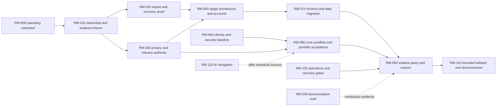

# Formal evidence-backed roadmap

Audit date: 21 July 2026 (Australia/Sydney) 
Source: findings in `18_FINDINGS_RISKS_ASSUMPTIONS_AND_DECISIONS.md` 
Constraint: this roadmap designs future work; no item was implemented, provisioned, migrated or deployed during the audit.

## How to use this roadmap

Sequence is dependency-based, not a calendar commitment. Effort is expressed as **person-weeks of focused delivery** and excludes procurement/provider response time, legal advice and waiting for account access. “Owner” means an accountable role, not the AI agent. No phase may be called complete from source presence alone: each item specifies runtime or documentary proof.

### Critical path

## Phase overview

| Required sequence | Roadmap items | Exit gate |
| --- | --- | --- |
| 1. Immediate security, privacy, compliance, data-loss and correctness blockers | RM-000, RM-030 | Restricted operation is recorded; payment policy and regulated-claim decisions have accountable owners |
| 2. Ownership, export, backup, restore and operational-access proof | RM-010, RM-020 | Complete owner-held export and isolated restore reconcile to source |
| 3. Documentation and source-of-truth recovery | RM-040 | Machine-readable current release/status registry and contradiction checks pass |
| 4. Target architecture and migration foundations | RM-050, RM-060, RM-065 | Owner-controlled accounts/IaC, privileged identity and executable schema-provenance baselines pass |
| 5. Core workflow and integration completion | RM-080 | Selected launch journeys and providers pass sandbox acceptance |
| 6. Backend/data/storage migration | RM-070 | Target schema/data/object reconciliation passes and repeatable delta process exists |
| 7. AI navigation and documentation | RM-120 | Only cited, authorised, read-only capabilities meet eval gates |
| 8. Reliability, observability and service ownership | RM-100 | Load, alert, incident, backup and restore objectives pass |
| 9. Architecture and maintainability | RM-085 | Auth manifest and accessibility gates pass |
| 10. Large-scale validation, cutover and decommission | RM-090, RM-110 | Shadow parity, cutover, rollback window and archival gates pass |
| 11. Optional discovery | RM-130 | Each opportunity has user evidence and its own bounded business case |

## RM-000 — Apply immediate Sites operating restrictions

- **Findings / phase / priority:** AUD-PLAT-001, AUD-DATA-001, AUD-ARCH-001; Phase 1; P0.
- **Problem and evidence:** the deployed Sites Worker contains Stripe/Square checkout creation, while current Sites terms prohibit initiating/executing/otherwise facilitating financial transactions. Sites also lacks data/inference residency. See `src/app/api/trade-payment-links/route.ts:163-322` and the official-source citations in AUD-PLAT-001.
- **Outcome:** no customer can enter a newly enabled payment path on an unapproved host; customer-facing claims match the authorised service boundary.
- **Scope:** provider/legal determination, feature/configuration operating restriction, claim inventory and incident/contact owner. **Non-goals:** rewriting payment code, choosing the target cloud, deleting commercial records or declaring the external redirect lawful.
- **Affected systems/workflows/actors/data/jurisdictions:** Sites Worker/UI; invoices/deposits; trades/customers; commercial references; Australia and Sites contractual scope.
- **Dependencies / blockers / critical path:** written provider/contact channel and owner authority; first roadmap gate and no technical predecessor.
- **Accountable / supporting roles:** business owner; counsel, product, payment owner and platform owner.
- **Recommended approach:** treat payment activation as blocked; request a written determination using the exact data flow; document bounded permitted use; route only informational/non-transactional traffic until resolved or migrated.
- **Acceptance / proof:** approved decision record quotes the current term/date and exact flow; production configuration/UI test proves no active checkout can be created while blocked; public/current docs carry the same status; exception has named expiry/review.
- **Tests / runtime / documentation:** negative production-safe route/config test, link/copy review, access log review; update current-truth registry and payment runbook only in the later authorised implementation task.
- **Rollout / migration / rollback / cleanup:** deploy restriction before broader migration; no data migration. Roll back only on written provider approval plus security/payment acceptance. Remove obsolete Sites payment secrets after target cutover and retention approval.
- **Effort / confidence / staffing:** 0.5-2 person-weeks across owner, counsel and one engineer; High confidence in scope, external-response duration unknown.
- **Risk of action / inaction / decisions:** action may temporarily remove collection convenience; inaction risks policy enforcement and commercial interruption. Owner chooses restriction versus explicit risk acceptance.

## RM-010 — Establish ownership, access and an immutable current-state evidence freeze

- **Findings / phase / priority:** AUD-OPS-001, AUD-DOC-001, AUD-INT-001; Phase 2; P0.
- **Problem and evidence:** Sites, D1/R2, Firebase and provider account/billing/transfer authority are not fully evidenced; the audit observed four source/release snapshots in one task.
- **Outcome:** two named humans can independently identify and administer every production component; the exact source, artifact, deployment, schema and account state is reproducible.
- **Scope:** account inventory, billing/deployment/admin authority, least-privilege access, break-glass process, source/deployment manifests and provider support questions. **Non-goals:** changing production data, exporting secrets into documentation or assuming binding access means ownership.
- **Affected:** GitHub, ChatGPT workspace/Sites, DNS/TLS, Firebase, external providers, repository/source artifacts and all operators.
- **Dependencies / blockers / critical path:** owner identity and read-only/provider access; predecessor RM-000 only for operating boundary. Blocks RM-020/RM-050.
- **Accountable / supporting roles:** business owner; platform/release lead, security, finance/procurement and provider account owners.
- **Approach:** make a redacted component register with account/billing/admin/deployment/CLI/API fields; save immutable manifests/checksums; ask provider questions that official documentation leaves unknown; test second-administrator access without disclosing credentials.
- **Acceptance / proof:** 100% of components in `06_HOSTING_OWNERSHIP_AND_CRM_SUITABILITY.md` have owner/billing/admin/deployment dispositions; two-human access drill succeeds; Git source SHA, saved-version source SHA and live deployment identity reconcile; gaps are explicit signed risks.
- **Tests / documentation:** read-only account screenshots/API exports, access review, Git/deployment provenance verifier; current-truth registry and access/break-glass runbook.
- **Rollout / migration / rollback / cleanup:** no user rollout; evidence freeze precedes export. Access grants use reversible least-privilege roles. Revoke temporary auditors and rotate any credentials exposed during the exercise.
- **Effort / confidence / staffing:** 1-3 person-weeks; Medium because provider access/response is unknown; owner plus platform and security roles.
- **Risk / decisions:** granting excess access is a risk; absent inventory leaves a single point of failure. Owner must name legal/billing owner and minimum two administrators.

## RM-020 — Prove complete export, owner-held backup and isolated restore

- **Findings / phase / priority:** AUD-DATA-002, AUD-DATA-004, AUD-OPS-002; Phase 2; P0.
- **Problem and evidence:** independent D1/R2 export, PITR, backup and restore are unproven; no last-proven restore exists.
- **Outcome:** a lost Sites workspace or database can be recovered from an owner-controlled, encrypted copy within approved loss/time objectives.
- **Scope:** D1 schema/data export, R2 object manifest/objects, checksums, encryption/key custody, backup schedule, retention/legal holds, isolated restore and application-level reconciliation. **Non-goals:** production cutover, live destructive restore or deciding RPO/RTO for the owner.
- **Affected:** 145 tables, 79 migration files, all R2 evidence, audit/commercial/provider references, privacy/tax retention and data owner.
- **Dependencies / blockers / critical path:** RM-010 account/access proof; provider-supported export capability. Hard gate for RM-070 and cutover.
- **Accountable / supporting roles:** data owner; database engineer, platform/SRE, security/privacy and domain owners.
- **Approach:** obtain full read-only exports; checksum and count them; store encrypted copies outside Sites; restore into an isolated target; reconcile schema, rows, key constraints, monetary aggregates, audit chains, object keys/sizes/hashes and representative authorised reads.
- **Acceptance / proof:** export covers 145/145 application tables and every authorised R2 object or records an exact unsupported item; two successive backups; restore completes without source mutation; counts/checksums and selected domain invariants match; owner approves measured RPO/RTO.
- **Tests / documentation:** automated export verifier, corruption/failure tests, restore rehearsal, application smoke, restore report; backup/restore/DR/key-rotation runbooks and evidence archive.
- **Rollout / migration / rollback / cleanup:** start read-only; no DNS change. Abort on incomplete export or mismatch. Destroy isolated copies through approved secure lifecycle after evidence retention; never delete source as part of this item.
- **Effort / confidence / staffing:** 2-6 person-weeks after export access; Low-Medium until provider capability is confirmed; database/platform/security trio.
- **Risk / decisions:** exports create sensitive copies; mitigate encryption, access and disposal. Inaction leaves catastrophic recovery unknown. Owner sets RPO/RTO/retention/key custodian.

## RM-030 — Resolve privacy, regulated-work and commercial-claim authority

- **Findings / phase / priority:** AUD-PRIV-001, AUD-COMP-001, AUD-COMM-001, AUD-DATA-001; Phase 1; P0.
- **Problem and evidence:** controller/entity coverage, cross-border disclosure, retention, NatHERS/electrical/scheme authority and claim substantiation are incomplete or unknown.
- **Outcome:** each released workflow and claim has a named legal entity, qualified actor, jurisdiction, purpose, retention rule and approved evidence source.
- **Scope:** legal/entity facts, data map, privacy notice/consent, breach plan, marketing/spam/call classifications, qualification/expiry rules, assessment consent/conflict/retention, claim/source register. **Non-goals:** legal certification, automated decisions about licence eligibility, or inventing rules from inaccessible standards.
- **Affected:** Australian household/trade/admin roles; every state/territory as offered; personal/evidence/financial data; assessment, install, comparison, rebate and communications workflows.
- **Dependencies / blockers / critical path:** owner supplies entity/service facts; qualified external specialists. Blocks broad release and informs RM-050/RM-080.
- **Accountable / supporting roles:** accountable privacy/compliance owner; counsel, accredited assessor, licensed trade, tax adviser, energy-market/scheme specialist, product/data owners.
- **Approach:** use the primary-source register in `02_INDUSTRY_BUSINESS_AND_GLOSSARY.md`; map each rule/claim to workflow, data and UI; mark unsupported jurisdictions/services unavailable; implement an expiry/review calendar only after rules are approved.
- **Acceptance / proof:** 100% material public claims have source/version/owner/freshness/qualification; all data classes have purpose/recipient/location/retention/deletion/legal hold; approved NDB and communications procedures; sample job passes jurisdiction evidence checklist.
- **Tests / documentation:** content snapshot/source freshness tests, consent withdrawal, qualification expiry, access/correction/deletion rehearsal and incident tabletop; policies/registers/runbooks with owner/review date.
- **Rollout / migration / rollback / cleanup:** release jurisdiction/service controls incrementally; revert a claim/workflow to unavailable if evidence expires. Archive superseded forms with effective dates; retain required records.
- **Effort / confidence / staffing:** 3-8 person-weeks of internal mapping plus external advice; Medium; legal/industry availability dominates.
- **Risk / decisions:** over-conservative gating can reduce acquisition; unsupported claims can harm customers and trigger enforcement. Owner chooses services/jurisdictions and accountable entity.

## RM-040 — Replace narrative status drift with verifiable release/documentation truth

- **Findings / phase / priority:** AUD-DOC-001, AUD-QA-001, AUD-API-001; Phase 3; P1.
- **Problem and evidence:** long-form handover/release documents temporarily contradicted code/deployment; runbooks contain stale provider/platform states, and one paid-referral API remains without a tracked current consumer.
- **Outcome:** a reader or retrieval system can distinguish planned, implemented, tested, configured, deployed and operational status for a dated checkpoint.
- **Scope:** documentation registry/metadata, machine-readable release manifest, source-to-deploy provenance, link/route/reference validation, route-consumer/deprecation ownership, contradiction rules and archive lifecycle. **Non-goals:** rewriting all historical prose or deleting records during the task.
- **Affected:** engineering, operations, product, AI retrieval, GitHub and Sites/target deployments.
- **Dependencies / blockers / critical path:** RM-010 defines identities; can run alongside RM-020/RM-030 and feeds every release.
- **Accountable / supporting roles:** documentation/release owner; product, engineering, operations and industry owners.
- **Approach:** adopt `15_RECOMMENDED_DOCUMENTATION_ARCHITECTURE.md`; generate current status from release manifests; make planned work unable to claim deployed status without artifact/runtime fields; archive historical documents rather than silently rewriting them.
- **Acceptance / proof:** 23/23 baseline docs have lifecycle/owner/disposition; links/routes are classified; every retained API has a named consumer/owner or explicit deprecation contract; the paid-referral route is disabled/removed or time-bounded from proven obligations; every active release claim has implementation SHA, artifact/saved version, deployment and dated runtime status; CI detects missing/stale metadata and contradictions.
- **Tests / documentation:** Markdown/anchor/route/external-link checker; schema validation; deliberate stale-status negative test; registry and templates.
- **Rollout / migration / rollback / cleanup:** introduce registry first, then point canonical docs to it; retain old docs as historical until consumers migrate. Roll back generated presentation, never immutable release records.
- **Effort / confidence / staffing:** 2-5 person-weeks; High; one documentation/release engineer with domain reviewers.
- **Risk / decisions:** excessive metadata can become new toil; keep fields tied to decisions. Owner approves canonical source and review cadence.

## RM-050 — Select and provision the owner-controlled managed target

- **Findings / phase / priority:** AUD-ARCH-001, AUD-DATA-001, AUD-OPS-001; Phase 4; P0.
- **Problem and evidence:** current combined host lacks required policy fit, residency choice, independent control and recovery evidence.
- **Outcome:** owner-controlled development/staging/production accounts and infrastructure reproduce the modular-monolith runtime with a managed relational database, object storage and observable deployment path.
- **Scope:** requirements/ADR, provider comparison, accounts/billing/admins, Australian-region decision, network/DNS/WAF, managed compute/PostgreSQL/object storage, secrets, queues/jobs, monitoring, CI/CD and IaC. **Non-goals:** Kubernetes, microservice split, multi-region active/active or data warehouse without measured need.
- **Affected:** full application, operators and all data; Australian privacy/commercial constraints.
- **Dependencies / blockers / critical path:** RM-010 ownership, RM-020 export feasibility, RM-030 data/residency requirements. Blocks RM-070.
- **Accountable / supporting roles:** architecture/platform owner; owner/procurement, security/privacy, database, application and operations.
- **Approach:** score the three classes in `16_PRODUCTION_PLATFORM_OPTIONS.md`; prefer the balanced managed modular monolith. AWS Sydney is one reference; Azure Australia East and GCP Sydney remain valid candidates subject to requirements and contracts.
- **Acceptance / proof:** signed ADR maps every requirement to a provider control; two administrators; IaC recreates an empty staging environment; no long-lived deploy keys; owner has dashboard/CLI/API/export; region, backup, logs and support terms are evidenced.
- **Tests / documentation:** IaC plan/apply/destroy in non-production, network/access tests, secret-rotation and cost-budget alerts; ADR, topology, account, deployment and break-glass runbooks.
- **Rollout / migration / rollback / cleanup:** provision isolated target without traffic; source remains authoritative. Destroy failed candidate resources after evidence retention and secret revocation.
- **Effort / confidence / staffing:** 4-10 person-weeks; Medium; platform lead plus application/database/security input.
- **Risk / decisions:** premature vendor selection creates lock-in; delay prolongs Sites exposure. Owner decides provider, region, support tier, budget and administrators.

## RM-060 — Establish privileged identity, authorization and security baseline

- **Findings / phase / priority:** AUD-SEC-001, AUD-SEC-002, AUD-SEC-003, AUD-SEC-004, AUD-OPS-003; Phase 4/9; P0-P1.
- **Problem and evidence:** privileged Firebase revocation/MFA/session controls are unproven, no CSP is deployed, route/object authorization coverage is incomplete, and the synthetic-identity CLI lacks a safe target boundary.
- **Outcome:** privileged compromise has a measured containment path; every API method has an explicit, tested role/tenant/object/rate policy.
- **Scope:** identity target decision, MFA/recovery/session/revocation, admin separation/break-glass, route manifest, capability-token lifecycle, webhook/replay/rate controls, CSP, security logging and a safe isolated synthetic-data toolchain. **Non-goals:** custom cryptography or replacing Firebase solely for fashion.
- **Affected:** customer/trade/admin/owner identities, 94 API route files, D1/R2, browser/mobile clients and providers.
- **Dependencies / blockers / critical path:** RM-050 for final host/identity integration; route-manifest work can start earlier. Blocks RM-090.
- **Accountable / supporting roles:** security/identity owner; application, QA, platform, privacy and domain owners.
- **Approach:** withdraw the generic Database Console route/navigation, then generate the route-method manifest; prioritise owner/payment/evidence routes; prove revoked-token denial and MFA; use central policy helpers without a generic command surface; introduce report-only then enforcing CSP. If diagnostics are justified, expose only explicit read-only projections; named repair commands must call domain services.
- **Acceptance / proof:** the generic catalogue/insert/delete route is unreachable; every remaining diagnostic projection is default-deny and classified; every exported API method is mapped; two-tenant negative suite passes; privileged session revocation meets approved latency; recovery/break-glass drill is audited; CSP is enforced with zero unexplained violations; zero-argument synthetic seeding is non-mutating and every provider run rejects production/shared projects without explicit approved confirmation.
- **Tests / documentation:** IDOR, stale/revoked token, role transition, capability replay, CSRF/XSS, webhook replay, rate/abuse and audit-alert tests; threat model/access/recovery runbooks.
- **Rollout / migration / rollback / cleanup:** enable stronger controls first in staging, then privileged cohort. Roll back only the faulty policy change while retaining audit logs; remove obsolete auth paths/tokens after transition.
- **Effort / confidence / staffing:** 4-9 person-weeks; Medium; security lead plus two application/QA contributors.
- **Risk / decisions:** access lockout if rollout is wrong; inaction leaves high-value identity exposure. Owner decides identity provider retention/migration and MFA policy.

## RM-065 — Reconcile migration authority and executable schema provenance

- **Findings / phase / priority:** AUD-DATA-003, AUD-DATA-005; Phase 4; P1.
- **Problem and evidence:** 79 SQL migrations but 68 Drizzle journal entries; 11 SQL files have no journal entry. The 145-table schema declares no foreign keys, so cross-table integrity is application-enforced.
- **Outcome:** one documented command creates exactly the canonical schema from zero and upgrades every supported prior state without ambiguous metadata; high-value relationships have an explicit constraint or approved tested exception.
- **Scope:** applied-migration ledger, SQL/journal/checksum mapping, orphan/integrity reports, bounded relationship constraints, clean replay, upgrade fixtures, schema diff and rollback/forward-fix policy. **Non-goals:** rewriting production migration history, destructive rollback or mass-adding constraints without data evidence.
- **Affected:** Drizzle, D1 export, target PostgreSQL translation, CI and database operators.
- **Dependencies / blockers / critical path:** must complete before RM-070 import; can run with RM-050.
- **Accountable / supporting roles:** database owner; application and release engineers.
- **Approach:** designate SQL or generated metadata as authoritative; map every file/checksum/order; preserve applied history; fail CI on new divergence; run orphan reports before adding constraints to new/high-value relationships; use forward fixes for deployed migrations.
- **Acceptance / proof:** 79/79 mapped with no duplicates/gaps; clean replay and representative upgrade produce approved schema; high-value orphan counts are zero or enumerated and approved; each relationship has a constraint or documented tested exception; schema diff is empty; immutable ledger archived.
- **Tests / documentation:** zero-to-current, each supported upgrade path, idempotency/failure, orphan, referential/delete/import/restore and post-migration invariant tests; migration and relationship policy/runbook.
- **Rollout / migration / rollback / cleanup:** metadata-only reconciliation first; never edit an applied SQL body. Abort on checksum discrepancy; keep export backup. Remove obsolete migration commands after all automation uses the canonical one.
- **Effort / confidence / staffing:** 1-4 person-weeks; High on gap, Medium on historical-state availability; database plus release engineer.
- **Risk / decisions:** wrong reconciliation can corrupt target history; leaving it ambiguous jeopardises cutover. Database owner selects canonical migrator.

## RM-070 — Build repeatable database/object migration and reconciliation

- **Findings / phase / priority:** AUD-DATA-002, AUD-DATA-003, AUD-DATA-004, AUD-ARCH-001; Phase 6; P0.
- **Problem and evidence:** target requires D1-to-managed-relational and R2-to-owner-storage migration while preserving IDs, cents, audit/version chains and object authorization.
- **Outcome:** repeated full-plus-delta imports produce a target copy whose schema, domain invariants and objects reconcile before traffic cutover.
- **Scope:** canonical contracts, type/conversion map, export importer, object copy, hashes, referential/domain reconciliation, delta/cutover capture and quarantine. **Non-goals:** opportunistic schema redesign, ID renumbering or decommissioning source.
- **Affected:** all tables/objects, every workflow and personal/financial/evidence data.
- **Dependencies / blockers / critical path:** RM-020, RM-050, RM-065; hard predecessor to RM-090.
- **Accountable / supporting roles:** database/migration owner; application domain owners, platform, security/privacy and QA.
- **Approach:** preserve stable identifiers/timestamps/integer cents; translate SQLite-specific constructs explicitly; copy objects with metadata/hash; reconcile counts plus business invariants; support restart/idempotency and repeat deltas.
- **Acceptance / proof:** 145/145 application tables mapped; 79 migration intents accounted for; 100% authorised objects copied and hashed; no unexplained count/key/aggregate variance; repeat run produces no duplicate/change; rejected records are enumerated and resolved.
- **Tests / documentation:** property/type/constraint tests, full synthetic import, redacted production rehearsal, interrupted/retry run, object auth/hash and domain reconciliation; mapping/data dictionary/runbook.
- **Rollout / migration / rollback / cleanup:** repeated read-only rehearsals, then final bounded delta. Source stays authoritative until RM-090. Rollback discards target traffic/state or reverse-reconciles only by an approved ledger. Clean temporary exports/keys under retention policy.
- **Effort / confidence / staffing:** 6-16 person-weeks; Low-Medium until export/schema edge cases are known; database lead plus 2-4 application/QA/platform contributors.
- **Risk / decisions:** transformations can silently change meaning; inaction preserves lock-in. Owner chooses tolerance, cutover write-freeze and source-retention window.

## RM-080 — Prove the selected core workflows and provider integrations end to end

- **Findings / phase / priority:** AUD-INT-001, AUD-QA-001, AUD-COMM-001, AUD-MOB-001; Phase 5; P1.
- **Problem and evidence:** adapters and broad workflow code exist, but provider accounts and complete staged journeys are mixed/unproven.
- **Outcome:** the owner-selected launch set completes without duplicate entry or false status, with deterministic recovery from each provider failure.
- **Scope:** choose launch journeys/providers; sandbox registrations/scopes; household/marketplace/job/field/quote/invoice/accounting/payment/email/calendar acceptance; reconciliation/manual recovery. **Non-goals:** activating every coded provider, two-way calendar authority, generic automation or native public release unless selected.
- **Affected:** customers, trades, staff, providers, personal/commercial data and jurisdictions selected by RM-030.
- **Dependencies / blockers / critical path:** RM-030, RM-060 and provider accounts. This phase proves the current-source sandbox and authoritative-record behavior before migration; RM-090 repeats the selected journeys on the migrated target. Blocks RM-090.
- **Accountable / supporting roles:** product owner per journey; provider account owners, application, QA, finance, operations, privacy/security and industry reviewers.
- **Approach:** define one canonical record and idempotency key per handoff; test sandbox consent/create/callback/replay/timeout/disconnect/reconcile; preserve explicit unavailable states for unselected providers.
- **Acceptance / proof:** each selected journey passes a named scenario from input to authoritative record/output; provider totals/status match TLink; duplicates/replays do not duplicate outcomes; partial failure exposes exact recovery; no provider is called “live” without dated runtime proof.
- **Tests / documentation:** contract plus sandbox E2E, webhook signature/replay, provider outage/timeout, reconciliation and privacy tests; provider data-flow/runbook/key-rotation/support owner.
- **Rollout / migration / rollback / cleanup:** release provider by provider to designated test tenants, then bounded cohort. Disable one provider independently; retain authoritative TLink state. Revoke unused apps/scopes and remove abandoned adapter claims after decision.
- **Effort / confidence / staffing:** 2-6 person-weeks per selected provider/journey; Medium-Low due external variance; product/QA/application plus provider specialist.
- **Risk / decisions:** real external side effects and fees require disposable sandbox records; untested activation creates financial/customer harm. Owner selects first-release providers and native-mobile scope.

## RM-085 — Close accessibility and route-contract release gates

- **Findings / phase / priority:** AUD-UX-001, AUD-SEC-004, AUD-QA-001; Phase 9; P1.
- **Problem and evidence:** broken skip targets, missing membership fragment targets, inconsistent dialog focus and incomplete per-route authorization/accessibility disposition remain.
- **Outcome:** representative public, customer, trade and operations journeys can be completed by keyboard/screen reader and every API method has negative authorization proof.
- **Scope:** guaranteed main target, valid route/fragment navigation, shared dialog primitive, focus/error/status behavior, reflow/orientation, route/auth manifest and test coverage. **Non-goals:** cosmetic redesign or a conformance claim beyond tested scope.
- **Affected:** all web layouts/API routes and mobile orientation where launched; disabled users and multi-tenant data.
- **Dependencies / blockers / critical path:** RM-060 manifest; target UI from RM-050. Blocks broad release sign-off.
- **Accountable / supporting roles:** frontend/accessibility owner and security owner; design, QA and representative users.
- **Approach:** repair shared primitives; select route-family sample based on full route inventory; automate structural checks and conduct manual assistive-tech acceptance; close auth matrix in parallel.
- **Acceptance / proof:** one valid skip target on every page and every static fragment resolves; keyboard focus enter/contain/return for every dialog family; 200% zoom/320 CSS px reflow; screen-reader labels/status; 94/94 route files disposed with negative access tests.
- **Tests / documentation:** axe/static plus keyboard/NVDA/VoiceOver or approved equivalents, route crawler, auth matrix/IDOR tests; accessibility statement and known-limit register.
- **Rollout / migration / rollback / cleanup:** shared primitives behind bounded component migration; visually and functionally compare each route family. Roll back broken primitive while preserving fixed semantics. Remove duplicate dialog implementations once all consumers migrate.
- **Effort / confidence / staffing:** 3-8 person-weeks; Medium; accessibility frontend engineer, security tester and user-research participants.
- **Risk / decisions:** shared primitive regression has broad reach; leaving defects excludes users. Owner chooses conformance scope and supported mobile orientations.

## RM-100 — Establish observable operations, capacity and recovery gates

- **Findings / phase / priority:** AUD-OPS-002, AUD-DATA-002, AUD-OPS-001; Phase 8; P1.
- **Problem and evidence:** transient Sites logs, manual release evidence and no measured restore/load/failover objectives cannot sustain business-critical operations.
- **Outcome:** named operators detect, diagnose, restore and communicate service/data failures using owner-accessible telemetry and rehearsed procedures.
- **Scope:** SLIs/SLOs, structured redacted logs/metrics/traces, alert routing, on-call/escalation, capacity/backpressure/retry budgets, health/readiness, backup/restore, incident and DR exercises, CI artifact/provenance. **Non-goals:** collecting sensitive payloads or buying enterprise tooling without need.
- **Affected:** API/Worker/jobs/queues/database/storage/providers/DNS/CI and all operators/users.
- **Dependencies / blockers / critical path:** RM-050 target; RM-020 recovery objectives; exercises target from RM-070. Blocks RM-090.
- **Accountable / supporting roles:** operations/SRE owner; platform, database, application, security/privacy, support and business incident lead.
- **Approach:** define business-derived indicators; retain redacted telemetry; alert on user outcome and queue/reconciliation age; simulate provider/database/object/identity failures; record runbook actions and measured restore.
- **Acceptance / proof:** approved SLO/RPO/RTO; 30-day representative telemetry queryable without AI; alerts reach two people; load meets approved concurrency/data scenario with budget; backup/restore and incident tabletop meet targets; build provenance links exact SHA to artifact/deployment.
- **Tests / documentation:** load/soak, rate/backpressure/retry-storm, dependency outage, failover/restore and alert-delivery tests; SLO, incident, DR, deployment, rollback and support runbooks.
- **Rollout / migration / rollback / cleanup:** instrument staging then production; start high-signal alerts and tune with evidence. Roll back noisy alerts independently, not observability. Remove Sites-only probes after target stability and evidence retention.
- **Effort / confidence / staffing:** 4-10 person-weeks initially plus ongoing ownership; Medium; platform/SRE with domain/on-call staff.
- **Risk / decisions:** noisy alerts/log PII or unbounded cost; absent controls leave failures invisible. Owner sets service objectives, coverage hours and support budget.

## RM-090 — Run shadow parity, security/capacity gates and reversible traffic cutover

- **Findings / phase / priority:** all P0/P1 findings, especially AUD-ARCH-001 and AUD-QA-001; Phase 10; P0.
- **Problem and evidence:** a complete-host migration has high data/workflow risk and cannot be validated from source tests alone.
- **Outcome:** target handles approved traffic with reconciled results/data and can return to the prior path within an approved rollback window.
- **Scope:** immutable release candidate, shadow/preview, route/workflow/data parity, synthetic/authenticated QA, security/accessibility/load/recovery, DNS/traffic plan, write freeze/delta, cutover and rollback decision log. **Non-goals:** feature expansion during migration.
- **Affected:** entire product, DNS/TLS, all users/data/providers and operators.
- **Dependencies / blockers / critical path:** RM-060/070/080/085/100 all exit; owner go/no-go. Direct predecessor to RM-110.
- **Accountable / supporting roles:** release/cutover owner; business/data/security/privacy/product/platform/QA/provider leads.
- **Approach:** freeze source; deploy exact artifact to target; shadow safe reads/calculations, never duplicate external side effects; compare route contracts and business outputs; take final delta; cut traffic in bounded stages with explicit abort thresholds.
- **Acceptance / proof:** route matrix has no unexplained difference; data/object/business aggregates reconcile; selected E2E, security, accessibility, load and restore gates pass; DNS/TLS/headers/health/alerts pass; signed go/no-go; rollback rehearsal succeeds.
- **Tests / documentation:** all prior gates plus production-safe smoke and traffic comparison; cutover command/evidence log, reconciliation report, incident communications and rollback runbook.
- **Rollout / migration / rollback / cleanup:** canary/internal users -> bounded cohort -> full traffic. Source Sites remains read-only/fallback during window. Roll back DNS/traffic and reconcile writes using immutable event/delta ledger; never merge divergent writes ad hoc. No decommission here.
- **Effort / confidence / staffing:** 3-8 person-weeks after prerequisites; Medium; coordinated 5-8-role cutover group, not necessarily full-time.
- **Risk / decisions:** outage or split-brain data; delay extends current platform risk. Owner approves write-freeze, variance thresholds, cutover and rollback window.

## RM-110 — Operate bounded fallback, archive evidence and decommission safely

- **Findings / phase / priority:** AUD-OPS-001, AUD-DATA-002, AUD-DOC-001; Phase 10; P1.
- **Problem and evidence:** immediate deletion removes rollback and may destroy inaccessible Sites/data evidence; indefinite dual-running creates split-brain and cost/security debt.
- **Outcome:** one authoritative production path remains, old resources are retained only for a defined evidence/rollback purpose, then removed with recoverable proof.
- **Scope:** stability observation, source/target reconciliation, fallback access restriction, data/legal retention, credential revocation, DNS/provider cleanup and archival. **Non-goals:** deleting any resource without owner approval and verified target backups.
- **Affected:** Sites, D1/R2, DNS, Firebase/provider apps, GitHub artifacts, operators and retained records.
- **Dependencies / blockers / critical path:** RM-090 successful cutover plus approved stability/retention criteria.
- **Accountable / supporting roles:** owner/release owner; data, security/privacy, platform, finance/procurement and legal.
- **Approach:** make Sites read-only/inaccessible to ordinary traffic as contract allows; monitor target; perform repeated reconciliation; export final evidence; obtain deletion/retention decision; revoke secrets and cancel resources in controlled order.
- **Acceptance / proof:** target meets agreed stability window and SLO; no unexplained source/target delta; two independent target backups/restores; all old dependencies/credentials/resources have retain/archive/delete disposition and approval; deletion receipts where available.
- **Tests / documentation:** fallback invocation drill before closure, final restore and provider/DNS checks; decommission checklist, evidence manifest and historical architecture record.
- **Rollout / migration / rollback / cleanup:** fallback remains bounded and write-disabled. If target fails within the approved window, invoke RM-090 rollback/reconciliation. After closure, remove code/config/secrets/providers only through separately authorised work.
- **Effort / confidence / staffing:** 2-5 person-weeks plus owner-defined observation period; High method, Medium provider deletion/export capability.
- **Risk / decisions:** early deletion is irreversible; indefinite retention expands exposure. Owner decides stability window, legal retention and final deletion authority.

## RM-120 — Add deterministic navigation and a cited read-only documentation assistant

- **Findings / phase / priority:** AUD-DOC-001, AUD-QA-001; Phase 7; P2.
- **Problem and evidence:** broad product navigation and rapidly changing documentation make discovery hard; embedded AI is `PLANNED ONLY` and canonical knowledge is not yet machine-governed.
- **Outcome:** users find records/workflows deterministically; authorised staff can ask questions of current documentation and receive citations/freshness without production mutation authority.
- **Scope:** role-aware navigation, command palette, authorised cross-entity search, contextual help, canonical-doc retrieval, citations/freshness/confidence, feedback and evals. **Non-goals:** unrestricted agent, raw production database retrieval, autonomous mutation or replacing domain decisions.
- **Affected:** customers/trades/admin/operators; authorised records and canonical documentation; personal data only where explicit search policy permits.
- **Dependencies / blockers / critical path:** RM-040 canonical docs and RM-060 retrieval authorization; not on migration critical path.
- **Accountable / supporting roles:** product/knowledge owner; frontend/search, security/privacy, documentation, QA and domain reviewers.
- **Approach:** implement deterministic navigation/search first; then a read-only cited retrieval assistant using the capability matrix in `14_AI_NAVIGATION_AND_PLATFORM_INTELLIGENCE.md`; separate indexes by tenant/role and exclude secrets.
- **Acceptance / proof:** predefined tasks meet success/time targets; every assistant claim cites an authorised current source; stale/contradictory/missing evidence yields explicit uncertainty; zero cross-tenant retrieval in adversarial suite; no mutation tool exposed.
- **Tests / documentation:** retrieval authorization, prompt-injection, citation/freshness, hallucination, PII leakage, cost/latency and regression evals; model/prompt/index/version register and escalation runbook.
- **Rollout / migration / rollback / cleanup:** staff-only read-only pilot, then bounded roles; kill switch removes AI while deterministic search remains. Delete stale indexes under retention controls; keep eval evidence.
- **Effort / confidence / staffing:** deterministic search 3-7 person-weeks; cited assistant discovery/pilot 4-10 more; Medium; product/search/security/knowledge team.
- **Risk / decisions:** hallucination or authorised-data leakage; inaction is usability cost, not a platform blocker. Owner decides model/provider, data classes, latency/cost and pilot roles.

## RM-130 — Optional product discovery after platform gates

- **Findings / phase / priority:** product opportunities in `03_PRODUCT_FEATURE_AND_WORKFLOW_STATUS.md`; Phase 11; P3.
- **Problem and evidence:** fast preview, phone dispatch, common jobs, office action centre, enterprise controls and broader automation are proposed, but platform/control work is release-critical.
- **Outcome:** only opportunities with observed user burden and measurable value enter delivery.
- **Scope:** interviews/observation, workflow timing/error baseline, prototype and bounded acceptance criteria. **Non-goals:** implementing the backlog during migration or using AI to infer customer need.
- **Affected:** selected trade/customer roles and their current workflows; no production data mutation in discovery without separate consent.
- **Dependencies / blockers / critical path:** core control gates and enough live usage; outside migration critical path.
- **Accountable / supporting roles:** product owner; design/research, domain operations, engineering and privacy.
- **Approach:** measure office re-entry, task completion, errors and support burden; rank one coherent slice; preserve TLink as authoritative and progressive disclosure.
- **Acceptance / proof:** each candidate has named user, current baseline, target, non-goals, data/privacy boundary and decision outcome; no implementation approved solely from roadmap prose.
- **Tests / documentation:** usability tasks and prototype accessibility; discovery brief/decision record.
- **Rollout / migration / rollback / cleanup:** prototype outside production or to consenting pilot; discard failed concepts and data. No migration/rollback unless a later item is approved.
- **Effort / confidence / staffing:** 1-3 person-weeks per discovery; Low until users/evidence exist; product researcher plus domain owner.
- **Risk / decisions:** delaying visible features can affect adoption; shipping during platform migration expands risk. Owner chooses one discovery at a time.

## Staffing scenarios

| Scenario | Shape | Consequence |
| --- | --- | --- |
| Sequential small team | One accountable technical lead, one application engineer, part-time data/security/QA and external legal/industry review | Lowest coordination burden; RM-010/020/030 largely sequential; no credible calendar estimate until provider export/access responds |
| Balanced parallel team | Platform lead; database/migration lead; application/QA pair; security/privacy lead; part-time product/industry/operations owners | RM-020, RM-030 and RM-040 can overlap; RM-050/060/065 can overlap after decisions; recommended for controlled migration |
| Larger programme | Balanced team plus dedicated SRE, accessibility, provider-integration and change/support roles | Faster evidence closure only if provider/account decisions are available; greater coordination cost; still no reason for microservices/Kubernetes |

## Global stop conditions

Stop migration/cutover and preserve evidence if any of these occur:

- complete source export cannot be obtained or independently verified;
- a table, object class, identifier, commercial total, audit chain or customer-visible state cannot be reconciled;
- the owner cannot administer/restore the target without the migration implementer or AI session;
- policy/privacy/regulated-work authority for the released workflow remains unresolved;
- privileged revocation, tenant isolation, provider replay, load, alert or restore gates fail;
- rollback would require unlogged manual merging of divergent writes;
- a concurrent source/deployment change invalidates the frozen manifest.

The next action at a stop is not broader implementation: record the exact failing gate, return traffic/source authority to the last proven state where safe, and obtain the named owner/provider/expert decision.
